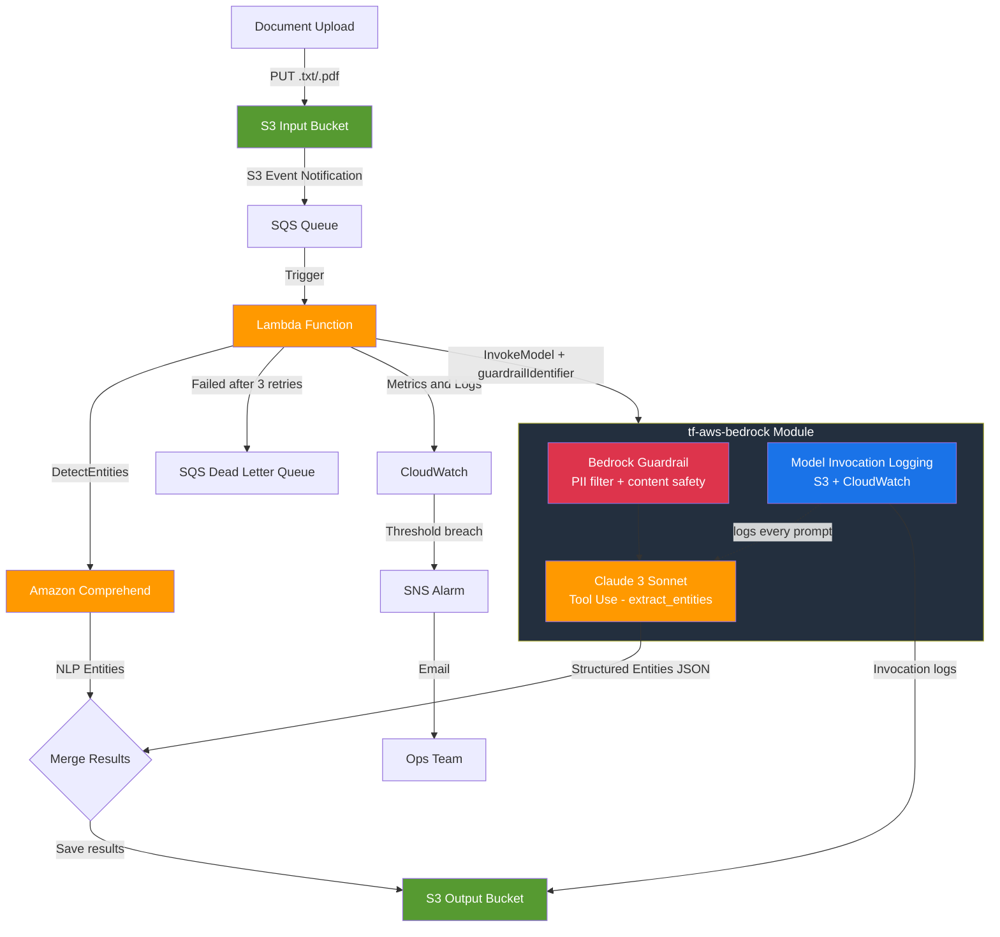

# Bedrock Entity Recognition Pipeline

A production-ready, event-driven named entity recognition (NER) pipeline built on AWS. Documents uploaded to an S3 input bucket are automatically processed by an AWS Lambda function that calls **Amazon Bedrock (Claude 3 Sonnet with Tool Use)** for structured entity extraction, and optionally **Amazon Comprehend** as an NLP baseline for side-by-side comparison. Results are persisted as JSON to an S3 output bucket.

The pipeline uses the **`tf-aws-bedrock`** module to provision model invocation logging (every Claude prompt + completion captured to S3 and CloudWatch) and guardrails (PII anonymisation + content-safety filters) — so Bedrock infrastructure is fully managed by Terraform alongside the rest of the stack.

---

## Architecture

### ASCII Diagram

```
+-------------------------------------------------------------------------+
|              Bedrock Entity Recognition Pipeline                        |
|                                                                         |
|  +---------+   S3 Event   +----------+  Trigger  +------------------+  |
|  | S3 Input| -----------> |   SQS    | --------> |  Lambda Function |  |
|  | Bucket  |              |  Queue   |           +--------+---------+  |
|  +---------+              +----------+                    |            |
|                           +----------+                    |            |
|                           |   DLQ    | <-- Failures ------+            |
|                           +----------+                    |            |
|                                              +------------+----------+ |
|                                              |                       | |
|                                   +----------v-----+  +-----------+  | |
|                                   | tf-aws-bedrock |  | Comprehend|  | |
|                                   |                |  |    NER    |  | |
|                                   | +------------+ |  +-----------+  | |
|                                   | | Guardrails | |        |        | |
|                                   | | PII filter | |        |        | |
|                                   | +------------+ |        |        | |
|                                   | +------------+ |        |        | |
|                                   | | Invocation | |        |        | |
|                                   | | Logging    | |        |        | |
|                                   | +------------+ |        |        | |
|                                   | +------------+ |        |        | |
|                                   | | Claude     | |        |        | |
|                                   | | Tool Use   | |        |        | |
|                                   | +------------+ |        |        | |
|                                   +-------+--------+        |        | |
|                                           |                 |        | |
|                                           +--------+--------+        | |
|                                                    |                 | |
|                                       +------------v-----------+     | |
|                                       |  S3 Output Bucket      |     | |
|                                       |  (results JSON +       |     | |
|                                       |   invocation logs)     |     | |
|                                       +------------------------+     | |
|                                                                       | |
|  +----------------------------------------------------------------+  | |
|  |  CloudWatch: Alarms + Dashboard + Log Groups + Bedrock Logs   |  | |
|  +----------------------------------------------------------------+  | |
+-------------------------------------------------------------------------+
```

### Mermaid Diagram



---

## What the `tf-aws-bedrock` Module Does

This is the **core Bedrock infrastructure** provisioned by Terraform — not just Lambda calling an API:

| Feature | What it provisions | Why it matters |
|---|---|---|
| **Model Invocation Logging** | CloudWatch Log Group + S3 prefix under `bedrock-invocation-logs/` | Every Claude prompt and completion is captured for audit, compliance, and debugging |
| **Guardrails** | `aws_bedrock_guardrail` resource with PII + content filters | Applied on **every** `invoke_model` call — enforced server-side by Bedrock, not just Lambda |
| **PII Anonymisation** | EMAIL, PHONE, NAME → masked in responses | Entity results never contain raw PII even if source docs do |
| **PII Blocking** | SSN, Credit Card, AWS Keys → request blocked outright | Hard stop on sensitive credential leakage |
| **Content Safety** | HATE (HIGH), VIOLENCE (MEDIUM), PROMPT_ATTACK (HIGH) | Prevents adversarial documents from jailbreaking the model |

The guardrail ID is injected into Lambda via `BEDROCK_GUARDRAIL_ID` environment variable. Lambda passes it as `guardrailIdentifier` to every `bedrock_runtime.invoke_model()` call.

---

## Prerequisites

The following reusable Terraform modules must exist at the paths shown relative to this solution directory:

| Module | Relative Path |
|--------|---------------|
| `tf-aws-kms` | `../../tf-aws-kms` |
| `tf-aws-iam-role` | `../../tf-aws-iam-role` |
| `tf-aws-s3` | `../../tf-aws-s3` |
| `tf-aws-sqs` | `../../tf-aws-sqs` |
| `tf-aws-lambda` | `../../tf-aws-lambda` |
| `tf-aws-sns` | `../../tf-aws-sns` |
| `tf-aws-bedrock` | `../../tf-aws-bedrock` |

Terraform >= 1.3.0 and AWS provider >= 5.0 are required.

Amazon Bedrock model access for `anthropic.claude-3-sonnet-20240229-v1:0` (or your chosen model) must be enabled in the target AWS account/region via the Bedrock console.

---

## Usage

### Minimal Example

```hcl
module "entity_recognition" {
  source = "./solutions/bedrock-entity-recognition"

  name        = "myapp"
  environment = "prod"
  aws_region  = "us-east-1"
}
```

### Full Example with All Options

```hcl
module "entity_recognition" {
  source = "./solutions/bedrock-entity-recognition"

  name        = "acme-docs"
  environment = "prod"
  aws_region  = "us-east-1"

  # Bedrock model selection
  claude_model_id          = "anthropic.claude-3-sonnet-20240229-v1:0"
  comprehend_language_code = "en"

  # Processing configuration
  enable_comprehend_comparison = true
  lambda_memory_mb             = 1024
  lambda_timeout_sec           = 300

  # Bedrock infrastructure (guardrail + logging)
  enable_bedrock_guardrail = true   # PII filter + content safety on every Claude call
  enable_bedrock_logging   = true   # Capture every prompt + completion to S3 + CloudWatch

  # Queue tuning
  sqs_visibility_timeout = 360
  sqs_max_receive_count  = 3

  # Security
  enable_kms_encryption = true

  # Alerting (set to null to disable)
  alarm_email = "ops-team@example.com"

  tags = {
    Team       = "data-platform"
    CostCenter = "CC-42"
  }
}
```

### Consuming Outputs

```hcl
output "upload_bucket" {
  value = module.entity_recognition.input_bucket_name
}

output "results_bucket" {
  value = module.entity_recognition.output_bucket_name
}

output "processing_function" {
  value = module.entity_recognition.lambda_function_name
}

output "guardrail_id" {
  value = module.entity_recognition.bedrock_guardrail_id
}

output "invocation_logs" {
  value = module.entity_recognition.bedrock_invocation_log_prefix
}
```

---

## How It Works

1. **Upload** — A `.txt` or `.pdf` document is uploaded to the S3 input bucket (`<name>-<env>-input`).
2. **S3 Event Notification** — S3 fires an `ObjectCreated` event and delivers it to the SQS processing queue.
3. **Lambda Trigger** — The Lambda function is invoked with a batch of one SQS message (batch size = 1 for reliable per-document processing).
4. **Read Document** — Lambda reads the raw document text from S3.
5. **Bedrock Guardrail** — The `tf-aws-bedrock` module has provisioned a guardrail that anonymises PII and blocks harmful content. Lambda passes the guardrail ID to every `invoke_model` call.
6. **Bedrock Tool Use** — Lambda calls `bedrock:InvokeModel` with a structured JSON tool schema (`extract_entities`). Claude is forced to call the tool, guaranteeing a structured entity array in the response. The guardrail is applied server-side before the response is returned.
7. **Model Invocation Logging** — Every Claude prompt and completion is automatically written to `s3://<name>-<env>-output/bedrock-invocation-logs/` and CloudWatch by the Bedrock service (provisioned by `tf-aws-bedrock`).
8. **Comprehend Comparison** (optional) — Lambda calls `comprehend:DetectEntities` on up to 5,000 characters of text. This provides an NLP-based baseline for accuracy comparison.
9. **Merge and Save** — Both entity lists are merged into a single JSON object and written to the S3 output bucket (`<name>-<env>-output`) at the path `output/<original-key-without-ext>_entities.json`.
10. **Failure Handling** — If Lambda throws an exception, SQS retries up to `sqs_max_receive_count` times (default 3) before routing the message to the Dead Letter Queue (DLQ).
11. **Monitoring** — CloudWatch alarms fire on Lambda errors and throttles. A CloudWatch dashboard provides at-a-glance visibility. Alarm notifications are sent via SNS email when `alarm_email` is configured.

### Guardrail Behaviour

| Scenario | Guardrail action | Lambda result |
|---|---|---|
| Document contains email/phone | `ANONYMIZE` — replaced with `[EMAIL]` / `[PHONE]` | Entity list returned without raw PII |
| Document contains SSN or credit card | `BLOCK` — request rejected | Empty entity list returned, warning logged |
| Document contains hate speech | `BLOCK` — blocked at `HIGH` threshold | Empty entity list returned, warning logged |
| Document contains prompt injection | `BLOCK` — blocked at `HIGH` threshold | Empty entity list returned, warning logged |
| No guardrail (`enable_bedrock_guardrail = false`) | No filtering | Raw entity list returned |

### Output JSON Shape

```json
{
  "source_bucket": "myapp-prod-input",
  "source_key": "reports/q1-report.txt",
  "bedrock_entities": [
    { "text": "Amazon Web Services", "type": "ORGANIZATION", "confidence": 0.99 },
    { "text": "Seattle",             "type": "LOCATION",     "confidence": 0.97 }
  ],
  "comprehend_entities": [
    { "Text": "Amazon Web Services", "Type": "ORGANIZATION", "Score": 0.998, "BeginOffset": 0, "EndOffset": 19 }
  ]
}
```

---

## Modules Used

| Module | Purpose |
|--------|---------|
| `tf-aws-bedrock` | **Core Bedrock infrastructure**: model invocation logging, guardrails (PII anonymisation + content safety), guardrail ID injected into Lambda |
| `tf-aws-kms` | Customer-managed KMS encryption key for S3 buckets and SQS queues |
| `tf-aws-iam-role` | Lambda execution IAM role with Bedrock, Comprehend, S3, and SQS permissions |
| `tf-aws-s3` | Input bucket (document uploads) and output bucket (entity results + Bedrock logs) |
| `tf-aws-sqs` | Document processing queue with built-in Dead Letter Queue |
| `tf-aws-lambda` | Entity recognition function (Python 3.12) with CloudWatch alarms and dashboard |
| `tf-aws-sns` | Optional alert topic for CloudWatch alarm email notifications |

---

## Inputs

| Name | Description | Type | Default | Required |
|------|-------------|------|---------|----------|
| `name` | Base name for all resources. Used as `<name>-<environment>-*` | `string` | — | yes |
| `environment` | Deployment environment (dev, staging, prod) | `string` | `"dev"` | no |
| `aws_region` | AWS region to deploy into | `string` | `"us-east-1"` | no |
| `tags` | Additional tags applied to all resources | `map(string)` | `{}` | no |
| `claude_model_id` | Bedrock Claude model ID for entity extraction | `string` | `"anthropic.claude-3-sonnet-20240229-v1:0"` | no |
| `comprehend_language_code` | Language code for Amazon Comprehend | `string` | `"en"` | no |
| `lambda_memory_mb` | Lambda function memory in MB | `number` | `512` | no |
| `lambda_timeout_sec` | Lambda function timeout in seconds | `number` | `300` | no |
| `enable_comprehend_comparison` | Also call Comprehend for NLP baseline comparison | `bool` | `true` | no |
| `enable_kms_encryption` | Encrypt S3 and SQS with a customer-managed KMS key | `bool` | `true` | no |
| `enable_bedrock_guardrail` | Create a Bedrock guardrail filtering PII and harmful content on every Claude invocation | `bool` | `true` | no |
| `enable_bedrock_logging` | Enable Bedrock model invocation logging — every prompt + completion saved to S3 and CloudWatch | `bool` | `true` | no |
| `alarm_email` | Email address for CloudWatch alarm SNS notifications | `string` | `null` | no |
| `sqs_visibility_timeout` | SQS message visibility timeout in seconds | `number` | `360` | no |
| `sqs_max_receive_count` | Max SQS receive attempts before routing to DLQ | `number` | `3` | no |

---

## Outputs

| Name | Description |
|------|-------------|
| `input_bucket_name` | Name of the S3 input bucket |
| `input_bucket_arn` | ARN of the S3 input bucket |
| `output_bucket_name` | Name of the S3 output bucket |
| `output_bucket_arn` | ARN of the S3 output bucket |
| `lambda_function_name` | Name of the entity recognition Lambda function |
| `lambda_function_arn` | ARN of the entity recognition Lambda function |
| `lambda_log_group_name` | CloudWatch Log Group name for the Lambda function |
| `lambda_cloudwatch_dashboard_url` | Direct URL to the Lambda CloudWatch dashboard |
| `sqs_queue_url` | URL of the document processing SQS queue |
| `sqs_queue_arn` | ARN of the document processing SQS queue |
| `sqs_dlq_url` | URL of the Dead Letter Queue |
| `sqs_dlq_arn` | ARN of the Dead Letter Queue |
| `lambda_role_arn` | ARN of the Lambda execution IAM role |
| `lambda_role_name` | Name of the Lambda execution IAM role |
| `kms_key_arn` | ARN of the KMS encryption key (null when KMS disabled) |
| `sns_alert_topic_arn` | ARN of the SNS alert topic (null when alarm_email not set) |
| `bedrock_guardrail_id` | Bedrock guardrail ID enforced on every Claude invocation (empty when disabled) |
| `bedrock_guardrail_arn` | Bedrock guardrail ARN (empty when disabled) |
| `bedrock_invocation_log_prefix` | S3 URI prefix where Bedrock model invocation logs are written (empty when disabled) |

---

## Deploying

### 1. Package the Lambda Handler

Before running Terraform, create the Lambda deployment zip:

```bash
cd solutions/bedrock-entity-recognition/lambda_src
bash build.sh
# Creates: lambda_src/handler.zip
```

### 2. Configure AWS Credentials

```bash
export AWS_PROFILE=my-profile
# or
export AWS_ACCESS_KEY_ID=...
export AWS_SECRET_ACCESS_KEY=...
export AWS_DEFAULT_REGION=us-east-1
```

### 3. Create a tfvars File

```hcl
# terraform.tfvars
name        = "acme-docs"
environment = "prod"
aws_region  = "us-east-1"
alarm_email = "ops-team@example.com"

# Bedrock infrastructure (both default to true)
enable_bedrock_guardrail = true
enable_bedrock_logging   = true
```

### 4. Apply

```bash
cd solutions/bedrock-entity-recognition

terraform init
terraform plan -var-file=terraform.tfvars
terraform apply -var-file=terraform.tfvars
```

### 5. Destroy

```bash
terraform destroy -var-file=terraform.tfvars
```

> **Note:** S3 buckets have `force_destroy = false` by default. Empty the buckets before destroying or set `force_destroy = true` in the module call.

---

## Testing

### Upload a Test Document

```bash
INPUT_BUCKET=$(terraform output -raw input_bucket_name)

cat > /tmp/test-doc.txt << 'EOF'
Amazon Web Services announced that Jeff Bezos founded the company in Bellevue,
Washington on July 5, 1994. AWS re:Invent 2024 will be held in Las Vegas in
December. The company employs over 1.5 million people worldwide.
EOF

aws s3 cp /tmp/test-doc.txt "s3://${INPUT_BUCKET}/input/test-doc.txt"
```

### Check Processing Logs

```bash
FUNCTION_NAME=$(terraform output -raw lambda_function_name)

# Tail live logs
aws logs tail "/aws/lambda/${FUNCTION_NAME}" --follow

# Or fetch last 5 minutes of logs
aws logs filter-log-events \
  --log-group-name "/aws/lambda/${FUNCTION_NAME}" \
  --start-time $(($(date +%s) - 300))000
```

### Retrieve Results

```bash
OUTPUT_BUCKET=$(terraform output -raw output_bucket_name)

aws s3 cp "s3://${OUTPUT_BUCKET}/output/test-doc_entities.json" - | python3 -m json.tool
```

### Check Bedrock Invocation Logs

```bash
OUTPUT_BUCKET=$(terraform output -raw output_bucket_name)
LOG_PREFIX=$(terraform output -raw bedrock_invocation_log_prefix)

# List invocation log files
aws s3 ls "${LOG_PREFIX}" --recursive | head -20

# Read a log entry
aws s3 cp "${LOG_PREFIX}$(aws s3 ls ${LOG_PREFIX} --recursive | head -1 | awk '{print $4}')" - | python3 -m json.tool
```

### Inspect the DLQ

```bash
DLQ_URL=$(terraform output -raw sqs_dlq_url)

aws sqs receive-message \
  --queue-url "${DLQ_URL}" \
  --max-number-of-messages 10 \
  --attribute-names All
```

### Open the CloudWatch Dashboard

```bash
terraform output -raw lambda_cloudwatch_dashboard_url
# Opens the Lambda metrics dashboard in the AWS Console
```

### Verify Guardrail Is Active

```bash
GUARDRAIL_ID=$(terraform output -raw bedrock_guardrail_id)

aws bedrock get-guardrail \
  --guardrail-identifier "${GUARDRAIL_ID}" \
  --guardrail-version DRAFT \
  --query '{name: name, status: status, sensitiveInformationPolicy: sensitiveInformationPolicy}'
```
