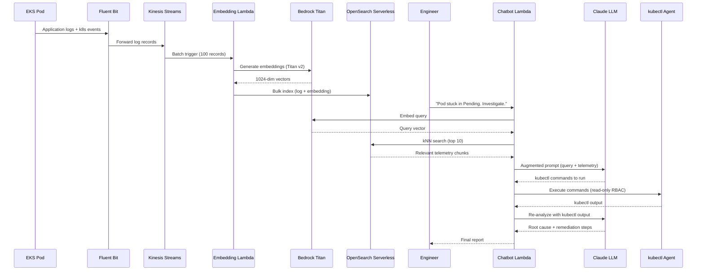
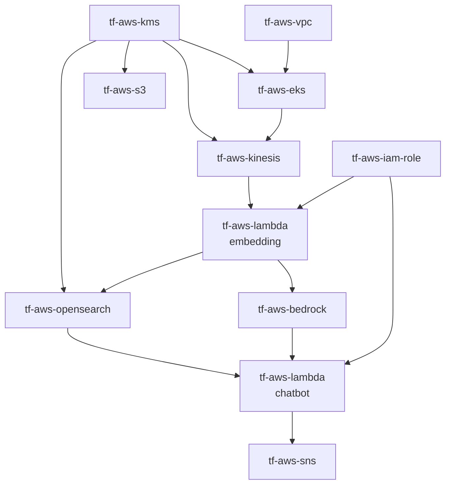

# EKS Conversational Observability -- AI-Powered Troubleshooting Assistant

## Overview

This Terraform solution implements an AI-powered EKS troubleshooting assistant based on the architecture described in the AWS blog post [Architecting Conversational Observability for Cloud Applications](https://aws.amazon.com/blogs/architecture/architecting-conversational-observability-for-cloud-applications/). It combines real-time telemetry ingestion from Amazon EKS with Retrieval-Augmented Generation (RAG) to give engineers a natural-language interface for diagnosing Kubernetes incidents.

The pipeline works by continuously streaming EKS pod logs and Kubernetes events through Fluent Bit into Kinesis Data Streams. An embedding Lambda normalises each record, calls Amazon Bedrock Titan Embed v2 to produce a 1024-dimensional semantic vector, and bulk-indexes the result into an OpenSearch Serverless VECTORSEARCH collection. When an engineer asks a question such as "My pod is stuck in Pending state, investigate", the chatbot Lambda embeds the query with the same model, performs a kNN search to retrieve the most semantically relevant telemetry chunks, then passes them along with the query to Claude as context, implementing the classic RAG pattern.

Claude analyses the retrieved telemetry and generates read-only `kubectl` commands. A lightweight troubleshooting agent running inside the EKS cluster (using the minimal RBAC in `k8s/rbac.yaml`) executes those commands and returns the output back to Claude for re-analysis. After up to three iterations Claude produces a final root cause summary and actionable remediation steps, significantly reducing mean time to resolution (MTTR) and enabling self-service troubleshooting without requiring senior engineers to manually grep through log streams.

---

## Architecture Diagram

```
+---------------------------------------------------------------------+
|                         AWS Region                                  |
|                                                                     |
|  +--------------------- VPC (private subnets) -------------------+ |
|  |                                                                | |
|  |  +------ EKS Cluster --------+                                | |
|  |  |                           |                                | |
|  |  |  Microservice Pods        |    +-- Embedding Lambda -----+ | |
|  |  |  (app logs, k8s events)   |    |                         | | |
|  |  |         |                 |    |  1. Decode Kinesis rec   | | |
|  |  |   Fluent Bit DaemonSet    |    |  2. Normalize telemetry | | |
|  |  |         |                 +--->|  3. Bedrock Titan Embed  | | |
|  |  |  CloudWatch Observability |    |  4. Bulk index OpenSearch| | |
|  |  |  Add-on (ADOT)            |    +-------------------------+ | |
|  |  +---------------------------+              |                  | |
|  |                                             v                  | |
|  |                                  +---------------------+       | |
|  |  Kinesis Data Streams <----------| OpenSearch Serverless|      | |
|  |  (telemetry buffer)              | VECTORSEARCH         |      | |
|  |         |                        | (1024-dim embeddings)|      | |
|  |         |                        +---------------------+       | |
|  |         |                                  ^                   | |
|  |         +-->  Embedding Lambda             |                   | |
|  |                                            |                   | |
|  +--------------------------------------------+-------------------+ |
|                                               |                     |
|  Engineer Query                               |                     |
|       |                                       |                     |
|       v                                       |                     |
|  +-- Chatbot Lambda (RAG) -------------------+                     |
|  |                                                                  |
|  |  1. Embed query (Bedrock Titan)                                  |
|  |  2. kNN search OpenSearch -> top-10 telemetry chunks            |
|  |  3. Augmented prompt -> Claude LLM                              |
|  |  4. Claude generates kubectl commands                           |
|  |  5. kubectl agent (read-only, in-cluster) executes              |
|  |  6. Claude iterates (max 3 cycles) -> root cause + fix          |
|  +------------------------------------------------------------------+
|                                                                     |
|  +----------+  +----------+  +----------+  +----------+            |
|  |  Bedrock |  |    KMS   |  |    S3    |  |    SNS   |            |
|  | guardrail|  | encrypt  |  | DLQ logs |  |  alarms  |            |
|  +----------+  +----------+  +----------+  +----------+            |
+---------------------------------------------------------------------+
```

---

## RAG Flow



---

## Module Dependency Graph



---

## Components

| Component | Module | Purpose |
|---|---|---|
| VPC | tf-aws-vpc | Multi-AZ private/public subnets with NAT Gateway and VPC Flow Logs |
| EKS | tf-aws-eks | Kubernetes cluster with IRSA, Fluent Bit via CloudWatch Observability add-on |
| Kinesis Data Streams | tf-aws-kinesis | High-throughput telemetry buffer from Fluent Bit, KMS-encrypted |
| OpenSearch Serverless | tf-aws-opensearch | VECTORSEARCH collection -- stores 1024-dim Titan embeddings |
| Embedding Lambda | tf-aws-lambda | Kinesis trigger: normalize telemetry, Bedrock Titan embed, OpenSearch bulk index |
| Chatbot Lambda | tf-aws-lambda | RAG: query embed -> OS kNN -> Claude LLM -> kubectl commands |
| Bedrock | tf-aws-bedrock | Titan Embed v2 (embeddings) + Claude 3 Sonnet (LLM) + guardrails |
| IAM | tf-aws-iam-role | Least-privilege execution roles for both Lambdas |
| KMS | tf-aws-kms | Encrypts Kinesis, OpenSearch, S3, Lambda environment variables |
| S3 | tf-aws-s3 | Dead-letter bucket for failed embedding records |
| SNS | tf-aws-sns | CloudWatch alarm notification topic |
| ECR | tf-aws-ecr | Container image repositories for Lambda functions (optional) |

---

## Deployment Steps

### Prerequisites

- AWS CLI configured with credentials that have permissions to create the resources above
- Terraform >= 1.3.0
- Python 3.12 (for building Lambda packages)
- `zip` utility available in your shell
- `kubectl` configured after cluster creation
- Bedrock model access enabled for `amazon.titan-embed-text-v2:0` and `anthropic.claude-3-sonnet-20240229-v1:0` in your AWS account and region

### Step 1 -- Package Lambda handlers

```bash
cd lambda_src && bash build.sh
```

This creates `embedding.zip` and `chatbot.zip` in the `lambda_src/` directory.

### Step 2 -- Initialise Terraform

```bash
terraform init
```

### Step 3 -- Plan

```bash
terraform plan \
  -var="name=myapp" \
  -var="environment=prod" \
  -var="alarm_email=oncall@example.com"
```

Review the plan output carefully. The first apply provisions ~14 modules and takes approximately 20-30 minutes (EKS cluster creation dominates).

### Step 4 -- Apply

```bash
terraform apply \
  -var="name=myapp" \
  -var="environment=prod" \
  -var="alarm_email=oncall@example.com"
```

### Step 5 -- Configure kubectl

Use the output from Terraform to update your kubeconfig:

```bash
$(terraform output -raw kubeconfig_command)
# e.g.: aws eks update-kubeconfig --name myapp-prod-eks --region us-east-1
kubectl get nodes
```

### Step 6 -- Deploy Fluent Bit

Get the Kinesis stream name from Terraform output and update the ConfigMap:

```bash
STREAM_NAME=$(terraform output -raw kinesis_stream_name)
REGION=$(terraform output -raw aws_region 2>/dev/null || echo "us-east-1")

sed -i "s/KINESIS_STREAM_NAME/${STREAM_NAME}/g" k8s/fluent-bit-configmap.yaml
sed -i "s/AWS_REGION/${REGION}/g" k8s/fluent-bit-configmap.yaml

kubectl apply -f k8s/fluent-bit-configmap.yaml
```

### Step 7 -- Apply RBAC for the troubleshooting agent

```bash
kubectl apply -f k8s/rbac.yaml
```

### Step 8 -- Create the OpenSearch kNN index

Retrieve the OpenSearch endpoint and create the index with kNN mapping:

```bash
OPENSEARCH_ENDPOINT=$(terraform output -raw opensearch_collection_endpoint)

curl -XPUT "${OPENSEARCH_ENDPOINT}/eks-telemetry" \
  --aws-sigv4 "aws:amz:${REGION}:aoss" \
  --user "${AWS_ACCESS_KEY_ID}:${AWS_SECRET_ACCESS_KEY}" \
  -H "Content-Type: application/json" \
  -d '{
    "settings": {
      "index": {
        "knn": true,
        "knn.algo_param.ef_search": 100
      }
    },
    "mappings": {
      "properties": {
        "embedding":  { "type": "knn_vector", "dimension": 1024 },
        "timestamp":  { "type": "date" },
        "log":        { "type": "text" },
        "namespace":  { "type": "keyword" },
        "pod":        { "type": "keyword" },
        "container":  { "type": "keyword" },
        "log_level":  { "type": "keyword" }
      }
    }
  }'
```

### Step 9 -- Test the chatbot

Invoke the chatbot Lambda directly:

```bash
aws lambda invoke \
  --function-name $(terraform output -raw chatbot_lambda_name) \
  --payload '{"query":"My pod is stuck in Pending state in namespace prod. Investigate."}' \
  --cli-binary-format raw-in-base64-out \
  response.json && cat response.json
```

---

## OpenSearch kNN Index Setup

The index must be created with kNN enabled before the embedding Lambda can index documents. The mapping below exactly matches the fields written by `embedding_handler.py`:

```bash
curl -XPUT "${OPENSEARCH_ENDPOINT}/eks-telemetry" \
  -H "Content-Type: application/json" \
  -d '{
    "settings": {
      "index": {
        "knn": true,
        "knn.algo_param.ef_search": 100
      }
    },
    "mappings": {
      "properties": {
        "embedding":  { "type": "knn_vector", "dimension": 1024 },
        "timestamp":  { "type": "date" },
        "log":        { "type": "text" },
        "namespace":  { "type": "keyword" },
        "pod":        { "type": "keyword" },
        "container":  { "type": "keyword" },
        "log_level":  { "type": "keyword" }
      }
    }
  }'
```

> Note: OpenSearch Serverless requires SigV4 authentication. The curl commands above use the `--aws-sigv4` flag (curl >= 7.75) or you can use the `awscurl` tool as an alternative.

---

## Security Considerations

- **Read-only kubectl commands**: Claude is instructed by the system prompt to generate only `get`, `describe`, `logs`, and `top` commands. The kubectl agent's RBAC ClusterRole grants only `get`, `list`, and `watch` verbs, enforcing this at the Kubernetes RBAC layer regardless of what the LLM produces.

- **Prompt injection protection**: The Bedrock guardrail `observability` blocks `PROMPT_ATTACK` content at `HIGH` strength on the input side. This prevents adversarial log content from hijacking the LLM's instructions.

- **OpenSearch Serverless access control**: The data access policy grants `aoss:APIAccessAll` only to the two Lambda execution role ARNs and the root account. No other principals can query or write to the collection.

- **IAM least-privilege**: The embedding Lambda role can only call `bedrock:InvokeModel` on the Titan Embed model ARN and `kinesis:Get*`/`Describe*`/`ListShards` on the specific stream. The chatbot Lambda role can only invoke the two specific model ARNs.

- **KMS encryption at rest**: When `enable_kms = true`, all data at rest is encrypted with a customer-managed KMS key: Kinesis stream, OpenSearch collection, S3 DLQ bucket, Lambda environment variables.

- **VPC isolation**: EKS nodes run in private subnets with no direct internet access. NAT Gateways provide egress. The EKS API server has `endpoint_public_access = false` by default.

- **OpenSearch Serverless VPC mode**: For production environments, set `network_access_type = "VPC"` in the `module "opensearch"` block and provide `vpc_subnet_ids` to restrict collection access to within your VPC.

- **Fluent Bit log sanitisation**: Sensitive data (PII, credentials, tokens) in pod logs is embedded into OpenSearch. Consider adding a Fluent Bit `lua` filter to redact sensitive patterns before forwarding to Kinesis.

---

## Cost Estimate

Estimated costs for a typical production deployment in us-east-1 at moderate log volume (~10M log lines/day):

| Resource | Estimated Cost |
|---|---|
| EKS Cluster control plane | $0.10/hr (~$73/month) |
| EC2 m5.xlarge x3 (worker nodes) | ~$0.57/hr (~$414/month) |
| Kinesis Data Streams (2 shards) | $0.015/hr (~$11/month) |
| OpenSearch Serverless (2 OCUs minimum) | ~$0.24/OCU/hr (~$350/month) |
| Bedrock Titan Embed v2 | $0.02 per 1M input tokens |
| Bedrock Claude 3 Sonnet | $0.003/1K input tokens, $0.015/1K output tokens |
| S3 DLQ bucket | < $1/month at low volume |
| Lambda (embedding + chatbot) | < $5/month at moderate volume |
| NAT Gateway | ~$0.045/hr + data processing |
| CloudWatch Logs + Alarms | ~$5-15/month |

> Tip: Set `opensearch_standby_replicas = "DISABLED"` and `single_nat_gateway = true` in dev/test environments to reduce OpenSearch cost by ~50% and NAT Gateway cost significantly.

---

## Inputs

| Name | Type | Default | Description |
|---|---|---|---|
| `name` | string | required | Base name for all resources |
| `environment` | string | `"dev"` | Deployment environment |
| `aws_region` | string | `"us-east-1"` | AWS region |
| `tags` | map(string) | `{}` | Additional tags merged onto all resources |
| `vpc_cidr` | string | `"10.0.0.0/16"` | VPC CIDR block |
| `availability_zones` | list(string) | `["us-east-1a","us-east-1b","us-east-1c"]` | AZs to deploy subnets into |
| `kubernetes_version` | string | `"1.30"` | EKS Kubernetes version |
| `node_instance_types` | list(string) | `["m5.xlarge"]` | EKS node instance types |
| `node_min_size` | number | `2` | Minimum node count |
| `node_max_size` | number | `8` | Maximum node count |
| `node_desired_size` | number | `3` | Desired node count |
| `kinesis_shard_count` | number | `2` | Kinesis shards (1MB/s each from Fluent Bit) |
| `kinesis_retention_hours` | number | `24` | Kinesis record retention hours |
| `opensearch_standby_replicas` | string | `"ENABLED"` | ENABLED (production) or DISABLED (dev/test) |
| `embedding_model_id` | string | `"amazon.titan-embed-text-v2:0"` | Bedrock embedding model ID |
| `llm_model_id` | string | `"anthropic.claude-3-sonnet-20240229-v1:0"` | Bedrock LLM model ID |
| `enable_bedrock_guardrail` | bool | `true` | Enable Bedrock guardrail for prompt injection protection |
| `embedding_lambda_memory_mb` | number | `512` | Embedding Lambda memory (MB) |
| `chatbot_lambda_memory_mb` | number | `1024` | Chatbot Lambda memory (MB) |
| `embedding_lambda_timeout` | number | `300` | Embedding Lambda timeout (seconds) |
| `chatbot_lambda_timeout` | number | `300` | Chatbot Lambda timeout (seconds) |
| `kinesis_batch_size` | number | `100` | Records per Lambda invocation from Kinesis |
| `alarm_email` | string | `null` | Email for CloudWatch alarm notifications |
| `log_retention_days` | number | `30` | CloudWatch log retention days |
| `telemetry_index_name` | string | `"eks-telemetry"` | OpenSearch index name for telemetry embeddings |
| `vector_dimensions` | number | `1024` | Embedding vector dimensions (must match model) |
| `enable_kms` | bool | `true` | Enable KMS encryption for all pipeline resources |

---

## Outputs

| Name | Description |
|---|---|
| `vpc_id` | ID of the VPC |
| `private_subnet_ids` | List of private subnet IDs |
| `public_subnet_ids` | List of public subnet IDs |
| `eks_cluster_name` | EKS cluster name |
| `eks_cluster_arn` | EKS cluster ARN |
| `eks_cluster_endpoint` | Kubernetes API server endpoint |
| `eks_oidc_provider_arn` | OIDC provider ARN for IRSA |
| `kubeconfig_command` | AWS CLI command to update local kubeconfig |
| `kinesis_stream_name` | Kinesis stream name (use in Fluent Bit config) |
| `kinesis_stream_arn` | Kinesis stream ARN |
| `opensearch_collection_endpoint` | OpenSearch Serverless collection endpoint |
| `opensearch_collection_arn` | OpenSearch collection ARN |
| `opensearch_collection_id` | OpenSearch collection ID |
| `opensearch_index_name` | Index name for telemetry embeddings |
| `opensearch_dashboard_endpoint` | OpenSearch Dashboards URL |
| `embedding_lambda_name` | Embedding Lambda function name |
| `embedding_lambda_arn` | Embedding Lambda ARN |
| `chatbot_lambda_name` | Chatbot Lambda function name |
| `chatbot_lambda_arn` | Chatbot Lambda ARN |
| `chatbot_lambda_function_url` | Chatbot Lambda HTTPS function URL |
| `bedrock_guardrail_id` | Bedrock guardrail ID |
| `bedrock_guardrail_arn` | Bedrock guardrail ARN |
| `embedding_lambda_role_arn` | IAM role ARN for embedding Lambda |
| `chatbot_lambda_role_arn` | IAM role ARN for chatbot Lambda |
| `kms_key_arn` | KMS key ARN (null when enable_kms = false) |
| `dlq_bucket_name` | S3 DLQ bucket name |
| `dlq_bucket_arn` | S3 DLQ bucket ARN |
| `alerts_sns_topic_arn` | SNS topic ARN for CloudWatch alarms |
| `ecr_embedding_repository_url` | ECR repository URL for embedding Lambda |
| `ecr_chatbot_repository_url` | ECR repository URL for chatbot Lambda |
| `fluent_bit_config_hint` | Fluent Bit OUTPUT block snippet |
| `chatbot_invoke_example` | Example AWS CLI command to invoke the chatbot |

---

## Clean Up

To destroy all resources created by this solution:

```bash
terraform destroy \
  -var="name=myapp" \
  -var="environment=prod"
```

> Warning: This will permanently delete the EKS cluster, OpenSearch collection (and all indexed telemetry), Kinesis stream, and all associated resources. Ensure you have exported any data you need before running destroy. The S3 DLQ bucket has `force_destroy = true` so it will be emptied and deleted automatically.
