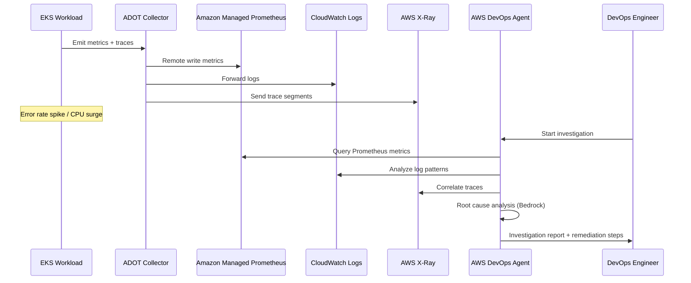
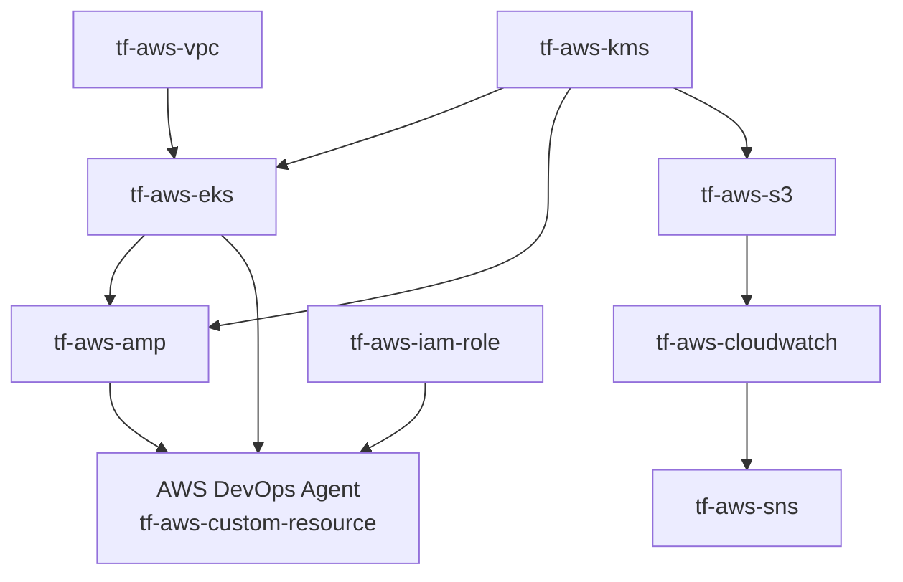

# EKS AI-Powered Incident Response with AWS DevOps Agent

[](https://www.terraform.io)
[](https://registry.terraform.io/providers/hashicorp/aws/latest)
[](LICENSE)

---

## Overview

This Terraform solution provisions a production-ready AWS EKS observability stack
integrated with AWS DevOps Agent for AI-powered incident investigation and response.
It is inspired by the AWS architecture blog post
[AI-Powered Event Response for Amazon EKS](https://aws.amazon.com/blogs/architecture/ai-powered-event-response-for-amazon-eks/)
and translates the reference architecture into fully reusable Terraform modules.

The solution collects metrics via the AWS Distro for OpenTelemetry (ADOT) EKS add-on,
stores them in Amazon Managed Prometheus (AMP), ships logs and Container Insights data
to CloudWatch, and captures distributed traces with AWS X-Ray. All observability signals
are connected to an AWS DevOps Agent Space powered by Amazon Bedrock, enabling on-demand
root cause analysis, incident investigation, and prevention recommendations — without
leaving the AWS console.

A CloudFormation Custom Resource pattern bridges the gap between Terraform and the
AWS DevOps Agent API (which has no native Terraform provider support). A Python Lambda
function manages the Agent Space lifecycle (Create / Update / Delete) and signals
CloudFormation on completion, giving Terraform full lifecycle control over the resource.

---

## Architecture Diagram

```
+------------------------------------------------------------------+
|                        AWS Region                                |
|                                                                  |
|  +--------------------------- VPC ----------------------------+  |
|  |                                                            |  |
|  |  +--- Private Subnets (AZ-a, AZ-b, AZ-c) --------------+ |  |
|  |  |                                                       | |  |
|  |  |  +------------------+   +------------------------+   | |  |
|  |  |  |   EKS Cluster    |   |  EKS Managed           |   | |  |
|  |  |  |                  |   |  Node Group            |   | |  |
|  |  |  |  Add-ons:        |   |  (m5.xlarge x3)        |   | |  |
|  |  |  |  - ADOT          |   +------------------------+   | |  |
|  |  |  |  - X-Ray Daemon  |                               | |  |
|  |  |  |  - Container     |                               | |  |
|  |  |  |    Insights      |                               | |  |
|  |  |  +------------------+                               | |  |
|  |  +-------------------------------------------------------+ |  |
|  |                                                            |  |
|  |  +--- Public Subnets ------------------------------------+ |  |
|  |  |  NAT Gateway / Internet Gateway                       | |  |
|  |  +-------------------------------------------------------+ |  |
|  +------------------------------------------------------------+  |
|                                                                  |
|  +----------------+  +------------------+  +----------------+   |
|  | Amazon Managed |  | CloudWatch Logs  |  |  AWS X-Ray     |   |
|  | Prometheus     |  | + Container      |  |  Traces        |   |
|  | (AMP)          |  |   Insights       |  |                |   |
|  |                |  |                  |  |                |   |
|  | Managed        |  | EKS Control      |  | Service Map    |   |
|  | Scraper <------+--+ Plane Logs       |  | + Latency      |   |
|  | (auto-scrapes  |  | Pod/Node Metrics |  |                |   |
|  |  EKS pods)     |  |                  |  |                |   |
|  +----------------+  +------------------+  +----------------+   |
|                                                                  |
|  +-------- AWS DevOps Agent (Bedrock-powered) ---------------+  |
|  |                                                            |  |
|  |  Agent Space                                              |  |
|  |  +------------------------------------------------------+ |  |
|  |  | Data Sources:                                        | |  |
|  |  |  - AMP Workspace  (Prometheus metrics)               | |  |
|  |  |  - CloudWatch     (logs + Container Insights)        | |  |
|  |  |  - X-Ray          (distributed traces)               | |  |
|  |  |  - EKS Cluster    (topology + resource discovery)    | |  |
|  |  +------------------------------------------------------+ |  |
|  |                                                            |  |
|  |  Capabilities:                                            |  |
|  |   Root Cause Analysis  |  Incident Investigation          |  |
|  |   Prevention Insights  |  Topology Discovery              |  |
|  +------------------------------------------------------------+  |
|                                                                  |
|  +-----------+   +----------+   +------------+   +-----------+  |
|  |    KMS    |   |    S3    |   |    SNS     |   |    IAM    |  |
|  |  (encrypt)|   | (logs)   |   | (alerts)   |   |  (IRSA)   |  |
|  +-----------+   +----------+   +------------+   +-----------+  |
+------------------------------------------------------------------+
```

---

## Event Investigation Flow



---

## Terraform Module Dependency Graph



---

## Components

| Component | Module | Purpose |
|---|---|---|
| VPC | tf-aws-vpc | Multi-AZ VPC with private/public subnets, NAT Gateway |
| EKS Cluster | tf-aws-eks | Kubernetes 1.30, managed node group |
| ADOT Add-on | aws_eks_addon | OpenTelemetry collector — scrapes pods, forwards to AMP + CW + X-Ray |
| X-Ray Add-on | aws_eks_addon | Distributed tracing daemon on every node |
| AMP Workspace | tf-aws-amp | Stores all Prometheus metrics from EKS |
| AMP Managed Scraper | tf-aws-amp | Auto-pulls metrics from EKS without Prometheus sidecar |
| AMP IRSA Role | tf-aws-amp | Kubernetes service account -> remote_write to AMP |
| CloudWatch Logs | tf-aws-cloudwatch | EKS control plane logs + Container Insights |
| SNS | tf-aws-sns | Alarm notifications |
| KMS | tf-aws-kms | Encrypts EKS, AMP, S3, CloudWatch |
| S3 | tf-aws-s3 | Stores logs and artifacts |
| AWS DevOps Agent | tf-aws-custom-resource | AI-powered incident investigation (no native TF support -- uses CloudFormation Custom Resource pattern) |

---

## Prerequisites

- **AWS Account** with AWS DevOps Agent access enabled in your region
- **Terraform >= 1.3.0**
- **AWS CLI** configured with credentials that have sufficient permissions
- **kubectl** installed for interacting with the cluster post-deployment
- **Package the Lambda handler** before running `terraform apply`:

```bash
cd lambda_src && bash build.sh
```

---

## Deployment Steps

### Step 1: Package the Lambda handler

The DevOps Agent custom resource Lambda must be zipped before Terraform can upload it.

```bash
cd lambda_src && bash build.sh
```

### Step 2: Initialize and plan

```bash
terraform init
terraform plan \
  -var="name=myapp" \
  -var="environment=prod" \
  -var="alarm_email=ops@example.com"
```

### Step 3: Apply

```bash
terraform apply \
  -var="name=myapp" \
  -var="environment=prod"
```

Terraform will provision all resources in dependency order. The DevOps Agent
CloudFormation stack is the last resource to complete and typically takes 3-5 minutes.

### Step 4: Configure kubectl

```bash
aws eks update-kubeconfig --region us-east-1 --name <eks_cluster_name output>
```

### Step 5: Open DevOps Agent Console

Copy the `devops_agent_console_url` output and open it in your browser to view the
provisioned Agent Space and begin incident investigations.

### Step 6: Run a test investigation

```bash
# Install a sample observability workload
kubectl apply -f https://raw.githubusercontent.com/aws-samples/sample-eks-containers-observability/main/k8s/sample-app.yaml

# Generate load with errors to trigger alerts
python traffic-generator.py --app all --duration 300 --rps 20 --error-rate 0.1

# Open the DevOps Agent console and start a new investigation
# The agent will query AMP, CloudWatch, and X-Ray to identify the root cause.
```

---

## Post-Deployment Architecture Verification

```bash
# Verify EKS add-ons are active
kubectl get pods -n opentelemetry-operator-system
kubectl get pods -n amazon-cloudwatch

# Verify AMP is receiving metrics (requires awscurl or Sigv4 signing)
aws amp query-metrics \
  --workspace-id <amp_workspace_id> \
  --query-string 'up' \
  --start-time $(date -d '5 minutes ago' --iso-8601=seconds) \
  --end-time $(date --iso-8601=seconds) \
  --step 30

# Check DevOps Agent Space
aws devops-agent get-agent-space --agent-space-id <devops_agent_space_id>
```

---

## Inputs

| Name | Type | Default | Description |
|---|---|---|---|
| name | string | (required) | Base name used for all resources in this solution |
| environment | string | "dev" | Deployment environment (dev, staging, prod) |
| aws_region | string | "us-east-1" | AWS region to deploy the solution into |
| tags | map(string) | {} | Additional tags merged onto every resource |
| vpc_cidr | string | "10.0.0.0/16" | IPv4 CIDR block for the VPC |
| availability_zones | list(string) | ["us-east-1a","us-east-1b","us-east-1c"] | List of AZs to deploy subnets into |
| kubernetes_version | string | "1.30" | Kubernetes version for the EKS cluster |
| node_instance_types | list(string) | ["m5.xlarge"] | EC2 instance types for the managed node group |
| node_min_size | number | 2 | Minimum number of nodes in the managed node group |
| node_max_size | number | 10 | Maximum number of nodes in the managed node group |
| node_desired_size | number | 3 | Desired number of nodes in the managed node group |
| enable_adot_addon | bool | true | Install ADOT EKS add-on for metrics and traces collection |
| enable_xray_addon | bool | true | Install AWS X-Ray daemon EKS add-on for distributed tracing |
| enable_container_insights | bool | true | Enable CloudWatch Container Insights for EKS pod/node metrics |
| enable_managed_scraper | bool | true | Create AMP managed scraper that auto-pulls metrics from EKS |
| enable_alert_manager | bool | false | Enable the AMP Alert Manager |
| alarm_email | string | null | Email address for CloudWatch alarm notifications |
| log_retention_days | number | 30 | CloudWatch log retention in days |
| enable_devops_agent | bool | true | Provision AWS DevOps Agent Space via CloudFormation Custom Resource |
| enable_kms | bool | true | Create customer-managed KMS key to encrypt EKS, AMP, S3, and CloudWatch |

---

## Outputs

| Name | Description |
|---|---|
| vpc_id | ID of the VPC |
| private_subnet_ids | Map of AZ => private subnet ID |
| public_subnet_ids | Map of AZ => public subnet ID |
| eks_cluster_name | Name of the EKS cluster |
| eks_cluster_endpoint | API server endpoint of the EKS cluster |
| eks_cluster_arn | ARN of the EKS cluster |
| eks_cluster_version | Kubernetes version running on the cluster |
| kubeconfig_command | AWS CLI command to update the local kubeconfig |
| amp_workspace_id | ID of the AMP workspace |
| amp_workspace_arn | ARN of the AMP workspace |
| amp_remote_write_url | Remote write URL for Prometheus / ADOT configuration |
| amp_query_url | Query URL for Grafana or other visualization tools |
| amp_irsa_role_arn | ARN of the IRSA role for in-cluster remote_write to AMP |
| cloudwatch_log_group | CloudWatch log group name for AMP |
| kms_key_arn | ARN of the customer-managed KMS key (null if enable_kms = false) |
| devops_agent_space_id | ID of the AWS DevOps Agent Space (null if enable_devops_agent = false) |
| devops_agent_console_url | URL to the AWS DevOps Agent console for the target region |

---

## How the Custom Resource Pattern Works

AWS DevOps Agent does not have a native Terraform resource or AWS CloudFormation
resource type. To manage it from Terraform, this solution uses the
**CloudFormation Custom Resource** pattern implemented by the `tf-aws-custom-resource`
module:

```
Terraform apply
    |
    v
aws_cloudformation_stack  (Terraform resource)
    |
    v
CloudFormation Custom Resource  (type: Custom::DevOpsAgentSpace)
    |
    v
AWS Lambda function  (handler.py)
    |
    v
boto3  -->  AWS DevOps Agent API
                |
                +-- create_agent_space()
                +-- associate_data_source()  (AMP workspace)
                +-- associate_data_source()  (EKS cluster)
    |
    v
_cfn_send()  -- signals CloudFormation with SUCCESS or FAILED
    |
    v
CloudFormation updates stack status
    |
    v
Terraform reads stack outputs (AgentSpaceId)
```

**Lifecycle events:**

- **Create**: Lambda calls `create_agent_space`, polls until ACTIVE, then calls
  `associate_data_source` for each connected data source. Signals SUCCESS with
  the `AgentSpaceId` in the response Data map.
- **Update**: Agent Space name and ARN associations are immutable. Lambda signals
  SUCCESS immediately without making any API calls.
- **Delete**: Lambda calls `delete_agent_space`. If the resource is already gone
  (ResourceNotFoundException), the deletion is treated as a no-op and SUCCESS is
  signaled to allow stack cleanup to proceed.

If the Lambda raises an unhandled exception, `_cfn_send` signals FAILED, which
causes the CloudFormation stack to roll back and surface the error in Terraform's
output.

---

## Cost Estimate

The following costs are approximate and based on us-east-1 pricing as of 2026.
Actual costs depend on usage patterns.

| Resource | Approx Cost |
|---|---|
| EKS Cluster | $0.10/hr |
| EC2 m5.xlarge x3 | ~$0.57/hr |
| AMP | $0.90/million samples ingested |
| AMP Managed Scraper | ~$0.01/hr |
| AWS DevOps Agent | See AWS pricing page |
| NAT Gateway | $0.045/hr |
| CloudWatch Logs | $0.50/GB ingested |
| S3 (log storage) | $0.023/GB/month |
| KMS | $1.00/key/month + $0.03/10k API calls |

Total estimated baseline (cluster idle): ~$0.70/hr (~$500/month)

---

## Clean Up

To destroy all resources provisioned by this solution:

```bash
terraform destroy
```

The DevOps Agent Space will be deleted first (via the custom resource Lambda),
followed by AMP, EKS, VPC, S3, and KMS resources in reverse dependency order.

> **Note**: The S3 log bucket has `force_destroy = true` so Terraform can delete
> it even when it contains objects. Remove or change this setting before deploying
> to production if you need to retain logs after a destroy.
