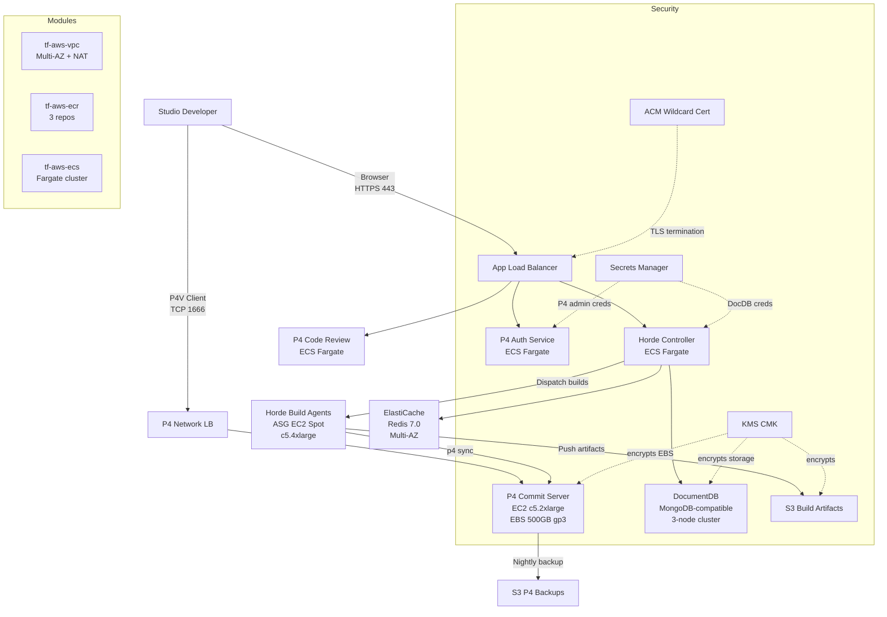

# Game Development Pipeline — Perforce + Unreal Horde on AWS

## Overview

Independent and mid-size game studios face a common infrastructure challenge: they need the same enterprise-grade version control and continuous integration tooling that AAA studios rely on, but without a dedicated platform engineering team to build and maintain it. Perforce Helix Core (P4) is the industry-standard version control system for game development — it handles binary assets like meshes, textures, and audio files that Git cannot manage efficiently. Unreal Engine Horde is Epic Games' purpose-built CI/CD system that natively understands Unreal Engine build graphs, test runs, and shader compilation. Setting up either system correctly on AWS requires deep knowledge of networking, EC2 sizing, IAM, and service integration.

This Terraform solution provisions a complete, production-ready game development infrastructure in a single `terraform apply`. It deploys Perforce P4 on an EC2 instance with a dedicated EBS data volume, exposes it externally via a Network Load Balancer on TCP/1666, and runs the P4 Auth and P4 Code Review web services in ECS Fargate containers. The Horde Controller runs as a Fargate service backed by DocumentDB (MongoDB-compatible) for job storage and ElastiCache Redis for session caching. All infrastructure runs in a purpose-built Multi-AZ VPC with private subnets for workloads and public subnets for load balancers.

The build agent fleet is the most cost-sensitive component: Horde build agents are EC2 instances that compile Unreal Engine projects in parallel. This solution deploys them as a Windows Server 2022 Auto Scaling Group using EC2 Spot Instances, which can reduce build agent costs by up to 90% versus On-Demand pricing. The ASG scales on CPU utilization and supports instance type diversification across the c5, c5a, c5n, and m5 families to maximize Spot availability. Agents auto-register with the Horde Controller on boot and pick up build jobs immediately, enabling fully elastic build capacity that scales to zero when no builds are running.

## Architecture Diagram

```
Internet
    |
Route 53 (*.games.example.com)
    |
    +-----------------------------------+
    |                                   |
    v                                   v
P4 NLB (TCP:1666)              App ALB (HTTPS:443)
    |                                   |
    v                    +--------------+---------------+
P4 Commit Server         |              |               |
(EC2 c5.2xlarge)      P4 Auth      P4 Code         Horde
(EBS 500GB gp3)       Service       Review          Server
                       (ECS)        (ECS)           (ECS)
                                                       |
                                      +--------+-------+
                                      |                |
                                 DocumentDB      ElastiCache
                                 (Horde DB)     (Redis cache)
                                 3-node          2-node
                                      |
                                      v
                              Horde Build Agents
                           (EC2 ASG c5.4xlarge, Spot)
                               min:1  max:10
                                      |
                                      v
                            S3 Build Artifacts
```



## Module Dependency Table

| Module | Resource | Purpose |
|---|---|---|
| tf-aws-vpc | VPC, subnets, NAT Gateways | Multi-AZ network foundation with public/private subnets |
| tf-aws-route53 | DNS A alias records | horde.domain + p4.domain + p4auth.domain + review.domain |
| tf-aws-acm | ACM wildcard certificate | *.domain TLS for all HTTPS services |
| tf-aws-kms | Customer-managed KMS key | Encrypts EBS, S3, DocumentDB, ElastiCache, Secrets Manager |
| tf-aws-s3 | 2 S3 buckets | Build artifacts (lifecycle to Glacier) + P4 depot backups |
| tf-aws-ecr | 3 ECR repositories | P4 Auth, P4 Code Review, and Horde Server container images |
| tf-aws-secretsmanager | 2 secrets | P4 admin credentials + Horde integration credentials |
| tf-aws-ec2 | P4 Commit Server | EC2 c5.2xlarge running P4D on Amazon Linux 2023 |
| tf-aws-ebs | P4 depot data volume | 500GB gp3 EBS with DLM automated snapshots |
| tf-aws-alb | NLB + ALB | P4 TCP:1666 (NLB) + HTTPS web services (ALB) |
| tf-aws-ecs | ECS Fargate cluster | Hosts P4 Auth, P4 Code Review, and Horde Controller services |
| tf-aws-documentdb | DocumentDB 3-node cluster | Horde job queue, agent registration, and test result storage |
| tf-aws-elasticache | Redis 7.0 replication group | Horde session cache and distributed job locking |
| tf-aws-asg | Horde build agent ASG | Auto-scaling Windows Spot fleet for Unreal Engine compilation |
| tf-aws-iam-role | 4 IAM roles | Least-privilege roles for P4 EC2, ECS execution, ECS tasks, and Horde agents |

## Prerequisites

Before deploying, ensure you have:

- **AWS account** with permissions to create VPCs, EC2, ECS, RDS, ElastiCache, S3, KMS, IAM roles, Route 53 records, and ACM certificates.

- **Route 53 hosted zone** for your domain. Retrieve the zone ID with:
  ```bash
  aws route53 list-hosted-zones --query "HostedZones[?Name=='games.example.com.'].Id" --output text
  ```

- **Unreal Engine Horde container image** built from Epic Games source code. Horde is distributed as source via the Epic Games GitHub organization (requires UE license agreement). Build the Docker image and push it to the ECR repository after `terraform apply`. See the [Horde documentation](https://dev.epicgames.com/documentation/en-us/unreal-engine/horde-in-unreal-engine) for build instructions.

- **Perforce container images** for P4 Auth Service and Helix ALM Code Review. Pull from the official Perforce Docker Hub registry:
  ```bash
  docker pull perforce/helix-auth-svc:latest
  docker pull perforce/helix-swarm:latest
  ```

- **Terraform >= 1.3.0** and the AWS CLI configured with your credentials.

## Deployment Steps

1. **Clone and navigate:**
   ```bash
   cd solutions/game-dev-pipeline
   ```

2. **Create your tfvars file:**
   ```bash
   cp example.tfvars terraform.tfvars
   # Edit terraform.tfvars with your domain, zone ID, and email
   ```

3. **Initialize Terraform:**
   ```bash
   terraform init
   ```

4. **Review the plan:**
   ```bash
   terraform plan -var-file=terraform.tfvars
   ```
   Review the plan output carefully — approximately 60-80 resources will be created.

5. **Apply the configuration:**
   ```bash
   terraform apply -var-file=terraform.tfvars
   ```
   Deployment takes approximately 20-30 minutes. DocumentDB cluster creation is the longest step (~15 minutes).

6. **Retrieve the P4 connection string:**
   ```bash
   terraform output p4_connection_string
   # Output: ssl:p4.games.example.com:1666
   ```

7. **Connect P4V clients** to the P4 server using the connection string. Accept the SSL certificate fingerprint on first connection.

8. **Push container images to ECR:**
   ```bash
   # Log in to ECR
   $(terraform output -raw ecr_login_command)

   # P4 Auth Service
   docker pull perforce/helix-auth-svc:latest
   docker tag perforce/helix-auth-svc:latest $(terraform output -raw ecr_p4_auth_url):latest
   docker push $(terraform output -raw ecr_p4_auth_url):latest

   # Horde Server (build from Epic source first)
   docker tag your-horde-image:latest $(terraform output -raw ecr_horde_url):latest
   docker push $(terraform output -raw ecr_horde_url):latest
   ```

9. **Force ECS service deployment** to pull the new images:
   ```bash
   aws ecs update-service \
     --cluster <prefix>-gamedev \
     --service horde-service \
     --force-new-deployment
   ```

10. **Access Horde:**
    ```bash
    terraform output horde_url
    # Open https://horde.games.example.com in your browser
    ```
    Horde agents auto-register with the controller once the ASG instances boot (~5-10 minutes on Windows).

## Post-Deployment Configuration

### Perforce P4 — First Steps

1. **Change the admin password immediately.** The initial password is stored in Secrets Manager:
   ```bash
   aws secretsmanager get-secret-value \
     --secret-id $(terraform output -raw p4_admin_secret_arn) \
     --query SecretString --output text | python3 -m json.tool
   ```

2. **Create your first depot:**
   ```bash
   p4 -p ssl:p4.games.example.com:1666 -u admin depot -t stream //GameProject
   ```

3. **Create streams** for your mainline and development branches:
   ```bash
   p4 stream -t mainline //GameProject/main
   p4 stream -t development //GameProject/dev
   ```

### Horde — Connect to Perforce

1. In the Horde web UI, navigate to **Server Settings > Perforce Connections**.
2. Add a new connection with:
   - **Server**: `ssl:p4.games.example.com:1666`
   - **Username**: `horde-svc` (create a dedicated service user in P4)
   - **Password**: from Secrets Manager
3. Create a **Stream** configuration pointing to `//GameProject/main`.

### Horde — Configure Unreal Engine Build Jobs

1. Create a `Horde.yaml` file in your Unreal project's root directory.
2. Define build graphs for compilation, cooking, and packaging:
   ```yaml
   # Horde.yaml — Unreal Engine 5 build configuration
   include:
     - path: Engine/Build/Horde/Horde.yaml  # Built-in UE5 graphs
   agents:
     - pool: windows-build
       properties:
         OSFamily: Windows
   ```
3. Commit the file to Perforce — Horde will detect it and create build jobs automatically.

### Unreal Build Accelerator (UBA)

Horde 5.x includes Unreal Build Accelerator, which distributes C++ compilation across all available agents. Enable it by setting `bAllowUBALocalExecutor=true` in your `BuildConfiguration.xml` and configuring the UBA coordinator endpoint in Horde Server Settings.

## Cost Estimate

All prices are approximate us-east-1 On-Demand rates as of 2026. Actual costs vary by usage.

| Component | Size | Estimated Cost |
|---|---|---|
| P4 Commit Server | c5.2xlarge (On-Demand) | ~$0.34/hr (~$246/month) |
| P4 EBS Data Volume | 500 GB gp3 + 3000 IOPS | ~$40/month |
| EBS Snapshots (DLM) | 7 daily snapshots | ~$2.50/month per snapshot set |
| ECS Fargate — P4 Auth | 0.5 vCPU / 1 GB | ~$0.01/hr |
| ECS Fargate — P4 Code Review | 1 vCPU / 2 GB | ~$0.02/hr |
| ECS Fargate — Horde Controller | 2 vCPU / 4 GB | ~$0.09/hr |
| DocumentDB | 3x db.r6g.large | ~$0.48/hr (~$350/month) |
| ElastiCache Redis | 2x cache.r6g.large | ~$0.26/hr (~$190/month) |
| Horde Build Agents (Spot) | 2x c5.4xlarge Spot | ~$0.16/hr (vs $0.68/hr On-Demand) |
| Horde Build Agents (On-Demand) | 2x c5.4xlarge | ~$0.68/hr |
| NAT Gateway | 3x AZs | ~$0.135/hr + $0.045/GB |
| App ALB | 1 ALB | ~$0.008/hr + LCU charges |
| P4 NLB | 1 NLB | ~$0.008/hr + NLCU charges |
| S3 Storage | Build artifacts + backups | ~$0.023/GB/month |
| Route 53 | 4 alias records | ~$0.50/month per hosted zone |

**Estimated total for dev environment (minimal load):** ~$900-1,100/month
**Cost optimization tips:**
- Set `single_nat_gateway = true` in the VPC module for dev (saves ~$0.27/hr)
- Reduce `docdb_cluster_size` to `1` for dev (saves ~$0.32/hr)
- Set `redis_num_cache_nodes` to `1` for dev (saves ~$0.13/hr)
- Use Horde agent scheduled scaling to scale to `min_size=0` outside business hours

## Inputs

| Name | Type | Default | Description |
|---|---|---|---|
| `name` | string | — | Base name for all resources, e.g. `anycompany-games` |
| `environment` | string | `"dev"` | Deployment environment (dev, staging, prod) |
| `aws_region` | string | `"us-east-1"` | AWS region to deploy into |
| `tags` | map(string) | `{}` | Additional tags merged onto all resources |
| `domain_name` | string | — | Base domain name, e.g. `games.example.com` |
| `route53_zone_id` | string | — | Existing Route 53 hosted zone ID |
| `vpc_cidr` | string | `"10.0.0.0/16"` | IPv4 CIDR block for the VPC |
| `availability_zones` | list(string) | `["us-east-1a","us-east-1b","us-east-1c"]` | AZs for subnet deployment |
| `p4_instance_type` | string | `"c5.2xlarge"` | EC2 instance type for P4 Commit Server |
| `p4_data_volume_size_gb` | number | `500` | EBS volume size in GB for P4 depot data |
| `p4_data_volume_type` | string | `"gp3"` | EBS volume type for P4 depot |
| `p4_data_volume_iops` | number | `3000` | Provisioned IOPS for P4 data volume |
| `p4_admin_email` | string | — | Email address for the Perforce admin user |
| `horde_instance_type` | string | `"c5.2xlarge"` | ECS task type for Horde Controller |
| `horde_agent_instance_type` | string | `"c5.4xlarge"` | EC2 type for Horde build agents |
| `horde_agent_min_size` | number | `1` | Minimum Horde agent ASG instances |
| `horde_agent_max_size` | number | `10` | Maximum Horde agent ASG instances |
| `horde_agent_desired` | number | `2` | Desired Horde agent ASG instances |
| `horde_use_spot` | bool | `true` | Use EC2 Spot for Horde build agents |
| `horde_spot_max_price` | string | `null` | Max Spot price per hour (null = On-Demand cap) |
| `docdb_instance_class` | string | `"db.r6g.large"` | DocumentDB instance class |
| `docdb_cluster_size` | number | `3` | DocumentDB cluster instances (1 primary + readers) |
| `redis_node_type` | string | `"cache.r6g.large"` | ElastiCache Redis node type |
| `redis_num_cache_nodes` | number | `2` | Redis replication group nodes |
| `enable_kms` | bool | `true` | Create customer-managed KMS key |
| `p4_allowed_cidrs` | list(string) | `["0.0.0.0/0"]` | CIDRs allowed to reach Perforce TCP/1666 |
| `horde_allowed_cidrs` | list(string) | `["0.0.0.0/0"]` | CIDRs allowed to access Horde web UI |

## Outputs

| Name | Description |
|---|---|
| `p4_server_private_ip` | Private IP of the P4 Commit Server EC2 instance |
| `p4_connection_string` | Perforce connection string for P4V clients |
| `p4_nlb_dns_name` | NLB DNS name for direct TCP/1666 access |
| `p4_admin_secret_arn` | Secrets Manager ARN with P4 admin credentials |
| `horde_url` | Horde web UI URL (HTTPS) |
| `horde_alb_dns_name` | ALB DNS name for Horde and P4 web services |
| `horde_docdb_secret_arn` | Secrets Manager ARN with DocumentDB credentials |
| `horde_redis_endpoint` | ElastiCache Redis primary endpoint address |
| `horde_agent_asg_name` | ASG name for Horde build agents |
| `ecr_p4_auth_url` | ECR URL for P4 Auth Service image |
| `ecr_p4_code_review_url` | ECR URL for P4 Code Review image |
| `ecr_horde_url` | ECR URL for Horde Server image |
| `vpc_id` | VPC ID |
| `private_subnet_ids` | List of private subnet IDs |
| `public_subnet_ids` | List of public subnet IDs |
| `kms_key_arn` | Customer-managed KMS key ARN |
| `ecr_login_command` | Docker ECR authentication command |
| `docdb_connection_string` | DocumentDB MongoDB connection string (no password) |

## example.tfvars

```hcl
# =============================================================================
# Game Development Pipeline — example.tfvars
# Copy to terraform.tfvars and fill in your values before deploying.
# =============================================================================

# ── Core ─────────────────────────────────────────────────────────────────────
name        = "anycompany-games"
environment = "dev"
aws_region  = "us-east-1"

tags = {
  Team       = "platform"
  CostCenter = "gamedev-infrastructure"
  Project    = "ue5-title"
}

# ── Domain ───────────────────────────────────────────────────────────────────
# Your Route 53 hosted zone must already exist.
# Get zone ID: aws route53 list-hosted-zones
domain_name     = "games.example.com"
route53_zone_id = "Z1234567890ABCDEFGHIJ"

# ── Network ──────────────────────────────────────────────────────────────────
vpc_cidr           = "10.0.0.0/16"
availability_zones = ["us-east-1a", "us-east-1b", "us-east-1c"]

# ── Perforce ─────────────────────────────────────────────────────────────────
p4_instance_type       = "c5.2xlarge"
p4_data_volume_size_gb = 500
p4_data_volume_type    = "gp3"
p4_data_volume_iops    = 3000
p4_admin_email         = "p4admin@example.com"

# Restrict to studio office and VPN CIDRs in production
p4_allowed_cidrs = ["0.0.0.0/0"]

# ── Horde ────────────────────────────────────────────────────────────────────
horde_instance_type       = "c5.2xlarge"
horde_agent_instance_type = "c5.4xlarge"
horde_agent_min_size      = 1
horde_agent_max_size      = 10
horde_agent_desired       = 2
horde_use_spot            = true
horde_spot_max_price      = null  # Cap at On-Demand price

# Restrict to studio network in production
horde_allowed_cidrs = ["0.0.0.0/0"]

# ── DocumentDB ───────────────────────────────────────────────────────────────
docdb_instance_class = "db.r6g.large"
docdb_cluster_size   = 3  # Use 1 for dev to save cost

# ── ElastiCache ──────────────────────────────────────────────────────────────
redis_node_type       = "cache.r6g.large"
redis_num_cache_nodes = 2  # Use 1 for dev to save cost

# ── Security ─────────────────────────────────────────────────────────────────
enable_kms = true
```
