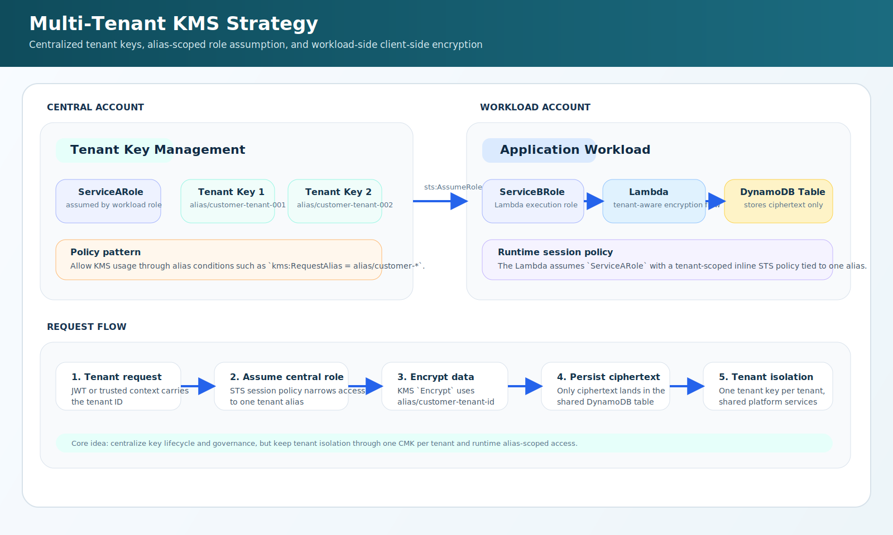

# Multi-Tenant KMS Strategy

Composable Terraform solution for the AWS pattern described in the AWS Architecture Blog post:

- https://aws.amazon.com/blogs/architecture/simplify-multi-tenant-encryption-with-a-cost-conscious-aws-kms-key-strategy/

This solution uses the existing modules in this repo to implement the core pattern:
- one customer managed KMS key per tenant in a central account
- alias-based access like `alias/customer-<tenant-id>`
- cross-account role assumption
- workload-side client-side encryption before writing ciphertext to DynamoDB

## Architecture

<p align="center">
  
</p>

This diagram is an original repo-native SVG based on the architecture pattern from the AWS post. It is not a direct copy of AWS's diagram asset.

## What This Solution Uses

- [tf-aws-kms](/c:/Users/shaik/OneDrive/Desktop/tf-modules/tf-aws-kms/README.md)
- [tf-aws-iam-role](/c:/Users/shaik/OneDrive/Desktop/tf-modules/tf-aws-iam-role/README.md)
- [tf-aws-dynamodb](/c:/Users/shaik/OneDrive/Desktop/tf-modules/tf-aws-dynamodb/README.md)
- [tf-aws-lambda](/c:/Users/shaik/OneDrive/Desktop/tf-modules/tf-aws-lambda/README.md)

## What It Provisions

- a central-account `ServiceARole` trusted by the workload role
- one KMS key per tenant in the central account
- exact tenant aliases such as `alias/customer-tenant-001`
- a workload-side DynamoDB table
- a workload-side Lambda and execution role
- a sample Lambda handler that:
  - reads tenant ID from the request
  - assumes the central role with a tenant-scoped session policy
  - encrypts plaintext with `kms:RequestAlias`
  - stores ciphertext in DynamoDB

## Important Notes

- This is a reference solution, not a SaaS control plane product.
- The runtime alias scoping is enforced in application code through `sts:AssumeRole` and an inline session policy.
- The current KMS module is strong enough for this solution, but it does not model the exact conditional key policy shape shown in the blog post. The session policy still gives you the important tenant-by-tenant restriction at runtime.
- You can point `aws.central` and `aws.workload` to two different accounts, or the same account for a lower-friction demo.

## Usage

```hcl
module "solution" {
  source = "./solutions/multi-tenant-kms-strategy"

  name_prefix    = "prod"
  environment    = "prod"
  central_region = "us-east-1"
  workload_region = "us-east-1"

  tenant_ids = [
    "tenant-001",
    "tenant-002",
    "tenant-003"
  ]
}
```

## Runtime Flow

1. A request reaches the workload Lambda with a tenant ID from a trusted token.
2. The Lambda builds a session policy for `alias/customer-<tenant-id>`.
3. The Lambda assumes `ServiceARole` in the central account.
4. The assumed credentials call KMS `Encrypt` with the tenant alias.
5. Ciphertext is stored in DynamoDB.

## Files

- [main.tf](main.tf)
- [variables.tf](variables.tf)
- [outputs.tf](outputs.tf)
- [lambda_src/tenant_encryptor.py](lambda_src/tenant_encryptor.py)
- [assets/architecture-diagram.svg](assets/architecture-diagram.svg)
