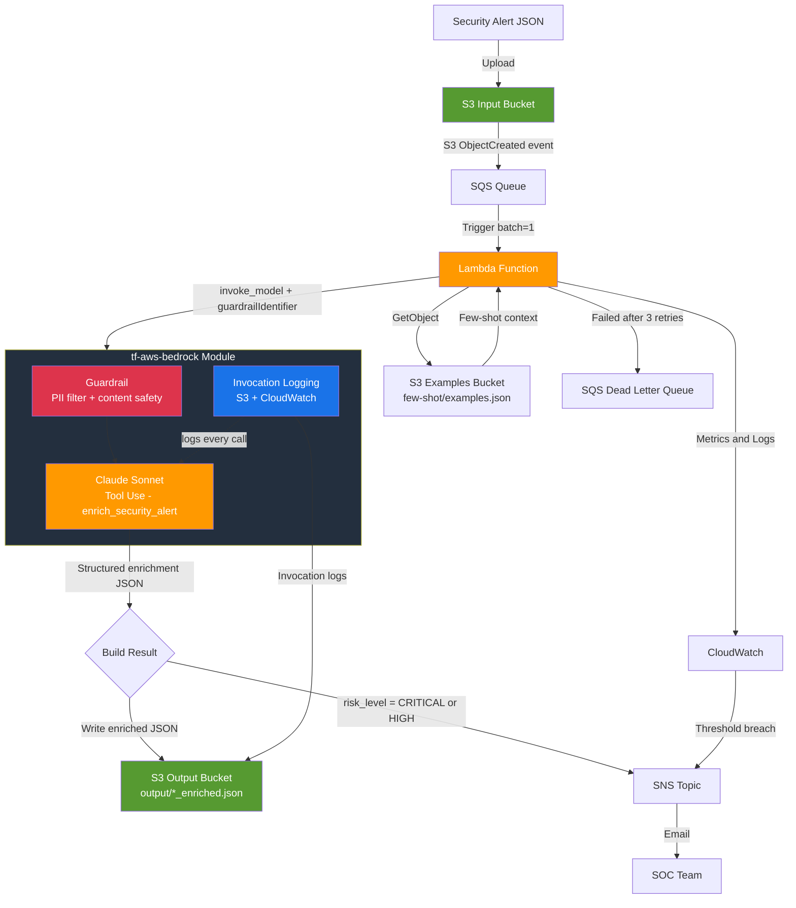

# Reco-Style Security Alert Enrichment Pipeline

A production-ready, event-driven security alert enrichment pipeline inspired by the [Reco architecture on AWS](https://aws.amazon.com/blogs/machine-learning/how-reco-transforms-security-alerts-using-amazon-bedrock/). Raw security alert JSON files are automatically transformed into rich, actionable enrichments using **Amazon Bedrock (Claude Sonnet with Tool Use)** and few-shot prompting — giving SOC analysts clear narratives, MITRE ATT&CK mappings, ready-to-run investigation queries, and prioritized remediation steps.

---

## Architecture

```
+-----------------------------------------------------------------------------+
|               Security Alert Enrichment Pipeline                            |
|                                                                             |
|  +----------+  JSON upload  +----------+  Trigger  +---------------------+ |
|  |  S3 Input| ------------> |   SQS    | --------> |  Lambda Function    | |
|  |  Bucket  |               |  Queue   |           +----------+----------+ |
|  | (alerts) |               +----------+                      |            |
|  +----------+               +----------+                      |            |
|                              |   DLQ    | <-- Failures --------+            |
|                              +----------+                      |            |
|                                                  +-------------+---------+  |
|                                                  |                       |  |
|                                      +-----------v-----------+           |  |
|                                      |   tf-aws-bedrock      |           |  |
|                                      |                       |           |  |
|                                      | +-------------------+ |           |  |
|                                      | | Guardrails        | |           |  |
|                                      | | PII filter +      | |           |  |
|                                      | | content safety    | |           |  |
|                                      | +-------------------+ |           |  |
|                                      | +-------------------+ |           |  |
|                                      | | Invocation Logging| |           |  |
|                                      | | S3 + CloudWatch   | |           |  |
|                                      | +-------------------+ |           |  |
|                                      | +-------------------+ |           |  |
|                                      | | Claude Sonnet     | |           |  |
|                                      | | Tool Use          | |           |  |
|                                      | | (few-shot)        | |           |  |
|                                      | +-------------------+ |           |  |
|                                      +-----------+-----------+           |  |
|                                                  |                       |  |
|         +----------------------------------------v-----+                |  |
|         |  S3 Output Bucket                            |                |  |
|         |  output/<key>_enriched.json                  |                |  |
|         |  bedrock-invocation-logs/                    |                |  |
|         +----------------------------------------------+                |  |
|                                                                          |  |
|  +--------------------------------------------------------------------+  |  |
|  |  CloudWatch: Lambda Alarms + Dashboard + Bedrock Invocation Logs  |  |  |
|  +--------------------------------------------------------------------+  |  |
|                                                                          |  |
|  +-------------------+  CRITICAL/HIGH alerts                           |  |
|  |   SNS Topic       | <-- Lambda publishes --------------------------+    |
|  |   (email alerts)  |                                                     |
|  +-------------------+                                                     |
+-----------------------------------------------------------------------------+
```

## Mermaid Diagram



---

## What Claude Returns (Tool Use Schema)

Every alert is enriched with the following structured fields:

| Field | Type | Description |
|---|---|---|
| `alert_summary` | string | 2-4 sentence human-readable narrative of what happened |
| `risk_level` | enum | CRITICAL / HIGH / MEDIUM / LOW / INFORMATIONAL |
| `affected_resources` | array | IPs, ARNs, usernames, hostnames involved |
| `attack_pattern` | string | MITRE ATT&CK tactic/technique (e.g. "Credential Access") |
| `business_impact` | string | One-sentence business impact statement |
| `investigation_queries` | array | 3-5 ready-to-run SQL/CloudWatch Logs Insights queries |
| `remediation_steps` | array | Ordered, specific remediation actions |
| `confidence` | number | Model confidence score 0-1 |

---

## What the tf-aws-bedrock Module Provisions

| Feature | What is created | Why |
|---|---|---|
| **Guardrails** | `aws_bedrock_guardrail` with PII + content filters | Applied server-side on every `invoke_model` call |
| **PII Anonymisation** | EMAIL, PHONE, NAME masked in output | Alert enrichments never contain raw PII |
| **PII Blocking** | SSN, Credit Card, AWS Keys blocked outright | Hard stop on credential leakage in alert data |
| **Content Safety** | HATE/HIGH, VIOLENCE/MEDIUM, PROMPT_ATTACK/HIGH | Adversarial alert content cannot jailbreak the model |
| **Invocation Logging** | CloudWatch Log Group + S3 prefix | Every prompt + completion captured for audit/compliance |

---

## Architecture vs Blog

| Blog component | This solution | Notes |
|---|---|---|
| Amazon Bedrock (Claude Sonnet) | tf-aws-bedrock + Lambda invoke_model | Full implementation |
| Few-shot prompting | S3 examples bucket + Lambda caching | examples.json cached in Lambda memory |
| Structured output | Bedrock Tool Use (enrich_security_alert) | Guaranteed JSON schema |
| Alert data store | S3 input/output buckets | Blog uses RDS PostgreSQL — use tf-aws-rds for full DB persistence |
| Event-driven processing | S3 -> SQS -> Lambda | Blog uses EKS microservices — Lambda is simpler and serverless |
| Content delivery | Not included | Blog uses CloudFront — no tf-aws-cloudfront module yet |
| WAF protection | Not included | Blog uses AWS WAF — no tf-aws-waf module yet |

---

## Prerequisites

Modules required (relative to this solution):

| Module | Path |
|---|---|
| tf-aws-kms | ../../tf-aws-kms |
| tf-aws-iam-role | ../../tf-aws-iam-role |
| tf-aws-s3 | ../../tf-aws-s3 |
| tf-aws-sqs | ../../tf-aws-sqs |
| tf-aws-lambda | ../../tf-aws-lambda |
| tf-aws-sns | ../../tf-aws-sns |
| tf-aws-bedrock | ../../tf-aws-bedrock |

Terraform >= 1.3.0 and AWS provider >= 5.0 required.

Amazon Bedrock model access for `anthropic.claude-3-sonnet-20240229-v1:0` must be enabled in the target account/region.

---

## Usage

### Minimal

```hcl
module "alert_enrichment" {
  source = "./solutions/reco-security-alert-enrichment"

  name        = "reco"
  environment = "prod"
  aws_region  = "us-east-1"
}
```

### Full Example

```hcl
module "alert_enrichment" {
  source = "./solutions/reco-security-alert-enrichment"

  name        = "reco"
  environment = "prod"
  aws_region  = "us-east-1"

  claude_model_id          = "anthropic.claude-3-sonnet-20240229-v1:0"
  enable_bedrock_guardrail = true
  enable_bedrock_logging   = true

  lambda_memory_mb   = 1024
  lambda_timeout_sec = 300

  sqs_visibility_timeout = 360
  sqs_max_receive_count  = 3

  enable_kms_encryption = true
  alarm_email           = "soc-team@example.com"

  tags = {
    Team       = "security"
    CostCenter = "SOC-01"
  }
}
```

---

## Inputs

| Name | Description | Type | Default | Required |
|---|---|---|---|---|
| `name` | Base name for all resources | string | — | yes |
| `environment` | Deployment environment | string | dev | no |
| `aws_region` | AWS region | string | us-east-1 | no |
| `tags` | Additional resource tags | map(string) | {} | no |
| `claude_model_id` | Bedrock Claude model ID | string | claude-3-sonnet | no |
| `enable_bedrock_guardrail` | Enable PII + content safety guardrail | bool | true | no |
| `enable_bedrock_logging` | Enable model invocation logging to S3 + CW | bool | true | no |
| `lambda_memory_mb` | Lambda memory in MB | number | 512 | no |
| `lambda_timeout_sec` | Lambda timeout in seconds | number | 300 | no |
| `sqs_visibility_timeout` | SQS visibility timeout in seconds | number | 360 | no |
| `sqs_max_receive_count` | Max SQS receive count before DLQ | number | 3 | no |
| `enable_kms_encryption` | KMS encryption for S3 + SQS | bool | true | no |
| `alarm_email` | Email for alarms and CRITICAL/HIGH alerts | string | null | no |

---

## Outputs

| Name | Description |
|---|---|
| `input_bucket_name` | Upload raw alert JSON files here |
| `output_bucket_name` | Enriched alert JSON results |
| `examples_bucket_name` | Upload few-shot/examples.json here |
| `lambda_function_name` | Alert enrichment Lambda function |
| `lambda_cloudwatch_dashboard_url` | CloudWatch dashboard URL |
| `sqs_queue_url` | Alert processing queue URL |
| `sqs_dlq_url` | Dead Letter Queue URL |
| `bedrock_guardrail_id` | Guardrail ID injected into Lambda |
| `bedrock_invocation_log_prefix` | S3 URI for Bedrock invocation logs |
| `sns_alert_topic_arn` | SNS topic for CRITICAL/HIGH alerts |

---

## Deploying

### 1. Package Lambda

```bash
cd solutions/reco-security-alert-enrichment/lambda_src
bash build.sh
```

### 2. Upload Few-Shot Examples

```bash
EXAMPLES_BUCKET=$(terraform output -raw examples_bucket_name)
aws s3 cp examples/few_shot_examples.json "s3://${EXAMPLES_BUCKET}/few-shot/examples.json"
```

### 3. Apply

```bash
cd solutions/reco-security-alert-enrichment
terraform init
terraform plan -var-file=terraform.tfvars
terraform apply -var-file=terraform.tfvars
```

---

## Testing

### Upload a Test Alert

```bash
INPUT_BUCKET=$(terraform output -raw input_bucket_name)

cat > /tmp/test-alert.json << 'EOF'
{
  "type": "UnauthorizedAPICall",
  "severity": "HIGH",
  "source_ip": "198.51.100.23",
  "user_identity": {
    "type": "IAMUser",
    "user_name": "ci-deploy",
    "account_id": "111122223333"
  },
  "event_name": "PutObject",
  "resource": "arn:aws:s3:::my-prod-data-bucket",
  "timestamp": "2024-03-15T02:17:00Z",
  "region": "us-east-1",
  "user_agent": "aws-cli/2.0"
}
EOF

aws s3 cp /tmp/test-alert.json "s3://${INPUT_BUCKET}/input/test-alert.json"
```

### Retrieve Enriched Result

```bash
OUTPUT_BUCKET=$(terraform output -raw output_bucket_name)
aws s3 cp "s3://${OUTPUT_BUCKET}/output/test-alert_enriched.json" - | python3 -m json.tool
```

### Check Logs

```bash
FUNCTION_NAME=$(terraform output -raw lambda_function_name)
aws logs tail "/aws/lambda/${FUNCTION_NAME}" --follow
```

### Verify Guardrail

```bash
GUARDRAIL_ID=$(terraform output -raw bedrock_guardrail_id)
aws bedrock get-guardrail --guardrail-identifier "${GUARDRAIL_ID}" --guardrail-version DRAFT
```
