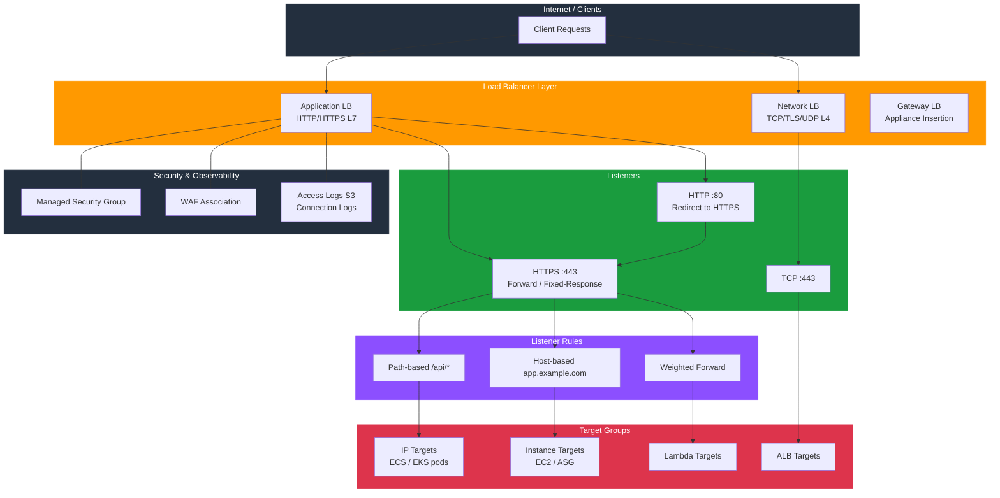

# tf-aws-alb

Terraform module for AWS Elastic Load Balancing v2.

Despite the module name, this module is not limited to ALB. It supports:
- Application Load Balancer (`load_balancer_type = "application"`)
- Network Load Balancer (`load_balancer_type = "network"`)
- Gateway Load Balancer (`load_balancer_type = "gateway"`)

Classic Load Balancer (`aws_elb`) is not covered by this module.

## Architecture



## Features

- ALB, NLB, and GWLB support through one module interface
- Target groups with health checks and optional stickiness
- Target attachment support for:
  - Auto Scaling groups
  - specific EC2 instances
  - IP targets
  - Lambda
  - child ALB targets
- Listener support for HTTP, HTTPS, TCP, TLS, UDP, and TCP_UDP where supported by AWS
- Redirect, fixed-response, and forward actions
- Weighted forwarding support
- Additional certificates for SNI
- Optional managed security group
- Access logs and ALB connection logs
- Optional WAF association
- Deletion protection enabled by default

## Load Balancer Types

| Type | `load_balancer_type` | Common Use |
|------|----------------------|------------|
| ALB | `"application"` | HTTP/HTTPS apps, path-based routing, host-based routing, Lambda targets |
| NLB | `"network"` | TCP/TLS/UDP traffic, static IP-oriented patterns, very high throughput |
| GWLB | `"gateway"` | Appliance insertion, firewall or inspection fleets |

## Security Controls

| Control | Default |
|---------|---------|
| Deletion protection | `true` |
| Drop invalid headers | `true` for ALB |
| TLS 1.3 SSL policy | `ELBSecurityPolicy-TLS13-1-2-2021-06` |
| WAF association | Optional |

## Versioning

Review [CHANGELOG.md](CHANGELOG.md) before selecting a module version. Use explicit git tags such as `?ref=v1.0.0`, `?ref=v1.1.0`, or `?ref=v2.0.0` so deployments stay predictable.

## Usage

### ALB example

```hcl
module "lb" {
  source = "git::https://github.com/your-org/tf-modules.git//tf-aws-alb?ref=v1.0.0"

  name               = "app"
  load_balancer_type = "application"
  vpc_id             = module.vpc.vpc_id
  subnets            = module.vpc.public_subnet_ids_list
  security_groups    = [module.alb_sg.security_group_id]

  target_groups = {
    app = {
      port        = 8080
      protocol    = "HTTP"
      target_type = "ip"
    }
  }

  listeners = {
    http = {
      port     = 80
      protocol = "HTTP"
      default_action = {
        type     = "redirect"
        redirect = { port = "443", protocol = "HTTPS", status_code = "HTTP_301" }
      }
    }
    https = {
      port            = 443
      protocol        = "HTTPS"
      certificate_arn = "arn:aws:acm:..."
      default_action  = { type = "forward", target_group_key = "app" }
    }
  }
}
```

### NLB example

```hcl
module "lb" {
  source = "git::https://github.com/your-org/tf-modules.git//tf-aws-alb?ref=v1.0.0"

  name               = "tcp-edge"
  load_balancer_type = "network"
  vpc_id             = module.vpc.vpc_id
  subnets            = module.vpc.public_subnet_ids_list

  target_groups = {
    app = {
      port        = 443
      protocol    = "TCP"
      target_type = "instance"
      health_check = {
        protocol = "TCP"
        port     = "traffic-port"
      }
    }
  }

  listeners = {
    tls = {
      port     = 443
      protocol = "TCP"
      default_action = {
        type             = "forward"
        target_group_key = "app"
      }
    }
  }
}
```

## Inputs

Key inputs:
- `load_balancer_type`
- `internal`
- `vpc_id`
- `subnets`
- `security_groups`
- `target_groups`
- `listeners`
- `create_security_group`
- `access_logs_enabled`
- `connection_logs_enabled`
- `web_acl_arn`

See [variables.tf](variables.tf) for the full interface.

## Outputs

Key outputs:
- `security_group_id`
- `lb_id`
- `lb_arn`
- `lb_dns_name`
- `lb_zone_id`
- `lb_arn_suffix`
- `target_group_arns`
- `target_group_names`
- `target_group_arn_suffixes`
- `listener_arns`
- `listener_rule_arns`

## Examples

- [Basic](examples/basic/)
- [ASG Instances](examples/asg-instances/)
- [IP Targets](examples/ip-targets/)
- [Lambda Targets](examples/lambda-targets/)
- `NLB`: see [examples/nlb-basic](examples/nlb-basic/)

## Notes

- Use ALB when you need L7 routing features like path or host conditions.
- Use NLB for L4 traffic and static-IP friendly patterns.
- Use GWLB for network appliance insertion, not normal web traffic.
- Security groups apply to ALB; NLB behavior differs by AWS capability and configuration.
