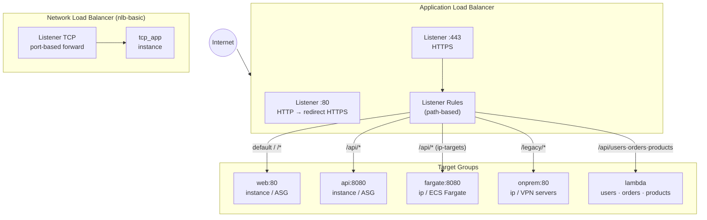

# tf-aws-alb Examples

Runnable examples for the [`tf-aws-alb`](../) Terraform module.

## Available Examples

| Example | Description |
|---------|-------------|
| [basic](basic/) | Minimal ALB configuration — HTTP/HTTPS listeners with instance target groups using variable-driven input |
| [asg-instances](asg-instances/) | ALB fronting an Auto Scaling Group — HTTP→HTTPS redirect, path-based routing to web and API target groups, ASG with CPU and request-count target tracking |
| [ip-targets](ip-targets/) | ALB with IP-type target groups — ECS Fargate containers, on-premises servers via VPN/Direct Connect, and cross-VPC peered IPs on a single load balancer |
| [lambda-targets](lambda-targets/) | ALB routing to Lambda microservices — three functions (users, orders, products) with path-based rules and CORS preflight handling |
| [nlb-basic](nlb-basic/) | Network Load Balancer (NLB) with a single TCP listener forwarding to EC2 instance targets |

## Architecture



## Quick Start

```bash
cd basic/
terraform init
terraform apply -var-file="dev.tfvars"
```
