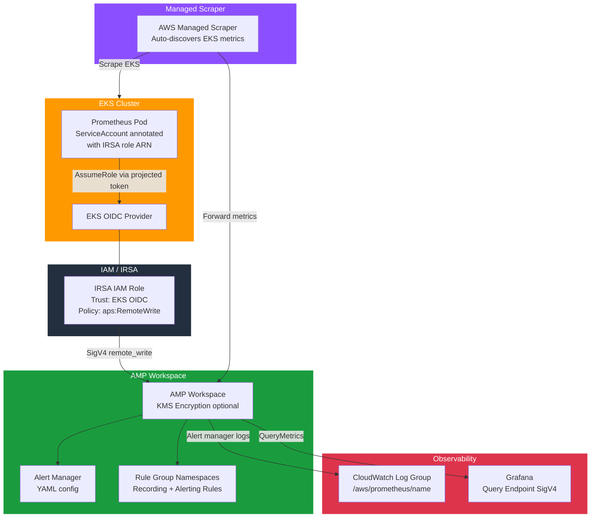

# Amazon Managed Service for Prometheus (AMP)

A production-ready Terraform module that provisions an **Amazon Managed Service for Prometheus (AMP)** workspace with optional EKS IRSA integration, Alert Manager configuration, managed scraper support, and CloudWatch logging.

---

## Description

This module creates and configures the following AWS resources:

- **AMP Workspace** — the core Prometheus-compatible metrics store, with optional KMS encryption and CloudWatch logging.
- **Alert Manager Definition** — inline YAML configuration for the AMP-native alert manager (routes, receivers, inhibition rules).
- **Rule Group Namespaces** — one or more Prometheus recording/alerting rule sets attached to the workspace.
- **IRSA IAM Role** — an IAM role with a web-identity trust policy scoped to an EKS OIDC provider, allowing a Kubernetes service account to authenticate and remote-write metrics to AMP without static credentials.
- **Managed Scraper** — an AWS-managed Prometheus scraper that automatically discovers and scrapes an EKS cluster's metrics, forwarding them to the AMP workspace.
- **CloudWatch Log Group** — captures AMP alert manager and rule evaluation logs with configurable retention.

---

## Architecture Overview



**Data flow:**
1. Prometheus running inside EKS assumes the IRSA role via the pod's service account token.
2. Prometheus remote-writes metrics to the AMP workspace endpoint using SigV4 signing.
3. Alternatively, the AWS-managed scraper (no Prometheus installation required) scrapes the EKS cluster and forwards metrics to AMP.
4. Grafana (or other tools) queries AMP via the workspace query endpoint using SigV4.

---

## Versioning

Review [CHANGELOG.md](CHANGELOG.md) before selecting a module version. Use explicit git tags such as `?ref=v1.0.0`, `?ref=v1.1.0`, or `?ref=v2.0.0` so deployments stay predictable.
## Usage Examples

### Basic Workspace

Minimal configuration — creates a single AMP workspace with CloudWatch logging enabled.

```hcl
module "amp" {
  source = "./tf-aws-amp"

  name        = "my-metrics"
  environment = "prod"

  tags = {
    Project = "platform"
    Owner   = "sre-team"
  }
}

output "remote_write_url" {
  value = module.amp.remote_write_url
}
```

---

### With EKS IRSA Role

Provisions an AMP workspace and an IAM role that can be assumed by a Kubernetes service account via IRSA. Use this when you run self-managed Prometheus (or the Prometheus Operator) inside EKS.

```hcl
data "aws_eks_cluster" "this" {
  name = "my-eks-cluster"
}

module "amp" {
  source = "./tf-aws-amp"

  name        = "eks-metrics"
  environment = "prod"

  # IRSA
  create_irsa_role               = true
  eks_oidc_provider_arn          = data.aws_eks_cluster.this.identity[0].oidc[0].issuer
  eks_oidc_issuer_url            = data.aws_eks_cluster.this.identity[0].oidc[0].issuer
  irsa_service_account_namespace = "monitoring"
  irsa_service_account_name      = "prometheus"

  # Grant query access in addition to remote-write
  irsa_extra_permissions = [
    "aps:QueryMetrics",
    "aps:GetSeries",
    "aps:GetLabels",
    "aps:GetMetricMetadata"
  ]
}
```

After apply, annotate the Kubernetes service account with the IRSA role ARN (see the [EKS Integration](#eks-integration) section below).

---

### With Managed Scraper

Uses the AWS-native managed scraper — no Prometheus installation inside the cluster is required. AWS provisions and manages the scraper infrastructure.

```hcl
data "aws_eks_cluster" "this" {
  name = "my-eks-cluster"
}

module "amp" {
  source = "./tf-aws-amp"

  name        = "eks-metrics"
  environment = "prod"

  # Managed scraper
  create_managed_scraper     = true
  scraper_eks_cluster_arn    = data.aws_eks_cluster.this.arn
  scraper_subnet_ids         = ["subnet-aaa111", "subnet-bbb222"]
  scraper_security_group_ids = ["sg-0123456789abcdef0"]

  # Optional: override the default scrape config
  scraper_configuration = <<-YAML
    global:
      scrape_interval: 15s
    scrape_configs:
      - job_name: 'kubernetes-pods'
        kubernetes_sd_configs:
          - role: pod
        relabel_configs:
          - source_labels: [__meta_kubernetes_pod_annotation_prometheus_io_scrape]
            action: keep
            regex: true
  YAML
}
```

---

### With Alert Manager and Rule Groups

Enables the AMP Alert Manager and attaches Prometheus recording/alerting rules.

```hcl
module "amp" {
  source = "./tf-aws-amp"

  name        = "eks-metrics"
  environment = "prod"

  # Alert Manager
  enable_alert_manager = true
  alert_manager_definition = <<-YAML
    alertmanager_config: |
      route:
        receiver: 'pagerduty'
        group_wait: 30s
        group_interval: 5m
        repeat_interval: 4h
        routes:
          - match:
              severity: critical
            receiver: 'pagerduty'
          - match:
              severity: warning
            receiver: 'slack'
      receivers:
        - name: 'pagerduty'
          pagerduty_configs:
            - routing_key: '<your-pd-integration-key>'
        - name: 'slack'
          slack_configs:
            - api_url: 'https://hooks.slack.com/services/XXX/YYY/ZZZ'
              channel: '#alerts'
  YAML

  # Rule Groups
  rule_group_namespaces = {
    "eks-node-rules" = <<-YAML
      groups:
        - name: node.rules
          rules:
            - alert: NodeHighCPU
              expr: (1 - avg(rate(node_cpu_seconds_total{mode="idle"}[5m])) by (instance)) * 100 > 85
              for: 10m
              labels:
                severity: warning
              annotations:
                summary: "Node {{ $labels.instance }} CPU usage above 85%"
    YAML

    "eks-pod-rules" = <<-YAML
      groups:
        - name: pod.rules
          rules:
            - alert: PodCrashLooping
              expr: rate(kube_pod_container_status_restarts_total[15m]) * 60 * 15 > 0
              for: 15m
              labels:
                severity: critical
              annotations:
                summary: "Pod {{ $labels.namespace }}/{{ $labels.pod }} is crash looping"
    YAML
  }
}
```

---

### Full Production Configuration

```hcl
module "amp" {
  source = "./tf-aws-amp"

  name        = "platform"
  name_prefix = "acme"
  environment = "prod"
  project     = "observability"
  owner       = "sre-team"
  cost_center = "CC-1234"

  kms_key_arn = aws_kms_key.amp.arn

  enable_alert_manager     = true
  alert_manager_definition = file("${path.module}/alertmanager.yaml")

  rule_group_namespaces = {
    "node-rules" = file("${path.module}/rules/node.yaml")
    "pod-rules"  = file("${path.module}/rules/pod.yaml")
  }

  create_irsa_role               = true
  eks_oidc_provider_arn          = module.eks.oidc_provider_arn
  eks_oidc_issuer_url            = module.eks.cluster_oidc_issuer_url
  irsa_service_account_namespace = "monitoring"
  irsa_service_account_name      = "prometheus"

  enable_logging     = true
  log_retention_days = 30

  tags = {
    Project    = "observability"
    CostCenter = "CC-1234"
  }
}
```

---

## EKS Integration

After the module creates the IRSA role, annotate the Kubernetes service account so the EKS OIDC identity webhook can inject the correct role ARN into Prometheus pods.

**Using kubectl:**

```bash
kubectl annotate serviceaccount prometheus \
  --namespace monitoring \
  eks.amazonaws.com/role-arn=$(terraform output -raw irsa_role_arn)
```

**Using Terraform (kubernetes provider):**

```hcl
resource "kubernetes_service_account" "prometheus" {
  metadata {
    name      = "prometheus"
    namespace = "monitoring"
    annotations = {
      "eks.amazonaws.com/role-arn" = module.amp.irsa_role_arn
    }
  }
}
```

**Using the Prometheus Operator (kube-prometheus-stack Helm chart):**

```yaml
# values.yaml
prometheus:
  serviceAccount:
    name: prometheus
    annotations:
      eks.amazonaws.com/role-arn: "<irsa_role_arn output value>"

  prometheusSpec:
    remoteWrite:
      - url: "<remote_write_url output value>"
        sigv4:
          region: us-east-1
        queueConfig:
          maxSamplesPerSend: 1000
          maxShards: 200
          capacity: 2500
```

> **Note:** The Prometheus pods must run with the annotated service account, and the EKS cluster must have the OIDC provider configured. The IRSA mechanism exchanges the pod's projected service account token for temporary AWS credentials — no static AWS keys are needed.

---

## Inputs

| Name | Description | Type | Default | Required |
|------|-------------|------|---------|:--------:|
| `name` | Name for the AMP workspace and related resources. | `string` | — | yes |
| `name_prefix` | Optional prefix prepended to all resource names. | `string` | `""` | no |
| `environment` | Deployment environment (dev, staging, prod). | `string` | `"dev"` | no |
| `project` | Project name tag. | `string` | `""` | no |
| `owner` | Owner tag. | `string` | `""` | no |
| `cost_center` | Cost center tag. | `string` | `""` | no |
| `tags` | Additional tags applied to all resources. | `map(string)` | `{}` | no |
| `workspace_alias` | Human-readable alias for the AMP workspace. Defaults to name. | `string` | `null` | no |
| `kms_key_arn` | KMS key ARN for encrypting AMP workspace data. Uses AWS-managed key when null. | `string` | `null` | no |
| `enable_alert_manager` | Enable the AMP Alert Manager with the provided definition. | `bool` | `false` | no |
| `alert_manager_definition` | Alert Manager YAML definition. Only used when `enable_alert_manager = true`. | `string` | *(default config)* | no |
| `rule_group_namespaces` | Map of rule group namespace name to YAML Prometheus rules content. | `map(string)` | `{}` | no |
| `create_irsa_role` | Create an IAM role for EKS service accounts (IRSA) so Prometheus can remote-write to AMP. | `bool` | `false` | no |
| `eks_oidc_provider_arn` | ARN of the EKS OIDC provider. Required when `create_irsa_role = true`. | `string` | `null` | no |
| `eks_oidc_issuer_url` | OIDC issuer URL of the EKS cluster. Required when `create_irsa_role = true`. | `string` | `null` | no |
| `irsa_service_account_namespace` | Kubernetes namespace of the Prometheus service account. | `string` | `"monitoring"` | no |
| `irsa_service_account_name` | Kubernetes service account name for Prometheus. | `string` | `"prometheus"` | no |
| `irsa_extra_permissions` | Additional IAM actions to grant to the IRSA role. | `list(string)` | `[]` | no |
| `create_managed_scraper` | Create an AMP managed scraper that automatically pulls metrics from an EKS cluster. | `bool` | `false` | no |
| `scraper_eks_cluster_arn` | EKS cluster ARN for the managed scraper. Required when `create_managed_scraper = true`. | `string` | `null` | no |
| `scraper_subnet_ids` | Subnet IDs where the managed scraper runs. Required when `create_managed_scraper = true`. | `list(string)` | `[]` | no |
| `scraper_security_group_ids` | Security group IDs for the managed scraper. | `list(string)` | `[]` | no |
| `scraper_configuration` | Prometheus scrape configuration YAML for the managed scraper. Defaults to a standard EKS config. | `string` | `null` | no |
| `enable_logging` | Enable CloudWatch logging for AMP alert manager and rule evaluations. | `bool` | `true` | no |
| `log_retention_days` | CloudWatch log retention in days. | `number` | `14` | no |

---

## Outputs

| Name | Description |
|------|-------------|
| `workspace_id` | ID of the AMP workspace. |
| `workspace_arn` | ARN of the AMP workspace. |
| `workspace_endpoint` | Prometheus query endpoint (use for Grafana data source). |
| `remote_write_url` | Full `remote_write` URL for Prometheus configuration. |
| `query_url` | Full query URL for Grafana or other tools. |
| `irsa_role_arn` | ARN of the IRSA IAM role for Prometheus service account. Empty when `create_irsa_role = false`. |
| `irsa_role_name` | Name of the IRSA IAM role. |
| `managed_scraper_id` | ID of the AMP managed scraper. Empty when `create_managed_scraper = false`. |
| `managed_scraper_arn` | ARN of the AMP managed scraper. |
| `log_group_name` | CloudWatch Log Group name for AMP logs. |
| `log_group_arn` | CloudWatch Log Group ARN. |
| `alert_manager_enabled` | Whether the Alert Manager is enabled. |

---

## Requirements

| Name | Version |
|------|---------|
| terraform | >= 1.3.0 |
| aws | >= 5.0 |

---

## Notes

- **KMS encryption:** When `kms_key_arn` is provided, both the AMP workspace and the CloudWatch log group use the same key. Ensure the KMS key policy grants `logs.amazonaws.com` the `kms:GenerateDataKey*` and `kms:Decrypt` permissions.
- **Managed scraper vs. self-managed Prometheus:** Use `create_managed_scraper = true` for a zero-ops scraping setup. Use `create_irsa_role = true` when you run the Prometheus Operator or a custom Prometheus deployment inside EKS.
- **OIDC issuer URL:** Pass the full URL (e.g. `https://oidc.eks.us-east-1.amazonaws.com/id/XXXX`) — the module strips the `https://` prefix automatically when constructing the IAM trust condition.
- **SigV4 signing:** Prometheus remote-write to AMP requires AWS SigV4 request signing. Use the `amazon-prometheus-proxy` sidecar or configure `sigv4` directly in the `remote_write` section of your Prometheus configuration (supported natively in Prometheus >= 2.26).

