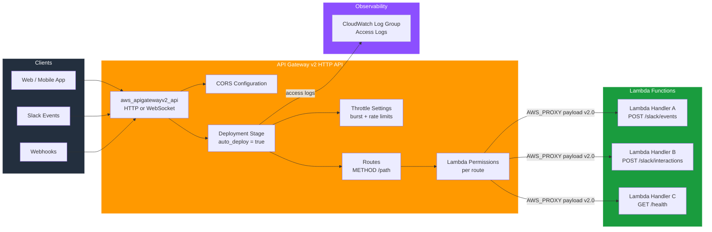

# tf-aws-apigateway

AWS HTTP API Gateway v2 module for Lambda-backed APIs.

This module provisions an **AWS API Gateway v2 HTTP API** with Lambda proxy integrations, a deployment stage, CloudWatch access logging, and the required Lambda invoke permissions. It is designed for building serverless HTTP APIs — including Slack event endpoints, webhooks, and REST backends.

---

## Architecture



---

## Features

- Creates an `aws_apigatewayv2_api` (HTTP or WebSocket)
- Configurable CORS via a single object variable
- Auto-deploying stage with throttle settings
- CloudWatch Log Group for access logs (optional, retention configurable)
- Lambda AWS_PROXY integrations with payload format version 2.0
- `aws_lambda_permission` grants automatically created per route
- Consistent tagging via `common_tags` locals

---

## Versioning

Review [CHANGELOG.md](CHANGELOG.md) before selecting a module version. Use explicit git tags such as `?ref=v1.0.0`, `?ref=v1.1.0`, or `?ref=v2.0.0` so deployments stay predictable.
## Usage

```hcl
module "slack_api" {
  source = "../../tf-aws-apigateway"

  name        = "slack-bot-api"
  name_prefix = "myapp"
  environment = "prod"
  project     = "slack-bot"
  owner       = "platform-team"
  cost_center = "eng-001"

  description = "Slack Events HTTP API"

  cors_configuration = {
    allow_origins  = ["https://slack.com"]
    allow_methods  = ["POST", "GET", "OPTIONS"]
    allow_headers  = ["Content-Type", "X-Slack-Signature", "X-Slack-Request-Timestamp"]
    expose_headers = []
    max_age        = 300
  }

  routes = {
    "POST /slack/events" = {
      lambda_invoke_arn    = module.slack_lambda.invoke_arn
      lambda_function_name = module.slack_lambda.function_name
      timeout_milliseconds = 29000
      authorization_type   = "NONE"
    }

    "POST /slack/interactions" = {
      lambda_invoke_arn    = module.slack_lambda.invoke_arn
      lambda_function_name = module.slack_lambda.function_name
      timeout_milliseconds = 15000
      authorization_type   = "NONE"
    }

    "GET /health" = {
      lambda_invoke_arn    = module.health_lambda.invoke_arn
      lambda_function_name = module.health_lambda.function_name
    }
  }

  enable_access_logs = true
  log_retention_days = 30

  default_route_settings = {
    throttling_burst_limit   = 1000
    throttling_rate_limit    = 2000
    detailed_metrics_enabled = false
  }

  tags = {
    Team = "platform"
  }
}
```

### Slack Request URL

After applying, set your Slack app's **Request URL** to:

```
${module.slack_api.invoke_url}/slack/events
```

The `invoke_url` output already includes the stage path (e.g., `https://<api-id>.execute-api.<region>.amazonaws.com`), so appending `/slack/events` gives the full endpoint.

---

## Inputs

| Name | Description | Type | Default | Required |
|------|-------------|------|---------|----------|
| `name` | Name of the API Gateway. | `string` | — | yes |
| `name_prefix` | Optional prefix prepended to the name. | `string` | `""` | no |
| `description` | Description of the API. | `string` | `"Managed by Terraform"` | no |
| `environment` | Deployment environment (dev, staging, prod). | `string` | `"dev"` | no |
| `project` | Project name tag. | `string` | `""` | no |
| `owner` | Owner tag. | `string` | `""` | no |
| `cost_center` | Cost center tag. | `string` | `""` | no |
| `tags` | Additional tags applied to all resources. | `map(string)` | `{}` | no |
| `protocol_type` | API protocol: `HTTP` or `WEBSOCKET`. | `string` | `"HTTP"` | no |
| `stage_name` | Name of the deployment stage. | `string` | `"$default"` | no |
| `auto_deploy` | Automatically deploy stage changes. | `bool` | `true` | no |
| `cors_configuration` | CORS settings object. Set to `null` to disable. | `object` | `null` | no |
| `cors_configuration.allow_headers` | Allowed request headers. | `list(string)` | See variables.tf | no |
| `cors_configuration.allow_methods` | Allowed HTTP methods. | `list(string)` | `["GET","POST","PUT","DELETE","OPTIONS"]` | no |
| `cors_configuration.allow_origins` | Allowed origins. | `list(string)` | `["*"]` | no |
| `cors_configuration.expose_headers` | Headers exposed to the browser. | `list(string)` | `[]` | no |
| `cors_configuration.max_age` | Preflight cache duration in seconds. | `number` | `300` | no |
| `routes` | Map of route keys to Lambda integration config. Key format: `"METHOD /path"`. | `map(object)` | `{}` | no |
| `routes[*].lambda_invoke_arn` | Lambda function invoke ARN. | `string` | — | yes (per route) |
| `routes[*].lambda_function_name` | Lambda function name (for permission grant). | `string` | — | yes (per route) |
| `routes[*].timeout_milliseconds` | Integration timeout in ms (max 29000). | `number` | `29000` | no |
| `routes[*].authorization_type` | Route authorization type (`NONE`, `JWT`, `AWS_IAM`, `CUSTOM`). | `string` | `"NONE"` | no |
| `routes[*].authorizer_id` | Authorizer ID when `authorization_type` is not `NONE`. | `string` | `null` | no |
| `enable_access_logs` | Enable CloudWatch access logging for the stage. | `bool` | `true` | no |
| `log_retention_days` | CloudWatch log retention period in days. | `number` | `14` | no |
| `default_route_settings` | Default throttling settings applied to all routes. | `object` | `{}` | no |
| `default_route_settings.throttling_burst_limit` | Max concurrent requests burst. | `number` | `5000` | no |
| `default_route_settings.throttling_rate_limit` | Steady-state requests per second. | `number` | `10000` | no |
| `default_route_settings.detailed_metrics_enabled` | Enable per-route detailed CloudWatch metrics. | `bool` | `false` | no |

---

## Outputs

| Name | Description |
|------|-------------|
| `api_id` | ID of the HTTP API. |
| `api_arn` | ARN of the HTTP API. |
| `api_endpoint` | Base endpoint URL of the API (without stage path). |
| `invoke_url` | Full invocation URL including the stage. Use as the Slack Request URL base. |
| `stage_id` | ID of the deployment stage. |
| `execution_arn` | Execution ARN of the API — used in Lambda resource-based policies. |
| `access_log_group_name` | CloudWatch Log Group name for API access logs. Empty string if logging is disabled. |
| `access_log_group_arn` | CloudWatch Log Group ARN for API access logs. Empty string if logging is disabled. |

---

## Notes

- **Slack Request URL**: In the Slack app configuration portal set the Request URL to `${module.<name>.invoke_url}/slack/events`. The `invoke_url` already contains the full base URL including the stage segment.
- **Timeout**: API Gateway v2 hard-limits integration timeout to **29 seconds**. The default `timeout_milliseconds = 29000` matches this limit.
- **Lambda permissions**: A `aws_lambda_permission` is automatically created for every entry in `routes`, scoped to `source_arn = <execution_arn>/*/*` (all methods and paths under this API).
- **Payload format**: All Lambda integrations use `payload_format_version = "2.0"` (the modern HTTP API event format). Ensure your Lambda handler reads `event.body`, `event.headers`, etc., using the v2 schema.
- **CORS**: When `cors_configuration` is set, API Gateway handles preflight `OPTIONS` responses automatically — you do not need an `OPTIONS` route in the `routes` map.
- **WebSocket**: Set `protocol_type = "WEBSOCKET"` if building a WebSocket API. CORS configuration is ignored for WebSocket APIs.

---

## Requirements

| Name | Version |
|------|---------|
| Terraform | >= 1.3.0 |
| AWS Provider | >= 5.0 |

