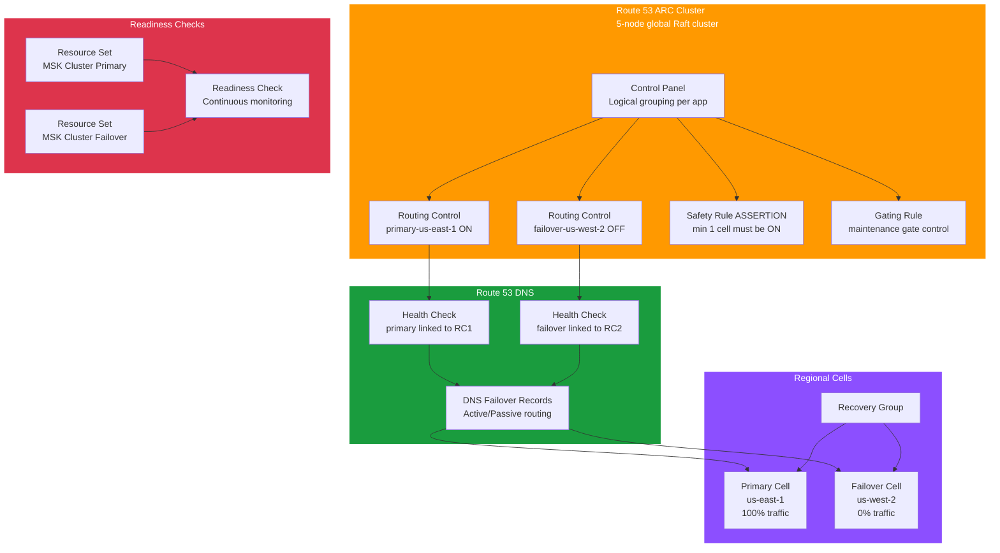

# tf-aws-app-recovery-controller

Terraform module for **AWS Route 53 Application Recovery Controller (ARC)** — automated, safe multi-region failover and readiness verification.

## Architecture



## What ARC Does

| Component | Purpose |
|---|---|
| **Cluster** | Global 5-node Raft cluster (survives full AWS region failure) — hosts routing control state |
| **Control Panel** | Logical grouping of routing controls per application |
| **Routing Control** | Binary ON/OFF switch wired to Route 53 health checks → controls DNS failover |
| **Safety Rule (Assertion)** | Ensures minimum N cells stay ON — prevents full blackout |
| **Safety Rule (Gating)** | Requires a gate control to be ON before target controls can change |
| **Health Check** | Route 53 health check whose state = routing control ON/OFF |
| **Recovery Group** | Represents the full application; contains regional cells |
| **Readiness Check** | Continuously monitors resources for failover readiness (capacity, lag, config) |

## Failover Flow

```
Normal:   primary-cell=ON   failover-cell=OFF   → 100% traffic to us-east-1
Failover: primary-cell=OFF  failover-cell=ON    → 100% traffic to us-west-2
               ↑
          Safety Rule: at least 1 must always be ON (prevents blackout)
          Gating Rule: maintenance-mode must be ON to toggle primary cell
```

## Versioning

Review [CHANGELOG.md](CHANGELOG.md) before selecting a module version. Use explicit git tags such as `?ref=v1.0.0`, `?ref=v1.1.0`, or `?ref=v2.0.0` so deployments stay predictable.
## Usage

```hcl
module "arc" {
  source      = "../../tf-aws-app-recovery-controller"
  name        = "payments"
  environment = "prod"

  control_panels   = { payments = {} }

  routing_controls = {
    primary-us-east-1  = { control_panel_key = "payments" }
    failover-us-west-2 = { control_panel_key = "payments" }
  }

  safety_rules = {
    min-one-cell = {
      name              = "payments-min-one-cell"
      control_panel_key = "payments"
      type              = "ASSERTION"
      wait_period_ms    = 5000
      asserted_controls = ["primary-us-east-1", "failover-us-west-2"]
      assertion_rule    = { threshold = 1, type = "ATLEAST" }
    }
  }

  health_checks = {
    primary  = { routing_control_key = "primary-us-east-1",  disabled = false }
    failover = { routing_control_key = "failover-us-west-2", disabled = true  }
  }

  recovery_group = {
    name  = "payments-recovery-group"
    cells = [
      { name = "primary-cell-us-east-1" },
      { name = "failover-cell-us-west-2" },
    ]
  }

  readiness_checks = {
    msk = {
      resource_set_name = "payments-msk"
      resource_set_type = "AWS::MSK::Cluster"
      resources = [
        { component_id = "primary",  resource_arn = var.msk_primary_arn },
        { component_id = "failover", resource_arn = var.msk_failover_arn },
      ]
    }
  }
}
```

## Performing Failover

```bash
# Get cluster endpoints
terraform output arc_cluster_endpoints

# Toggle routing controls (use ANY of the 5 cluster endpoints)
aws route53-recovery-cluster update-routing-control-state \
  --routing-control-arn <primary-cell-arn> \
  --routing-control-state OFF \
  --endpoint-url https://<cluster-endpoint>

aws route53-recovery-cluster update-routing-control-state \
  --routing-control-arn <failover-cell-arn> \
  --routing-control-state ON \
  --endpoint-url https://<cluster-endpoint>
```

## Real-World Examples

| Example | Scenario |
|---|---|
| `payment-multi-region-failover` | Active/passive payment platform: us-east-1 → us-west-2 with safety rules, gating, readiness checks, and Route 53 DNS failover |

## Inputs

| Name | Type | Default | Description |
|---|---|---|---|
| `name` | `string` | — | Resource name |
| `create_cluster` | `bool` | `true` | Create new ARC cluster (shared clusters save cost) |
| `cluster_arn` | `string` | `null` | Existing cluster ARN (when `create_cluster = false`) |
| `control_panels` | `map(object)` | `{default={}}` | Control panel definitions |
| `routing_controls` | `map(object)` | `{}` | Traffic routing switches |
| `safety_rules` | `map(object)` | `{}` | ASSERTION and GATING safety rules |
| `health_checks` | `map(object)` | `{}` | Route 53 routing control health checks |
| `recovery_group` | `object` | `null` | Recovery group with regional cells |
| `readiness_checks` | `map(object)` | `{}` | Resource readiness monitoring configs |

## Outputs

| Name | Description |
|---|---|
| `cluster_arn` | ARC cluster ARN |
| `cluster_endpoints` | 5 global cluster endpoints for routing control API calls |
| `routing_control_arns` | Map of control key → ARN (use in CLI failover commands) |
| `safety_rule_arns` | Map of rule key → ARN |
| `health_check_ids` | Route 53 health check IDs (wire into DNS failover records) |
| `recovery_group_arn` | Recovery group ARN |
| `readiness_check_arns` | Readiness check ARNs |
| `failover_runbook` | Generated CLI runbook for the switchover procedure |

