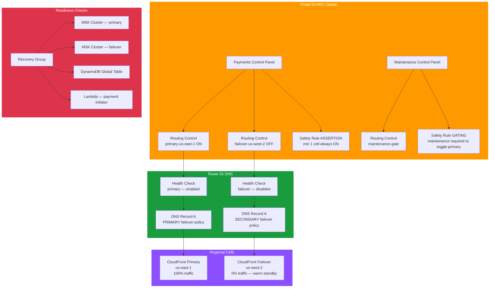

# tf-aws-app-recovery-controller — Examples

> Quick-start examples for the `tf-aws-app-recovery-controller` Terraform module.

## Available Examples

| Example | Description |
|---------|-------------|
| [payment-multi-region-failover](payment-multi-region-failover/) | Full active/passive multi-region failover for a real-time payment platform — ARC cluster, dual routing controls, assertion + gating safety rules, Route 53 health checks, readiness checks for MSK, DynamoDB, and Lambda across us-east-1 / us-west-2 |

## Architecture



## Running an Example

```bash
cd payment-multi-region-failover
terraform init
terraform apply -var-file="dev.tfvars"
```
