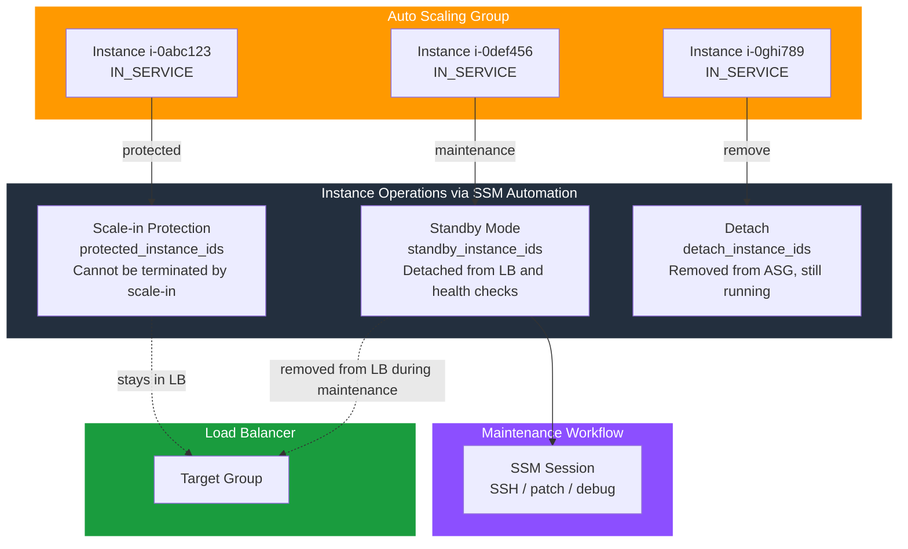

# tf-aws-asg-instance-ops

Utility module for per-instance ASG operations. Use alongside `tf-aws-asg`.

## Architecture



## Operations

| Operation | Variable | Effect | Reversible? |
|-----------|----------|--------|-------------|
| **Scale-in protect** | `protected_instance_ids` | Instance cannot be terminated by scale-in | Yes — remove ID, re-apply |
| **Standby** | `standby_instance_ids` | Instance detached from LB & health checks, stays in ASG | Yes — remove ID, re-apply |
| **Detach** | `detach_instance_ids` | Instance removed from ASG (still running, unmanaged) | Manual — re-attach via console/CLI |

## Versioning

Review [CHANGELOG.md](CHANGELOG.md) before selecting a module version. Use explicit git tags such as `?ref=v1.0.0`, `?ref=v1.1.0`, or `?ref=v2.0.0` so deployments stay predictable.
## Usage

```hcl
module "asg_ops" {
  source   = "../../tf-aws-asg-instance-ops"
  asg_name = module.asg.asg_name

  # Protect i-0abc123 during a hot patch (no scale-in)
  protected_instance_ids = ["i-0abc123"]

  # Put i-0def456 into standby for maintenance
  standby_instance_ids = ["i-0def456"]
}
```

## Workflow: patch an instance without termination

```bash
# 1. Add to standby via Terraform
echo 'standby_instance_ids = ["i-0abc123"]' >> ops.tfvars
terraform apply -var-file=ops.tfvars

# 2. SSH/SSM in and patch
aws ssm start-session --target i-0abc123

# 3. Return to service
# Remove from standby_instance_ids in tfvars, re-apply
terraform apply -var-file=ops.tfvars
```

