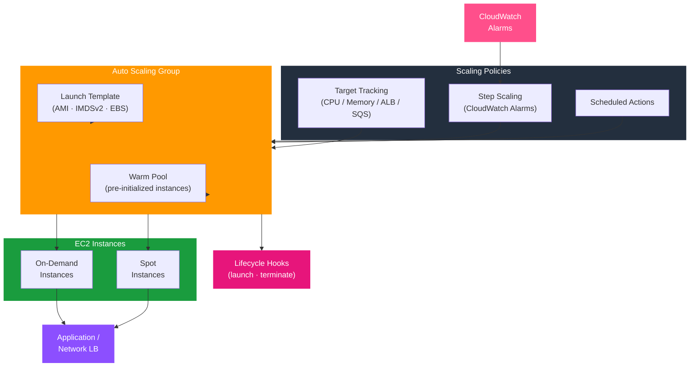

# tf-aws-asg

Terraform module for AWS Auto Scaling Groups — launch templates, mixed-instance policies, Spot support, warm pools, target tracking, step scaling, and lifecycle hooks.

---

## Architecture



---

## Features

- Launch Templates with AMI lookup (Amazon Linux 2023, Windows, custom)
- IMDSv2 enforced, detailed monitoring, EBS optimised
- Mixed instances policy — On-Demand base + Spot diversification
- Warm pools for fast scale-out without cold-start latency
- Target tracking: CPU, memory (agent), ALB request count, SQS queue depth, network I/O
- Step scaling with configurable CloudWatch alarms
- Scheduled scaling actions
- Lifecycle hooks (launch/terminate) for graceful operations
- Rolling update policy with configurable min-healthy-percentage

## Security Controls

| Control | Implementation |
|---------|---------------|
| IMDSv2 enforced | `http_tokens = "required"` |
| EBS encryption | `encrypted = true` on all volumes |
| Instance profile | `iam_instance_profile_name` |
| Hop limit (container safe) | `http_put_response_hop_limit = 2` |
| Detailed monitoring | `enable_detailed_monitoring = true` |

## Versioning

Use explicit git tags such as `?ref=v1.0.0` to pin your deployments.

## Usage

```hcl
module "asg" {
  source = "git::https://github.com/your-org/golden_modules.git//tf-aws-asg?ref=v1.0.0"

  name                    = "app-servers"
  environment             = "prod"
  vpc_zone_identifier     = module.vpc.private_subnet_ids
  target_group_arns       = [module.alb.target_group_arn]
  iam_instance_profile_name = aws_iam_instance_profile.app.name

  min_size         = 2
  max_size         = 20
  desired_capacity = 4

  instance_type = "m6i.large"
  ami_id        = "ami-0abcdef1234567890"

  enable_spot          = true
  spot_instance_pools  = 3
  on_demand_base_capacity = 2

  cpu_target_value = 60
  enable_warm_pool = true
}
```

## Scaling Policy Modes

| Policy Type | Variable | Trigger |
|------------|----------|---------|
| CPU target tracking | `cpu_target_value` | EC2 CPU utilisation |
| Memory target tracking | `memory_target_value` | CloudWatch agent metric |
| ALB request count | `alb_request_target_value` | Requests per target |
| SQS queue depth | `sqs_messages_per_instance` | Queue depth / capacity |
| Step scaling | `step_scaling_policies` | Custom CloudWatch alarms |
| Scheduled | `scheduled_actions` | Cron expression |

## Examples

- [Basic](examples/basic/)
- [Complete with Spot + Warm Pool](examples/complete/)
