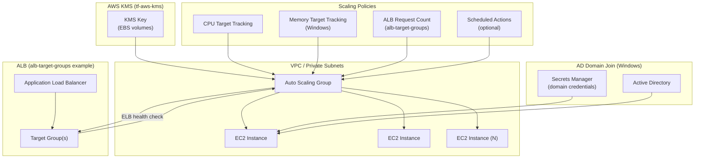

# tf-aws-asg Examples

Runnable examples for the [`tf-aws-asg`](../) Terraform module.

## Available Examples

| Example | Description |
|---------|-------------|
| [linux](linux/) | Linux Auto Scaling Group with CPU target-tracking scaling, optional scheduled actions, and KMS-encrypted EBS volumes |
| [windows](windows/) | Windows Auto Scaling Group with Active Directory domain-join, mixed-instances policy (on-demand + Spot), CPU and memory target-tracking scaling, and optional scheduled actions |
| [alb-target-groups](alb-target-groups/) | Linux ASG integrated with ALB target groups, ELB health checks, CPU and ALB request-count target-tracking scaling policies |

## Architecture



## Quick Start

Linux ASG:

```bash
cd linux/
terraform init
terraform apply -var-file="dev.tfvars"
```

Windows ASG with domain join:

```bash
cd windows/
terraform init
terraform apply -var-file="dev.tfvars"
```

ASG with ALB target groups:

```bash
cd alb-target-groups/
terraform init
terraform apply -var-file="dev.tfvars"
```
