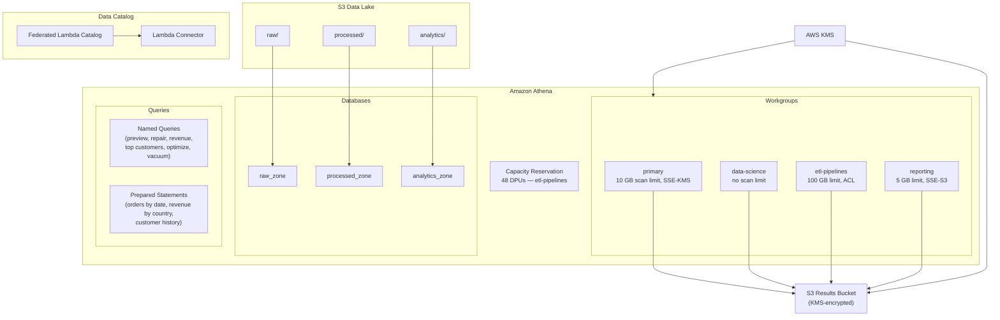

# tf-aws-athena Examples

Runnable examples for the [`tf-aws-athena`](../) Terraform module.

## Available Examples

| Example | Description |
|---------|-------------|
| [complete](complete/) | Full configuration with 4 workgroups (primary, data-science, etl-pipelines, reporting), 3 databases (raw/processed/analytics zones), 8 named queries, 3 prepared statements, 1 federated Lambda data catalog, 1 capacity reservation, and KMS-encrypted result storage |

## Architecture



## Quick Start

```bash
cd complete/
terraform init
terraform apply -var-file="dev.tfvars"
```
