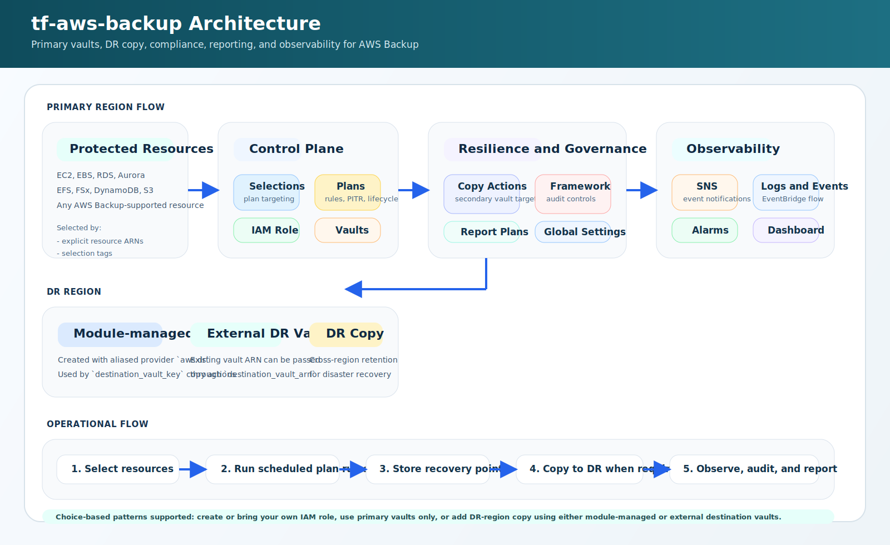

# tf-aws-backup

Terraform module for AWS Backup with support for vaults, plans, resource selections, compliance frameworks, report plans, notifications, and CloudWatch monitoring.

## Architecture

<p align="center">
  
</p>

## Scope

This module can manage:
- AWS Backup IAM role creation or BYO IAM role usage
- backup vaults
- vault policies
- vault lock configuration
- vault-level and module-level SNS notifications
- backup plans and rules
- backup selections by ARN, tag, and condition
- Backup Audit Manager framework
- backup report plans
- account-level AWS Backup global settings
- region-level resource opt-in preferences
- CloudWatch log ingestion for backup events
- CloudWatch alarms and dashboard

## Requirements

- Terraform `>= 1.3.0`
- AWS provider `>= 5.0`

## Features

- Choice-based IAM model: create a dedicated IAM role or use an existing one
- Choice-based SNS model: create a module-level topic, use an existing topic, or disable notifications
- Multiple vaults with optional vault policy and vault lock
- Optional DR-region vaults created with an aliased provider (`aws.dr`)
- Multiple plans with one or more rules per plan
- Scheduled, on-demand, and continuous backup support
- Copy actions for secondary vault targets using either a raw `destination_vault_arn` or module-managed `destination_vault_key`
- ARN-based, tag-based, and condition-based resource selections
- Optional Backup Audit Manager framework for compliance controls
- Optional AWS Backup report plans to S3
- Optional CloudWatch Logs integration for backup event visibility
- Optional CloudWatch alarms for backup, copy, and restore failures
- Optional CloudWatch dashboard for backup observability

## Versioning

Review [CHANGELOG.md](CHANGELOG.md) before selecting a module version. Use explicit git tags such as `?ref=v1.0.0`, `?ref=v1.1.0`, or `?ref=v2.0.0` so deployments stay predictable.

## Usage

```hcl
module "backup" {
  source = "git::https://github.com/your-org/tf-modules.git//tf-aws-backup?ref=v1.0.0"

  name        = "platform"
  name_prefix = "prod"
  environment = "prod"

  create_iam_role = true
  create_sns_topic = true

  vaults = {
    primary = {
      enable_vault_lock             = true
      vault_lock_min_retention_days = 7
      vault_lock_max_retention_days = 365
    }
  }

  plans = {
    daily = {
      rules = [
        {
          rule_name         = "daily"
          vault_key         = "primary"
          schedule          = "cron(0 2 * * ? *)"
          completion_window = 180
          lifecycle = {
            delete_after = 35
          }
        }
      ]
    }
  }

  selections = {
    tagged_resources = {
      plan_key = "daily"
      selection_tags = [
        {
          type  = "STRINGEQUALS"
          key   = "Environment"
          value = "prod"
        }
      ]
    }
  }

  enable_cloudwatch_logs      = true
  create_cloudwatch_alarms    = true
  create_cloudwatch_dashboard = true
}
```

### Cross-region DR copy with module-managed DR vault

```hcl
provider "aws" {
  region = "us-east-1"
}

provider "aws" {
  alias  = "dr"
  region = "us-west-2"
}

module "backup" {
  source = "git::https://github.com/your-org/tf-modules.git//tf-aws-backup?ref=v1.0.0"

  providers = {
    aws    = aws
    aws.dr = aws.dr
  }

  name = "platform"

  vaults = {
    primary = {}
  }

  dr_vaults = {
    dr = {
      enable_vault_lock             = true
      vault_lock_min_retention_days = 7
      vault_lock_max_retention_days = 365
    }
  }

  plans = {
    daily = {
      rules = [
        {
          rule_name = "daily"
          vault_key = "primary"
          schedule  = "cron(0 2 * * ? *)"
          lifecycle = {
            delete_after = 35
          }
          copy_actions = [
            {
              destination_vault_key = "dr"
              lifecycle = {
                delete_after = 60
              }
            }
          ]
        }
      ]
    }
  }
}
```

## Core Inputs

### Naming and Tags

| Name | Description |
|------|-------------|
| `name` | Base name for generated resources. |
| `name_prefix` | Optional prefix prepended to names. |
| `environment` | Environment tag value. |
| `project` | Project tag value. |
| `owner` | Owner tag value. |
| `cost_center` | Cost center tag value. |
| `tags` | Additional resource tags. |

### IAM

| Name | Description |
|------|-------------|
| `create_iam_role` | Create a dedicated AWS Backup IAM role. |
| `iam_role_arn` | Existing IAM role ARN when using BYO IAM. |
| `iam_role_name` | Optional custom IAM role name. |
| `enable_s3_backup` | Attach S3 backup/restore policies to the created IAM role. |

### Notifications

| Name | Description |
|------|-------------|
| `create_sns_topic` | Create a module-level SNS topic for backup events. |
| `sns_topic_arn` | Existing SNS topic ARN for BYO notification integration. |
| `sns_kms_key_id` | KMS key for SNS topic encryption when creating the topic. |

### Vaults

| Name | Description |
|------|-------------|
| `vaults` | Map of backup vault definitions including KMS, policy, lock, and notification settings. |
| `dr_vaults` | Map of DR-region vault definitions created with the aliased provider `aws.dr`. |

### Plans

| Name | Description |
|------|-------------|
| `plans` | Map of AWS Backup plans with one or more rules. |

### Selections

| Name | Description |
|------|-------------|
| `selections` | Map of backup resource selections assigning resources to plans. |

### Compliance and Reports

| Name | Description |
|------|-------------|
| `create_framework` | Create a Backup Audit Manager framework. |
| `framework_description` | Description for the backup framework. |
| `framework_controls` | Compliance controls for the framework. |
| `report_plans` | Report plans delivered to S3. |

### Account and Region Settings

| Name | Description |
|------|-------------|
| `configure_global_settings` | Manage AWS Backup global settings. |
| `enable_cross_account_backup` | Enable cross-account backup support. |
| `configure_region_settings` | Manage region-level opt-in preferences. |
| `resource_type_opt_in_preference` | Resource type opt-in map. |
| `resource_type_management_preference` | Advanced management preference map. |

### Monitoring

| Name | Description |
|------|-------------|
| `enable_cloudwatch_logs` | Route backup events to CloudWatch Logs. |
| `log_retention_days` | Retention period for CloudWatch logs. |
| `log_kms_key_arn` | KMS key for log group encryption. |
| `create_cloudwatch_alarms` | Create backup failure alarms. |
| `alarm_actions` | SNS topic ARNs for alarm notifications. |
| `backup_job_failed_threshold` | Backup job failure threshold. |
| `copy_job_failed_threshold` | Copy job failure threshold. |
| `create_cloudwatch_dashboard` | Create a CloudWatch dashboard. |
| `dashboard_name` | Optional dashboard name override. |

## Outputs

| Name | Description |
|------|-------------|
| `iam_role_arn` | Effective IAM role ARN used by AWS Backup. |
| `sns_topic_arn` | Effective SNS topic ARN used for notifications. |
| `sns_topic_name` | Name of the module-created SNS topic. |
| `vault_arns` | Map of vault keys to vault ARNs. |
| `dr_vault_arns` | Map of DR vault keys to DR-region vault ARNs. |
| `plan_ids` | Map of plan keys to backup plan IDs. |
| `framework_arn` | ARN of the Backup Audit Manager framework. |
| `cloudwatch_log_group_name` | CloudWatch log group name for backup events. |
| `cloudwatch_log_group_arn` | CloudWatch log group ARN for backup events. |
| `cloudwatch_event_rule_arn` | EventBridge rule ARN for backup events. |
| `cloudwatch_alarm_backup_failed_arn` | Alarm ARN for failed backup jobs. |
| `cloudwatch_alarm_copy_failed_arn` | Alarm ARN for failed copy jobs. |
| `cloudwatch_alarm_restore_failed_arn` | Alarm ARN for failed restore jobs. |
| `cloudwatch_dashboard_name` | Backup dashboard name. |
| `cloudwatch_dashboard_url` | AWS Console URL for the dashboard. |
| `custom_metric_namespace` | Custom CloudWatch metric namespace used by the module. |

## Design Notes

- `vault_key` in a plan rule references a vault created by this module; `target_vault_name` is for external or pre-existing vaults.
- For copy actions, use `destination_vault_key` when the DR vault is created by this module in `dr_vaults`, or `destination_vault_arn` when the destination vault already exists.
- To create DR vaults, pass both providers into the module:
  `providers = { aws = aws.primary, aws.dr = aws.dr }`
- For continuous backup, use `enable_continuous_backup = true` only for supported resource types.
- Vault lock is intentionally powerful; review retention values carefully before enabling in production.
- Only one module instance per account should manage account-level global or region settings.
- This module focuses on AWS Backup control plane resources, not restore orchestration.

## Examples

- [Basic](examples/basic/)
- [Complete](examples/complete/)
