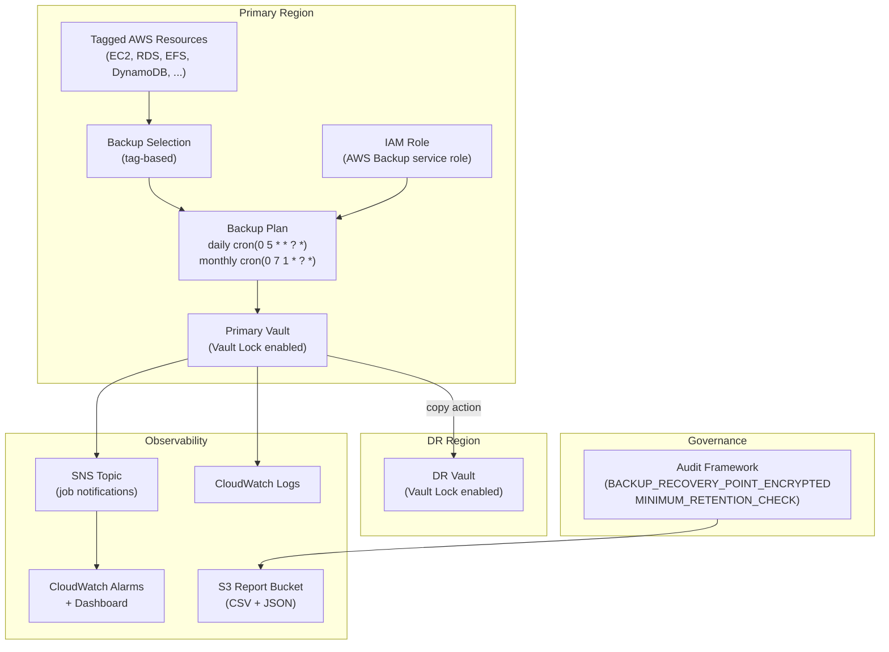

# tf-aws-backup Examples

Runnable examples for the [`tf-aws-backup`](../) Terraform module.

## Available Examples

| Example | Description |
|---------|-------------|
| [basic](basic/) | Single vault with a daily backup plan selected by resource tags, optional cross-region copy, SNS notifications, and CloudWatch alarms/dashboard |
| [complete](complete/) | Production setup with vault lock, daily and monthly backup rules, cross-region DR vault (dual-provider), EC2 VSS advanced settings, audit framework with compliance controls, and CSV/JSON report plans |

## Architecture



## Quick Start

```bash
cd basic/
terraform init
terraform apply -var-file="dev.tfvars"
```

For the full production setup:

```bash
cd complete/
terraform init
terraform apply -var-file="dev.tfvars"
```
