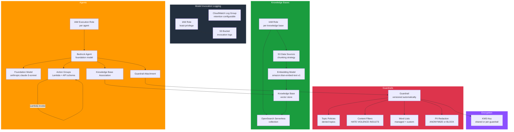

# tf-aws-bedrock

Terraform module for Amazon Bedrock — Build generative AI applications.

This module provisions and wires together the key Amazon Bedrock primitives:
model invocation logging, guardrails, knowledge bases (with S3 data sources),
and agents (with action groups and knowledge base associations). All IAM roles
required by each feature are created and scoped automatically.

---

## Architecture



---

## Features

- **Model invocation logging** — optionally writes embedding, image, and text
  payloads to CloudWatch Logs and/or S3; creates a dedicated IAM role with
  least-privilege permissions.
- **Guardrails** — create one or more named guardrails with topic policies,
  content filters, managed and custom word lists, and PII redaction rules;
  each guardrail is versioned automatically.
- **Knowledge bases** — provision vector knowledge bases backed by OpenSearch
  Serverless; attach one or more S3 data sources per knowledge base with
  configurable chunking; a scoped IAM role is created per knowledge base.
- **Agents** — create Bedrock agents with a foundation model, system prompt,
  optional guardrail attachment, action groups (Lambda + API schema or inline
  function schema), and knowledge base associations; a dedicated IAM execution
  role is created per agent following the required naming convention.
- **KMS encryption** — an optional `kms_key_arn` is applied to the CloudWatch
  log group and to guardrails that do not specify their own key.
- **Consistent tagging** — all resources receive a merged tag map composed of
  `Name`, `Environment`, `Project`, `Owner`, `CostCenter`, `ManagedBy`, and
  any extra tags supplied via `var.tags`.

---

## Versioning

Review [CHANGELOG.md](CHANGELOG.md) before selecting a module version. Use explicit git tags such as `?ref=v1.0.0`, `?ref=v1.1.0`, or `?ref=v2.0.0` so deployments stay predictable.
## Usage

### Minimal

```hcl
module "bedrock" {
  source      = "git::https://github.com/your-org/tf-modules.git//tf-aws-bedrock"
  name        = "myapp"
  environment = "prod"
}
```

### With guardrails enabled

```hcl
module "bedrock" {
  source      = "git::https://github.com/your-org/tf-modules.git//tf-aws-bedrock"
  name        = "myapp"
  environment = "prod"
  kms_key_arn = aws_kms_key.bedrock.arn

  guardrails = {
    default = {
      description            = "Standard content policy"
      blocked_input_message  = "Sorry, this input is not allowed."
      blocked_output_message = "Sorry, this response cannot be provided."

      content_policy_filters = [
        {
          type            = "HATE"
          input_strength  = "HIGH"
          output_strength = "HIGH"
        },
        {
          type            = "VIOLENCE"
          input_strength  = "MEDIUM"
          output_strength = "MEDIUM"
        },
      ]

      managed_word_lists = ["PROFANITY"]
      custom_words       = ["badword1", "badword2"]

      sensitive_information_policy_config = [
        { type = "EMAIL", action = "ANONYMIZE" },
        { type = "PHONE", action = "BLOCK" },
      ]
    }
  }
}
```

### With knowledge bases (BYO OpenSearch collection from tf-aws-opensearch)

The module creates the knowledge base IAM role internally. You only need to
supply the OpenSearch Serverless collection ARN and the S3 bucket ARNs that
hold your documents.

```hcl
module "bedrock" {
  source      = "git::https://github.com/your-org/tf-modules.git//tf-aws-bedrock"
  name        = "myapp"
  environment = "prod"

  knowledge_bases = {
    docs = {
      description                  = "Product documentation knowledge base"
      embedding_model_arn          = "arn:aws:bedrock:us-east-1::foundation-model/amazon.titan-embed-text-v1"
      storage_type                 = "OPENSEARCH_SERVERLESS"
      opensearch_collection_arn    = module.opensearch.collection_arn
      opensearch_vector_index_name = "bedrock-knowledge-base-default-index"

      s3_data_sources = [
        {
          bucket_arn         = aws_s3_bucket.docs.arn
          key_prefixes       = ["product-docs/"]
          chunking_strategy  = "FIXED_SIZE"
          max_tokens         = 300
          overlap_percentage = 20
        },
      ]
    }
  }
}
```

### With agents enabled

```hcl
module "bedrock" {
  source      = "git::https://github.com/your-org/tf-modules.git//tf-aws-bedrock"
  name        = "myapp"
  environment = "prod"

  # Create the knowledge base in the same module call, then reference its ID
  knowledge_bases = {
    docs = {
      opensearch_collection_arn = module.opensearch.collection_arn
      s3_data_sources = [
        { bucket_arn = aws_s3_bucket.docs.arn }
      ]
    }
  }

  guardrails = {
    safe = {
      content_policy_filters = [
        { type = "HATE", input_strength = "HIGH", output_strength = "HIGH" }
      ]
    }
  }

  agents = {
    assistant = {
      foundation_model   = "anthropic.claude-3-sonnet-20240229-v1:0"
      instruction        = "You are a helpful product assistant. Answer questions using only the knowledge base."
      idle_session_ttl   = 600
      guardrail_key      = "safe"
      knowledge_base_ids = [module.bedrock.knowledge_base_ids["docs"]]

      action_groups = [
        {
          name        = "order-lookup"
          description = "Look up order status"
          lambda_arn  = aws_lambda_function.order_lookup.arn
          api_schema = {
            s3_bucket = aws_s3_bucket.schemas.bucket
            s3_key    = "order-lookup-schema.json"
          }
        },
      ]
    }
  }
}
```

---

## Inputs

| Name | Type | Default | Description |
|------|------|---------|-------------|
| `name` | `string` | — | Base name for all resources. Required. |
| `name_prefix` | `string` | `""` | Optional prefix prepended to `name` (`<prefix>-<name>`). |
| `environment` | `string` | `"dev"` | Deployment environment (e.g. dev, staging, prod). Applied as a tag. |
| `project` | `string` | `""` | Project name applied as a tag. |
| `owner` | `string` | `""` | Owner identifier applied as a tag. |
| `cost_center` | `string` | `""` | Cost center code applied as a tag. |
| `tags` | `map(string)` | `{}` | Additional tags merged onto all resources. |
| `enable_model_invocation_logging` | `bool` | `false` | When `true`, creates the `aws_bedrock_model_invocation_logging_configuration` resource and the supporting IAM role. |
| `invocation_log_s3_bucket` | `string` | `null` | S3 bucket name to receive invocation logs. When set, an S3 delivery target is added to the logging config. |
| `invocation_log_s3_prefix` | `string` | `"bedrock-logs/"` | Key prefix for S3 log objects. |
| `invocation_log_cloudwatch_log_group` | `string` | `null` | Name of an existing CloudWatch log group to receive logs. When `null` and logging is enabled, a new log group is created. |
| `invocation_log_retention_days` | `number` | `90` | Retention period in days for the managed CloudWatch log group. |
| `kms_key_arn` | `string` | `null` | ARN of a KMS key used to encrypt the CloudWatch log group and as the default key for guardrails that do not specify their own. |
| `guardrails` | `map(object)` | `{}` | Map of guardrail name to configuration. See [Guardrail object schema](#guardrail-object-schema). |
| `knowledge_bases` | `map(object)` | `{}` | Map of knowledge base name to configuration. See [Knowledge base object schema](#knowledge-base-object-schema). |
| `agents` | `map(object)` | `{}` | Map of agent name to configuration. See [Agent object schema](#agent-object-schema). |

### Guardrail object schema

| Attribute | Type | Default | Description |
|-----------|------|---------|-------------|
| `description` | `string` | `""` | Human-readable description of the guardrail. |
| `blocked_input_message` | `string` | `"Sorry, this input is not allowed."` | Message returned when input is blocked. |
| `blocked_output_message` | `string` | `"Sorry, this response cannot be provided."` | Message returned when output is blocked. |
| `kms_key_arn` | `string` | `null` | Per-guardrail KMS key. Falls back to `var.kms_key_arn` when `null`. |
| `topic_policy_topics` | `list(object)` | `[]` | List of denied topics. Each entry has `name`, `definition`, `type` (`DENY`), and optional `examples`. |
| `content_policy_filters` | `list(object)` | `[]` | List of content filter rules. Each entry has `type` (`SEXUAL\|VIOLENCE\|HATE\|INSULTS\|MISCONDUCT\|PROMPT_ATTACK`), `input_strength`, and `output_strength` (`NONE\|LOW\|MEDIUM\|HIGH`). |
| `managed_word_lists` | `list(string)` | `["PROFANITY"]` | AWS-managed word list names to enable. |
| `custom_words` | `list(string)` | `[]` | Additional custom words to block. |
| `sensitive_information_policy_config` | `list(object)` | `[]` | PII entity rules. Each entry has `type` (e.g. `EMAIL`, `PHONE`, `ADDRESS`) and `action` (`ANONYMIZE\|BLOCK`). |

### Knowledge base object schema

| Attribute | Type | Default | Description |
|-----------|------|---------|-------------|
| `description` | `string` | `""` | Description of the knowledge base. |
| `embedding_model_arn` | `string` | `arn:aws:bedrock:us-east-1::foundation-model/amazon.titan-embed-text-v1` | ARN of the Bedrock embedding foundation model. |
| `storage_type` | `string` | `"OPENSEARCH_SERVERLESS"` | Vector store backend. Supported: `OPENSEARCH_SERVERLESS`, `PINECONE`, `REDIS_ENTERPRISE_CLOUD`, `RDS`. |
| `opensearch_collection_arn` | `string` | `null` | ARN of the OpenSearch Serverless collection. Required when `storage_type` is `OPENSEARCH_SERVERLESS`. |
| `opensearch_vector_index_name` | `string` | `"bedrock-knowledge-base-default-index"` | Name of the vector index in the collection. |
| `opensearch_field_mapping` | `object` | `{}` | Field name overrides: `vector_field`, `text_field`, `metadata_field`. |
| `s3_data_sources` | `list(object)` | `[]` | List of S3 data source configs. Each entry has `bucket_arn`, optional `key_prefixes`, `chunking_strategy` (`FIXED_SIZE\|NONE`), `max_tokens`, and `overlap_percentage`. |

### Agent object schema

| Attribute | Type | Default | Description |
|-----------|------|---------|-------------|
| `description` | `string` | `""` | Description of the agent. |
| `foundation_model` | `string` | — | Foundation model ID to back the agent (e.g. `anthropic.claude-3-sonnet-20240229-v1:0`). Required. |
| `instruction` | `string` | — | System prompt / instruction for the agent. Required. |
| `idle_session_ttl` | `number` | `600` | Idle session timeout in seconds. |
| `knowledge_base_ids` | `list(string)` | `[]` | IDs of knowledge bases to associate with this agent. |
| `guardrail_key` | `string` | `null` | Key from `var.guardrails` to attach to this agent. The guardrail must be declared in the same module call. |
| `action_groups` | `list(object)` | `[]` | Action group definitions. Each entry has `name`, optional `description`, optional `lambda_arn`, optional `api_schema` (`s3_bucket`, `s3_key`), and optional `function_schema`. |

---

## Outputs

| Name | Type | Description |
|------|------|-------------|
| `guardrail_ids` | `map(string)` | Map of guardrail key to Bedrock guardrail ID. |
| `guardrail_arns` | `map(string)` | Map of guardrail key to Bedrock guardrail ARN. |
| `knowledge_base_ids` | `map(string)` | Map of knowledge base key to Bedrock knowledge base ID. |
| `knowledge_base_arns` | `map(string)` | Map of knowledge base key to Bedrock knowledge base ARN. |
| `agent_ids` | `map(string)` | Map of agent key to Bedrock agent ID. |
| `agent_arns` | `map(string)` | Map of agent key to Bedrock agent ARN. |

---

## BYO Pattern

This module follows the Bring Your Own (BYO) pattern for two optional
cross-cutting concerns:

### `kms_key_arn`

Pass the ARN of an existing KMS key (e.g. from the `tf-aws-kms` module) to
encrypt resources at rest. The same key is used for the CloudWatch log group
and as the default key for every guardrail that does not declare its own
`kms_key_arn`. When omitted, AWS-managed keys are used.

```hcl
module "kms" {
  source      = "../tf-aws-kms"
  name        = "bedrock"
  environment = var.environment
}

module "bedrock" {
  source      = "../tf-aws-bedrock"
  name        = var.name
  environment = var.environment
  kms_key_arn = module.kms.key_arn   # BYO KMS key
}
```

### IAM roles

The module creates all IAM roles it needs internally (one for logging, one per
knowledge base, one per agent). If you need to supply a pre-existing role — for
example because your organization enforces a role-creation boundary — replace
the relevant `aws_iam_role` resource by targeting the module and overriding
`role_arn` inputs. This pattern is commonly combined with `tf-aws-iam` to
pre-provision the execution roles before the Bedrock module is applied.

---

## Requirements

| Requirement | Version |
|-------------|---------|
| Terraform | >= 1.3.0 |
| AWS provider | >= 5.0 |

