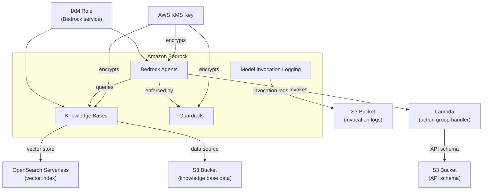

# tf-aws-bedrock Examples

Runnable examples for the [`tf-aws-bedrock`](../) Terraform module.

## Available Examples

| Example | Description |
|---------|-------------|
| [complete](complete/) | Full configuration with KMS encryption, model invocation logging to S3, guardrails, knowledge bases backed by OpenSearch Serverless, and agents with action groups |

## Architecture



## Quick Start

```bash
cd complete/
terraform init
terraform apply -var-file="dev.tfvars"
```
