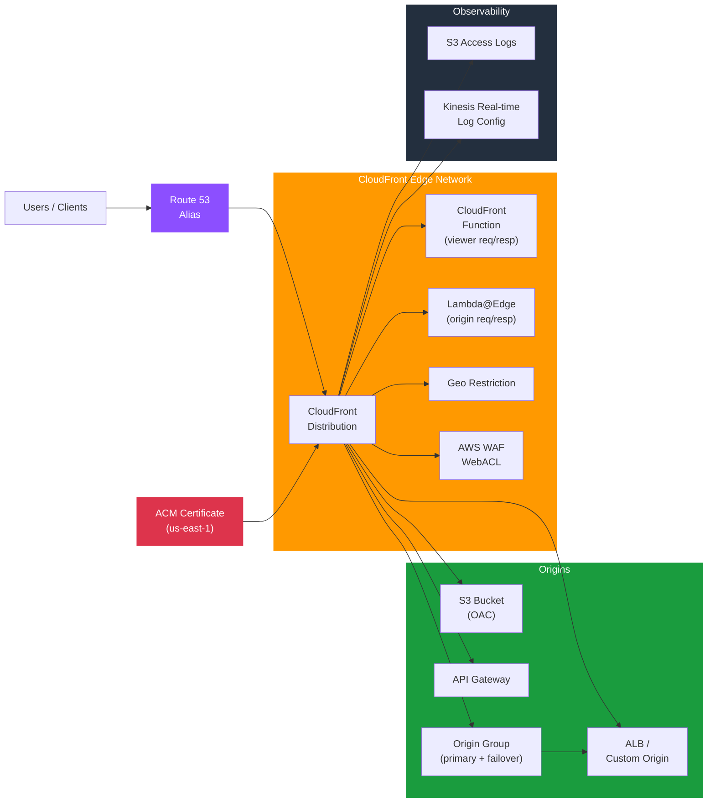

# tf-aws-cloudfront

Terraform module for Amazon CloudFront — CDN distributions with multi-origin, origin failover groups, cache behaviours, Lambda@Edge / CloudFront Functions, OAC for S3, geo-restriction, WAF, and real-time logging.

---

## Architecture



---

## Features

- Multi-origin distributions with custom headers and Origin Shield
- Origin groups for automatic failover between primary and secondary origins
- Origin Access Control (OAC) for private S3 buckets — no public bucket policy needed
- Default and ordered cache behaviours with managed cache/origin-request policies
- Lambda@Edge (viewer-request, origin-request, origin-response, viewer-response)
- CloudFront Functions for lightweight header manipulation at the edge
- Geo-restriction (whitelist or blacklist by country)
- AWS WAF WebACL association
- Custom SSL certificate via ACM (must be in us-east-1)
- Real-time log streaming to Kinesis Data Streams
- S3 access log delivery

## Security Controls

| Control | Implementation |
|---------|---------------|
| Private S3 access | Origin Access Control (OAC) |
| TLS enforcement | `viewer_protocol_policy = "redirect-to-https"` |
| Minimum TLS version | `minimum_protocol_version = "TLSv1.2_2021"` |
| Layer 7 firewall | `web_acl_id` (WAFv2 CLOUDFRONT scope) |
| Geo-blocking | `geo_restriction_type`, `geo_restriction_locations` |

## Versioning

Use explicit git tags such as `?ref=v1.0.0` to pin your deployments.

## Usage

```hcl
module "cdn" {
  source = "git::https://github.com/your-org/golden_modules.git//tf-aws-cloudfront?ref=v1.0.0"

  enabled         = true
  is_ipv6_enabled = true
  aliases         = ["cdn.example.com"]

  viewer_certificate = {
    acm_certificate_arn      = module.acm.certificate_arn
    ssl_support_method       = "sni-only"
    minimum_protocol_version = "TLSv1.2_2021"
  }

  origins = {
    s3 = {
      domain_name              = module.s3.bucket_regional_domain_name
      origin_access_control_id = aws_cloudfront_origin_access_control.main.id
    }
    api = {
      domain_name = "api.example.com"
      custom_origin_config = {
        http_port              = 80
        https_port             = 443
        origin_protocol_policy = "https-only"
      }
    }
  }

  default_cache_behavior = {
    target_origin_id       = "s3"
    viewer_protocol_policy = "redirect-to-https"
    cached_methods         = ["GET", "HEAD"]
    cache_policy_id        = "658327ea-f89d-4fab-a63d-7e88639e58f6" # CachingOptimized
  }

  logging_config = {
    bucket = module.log_bucket.bucket_domain_name
    prefix = "cloudfront/"
  }
}
```

## Cache Policy Reference

| Policy | ID | Use Case |
|--------|----|----------|
| CachingOptimized | `658327ea-…` | Static assets (default) |
| CachingDisabled | `4135ea2d-…` | APIs / dynamic content |
| CachingOptimizedForUncompressedObjects | `b2884449-…` | Pre-compressed assets |

## Examples

- [Static S3 Website](examples/s3-static/)
- [API + S3 Multi-origin](examples/multi-origin/)
- [Origin Failover Group](examples/failover/)
