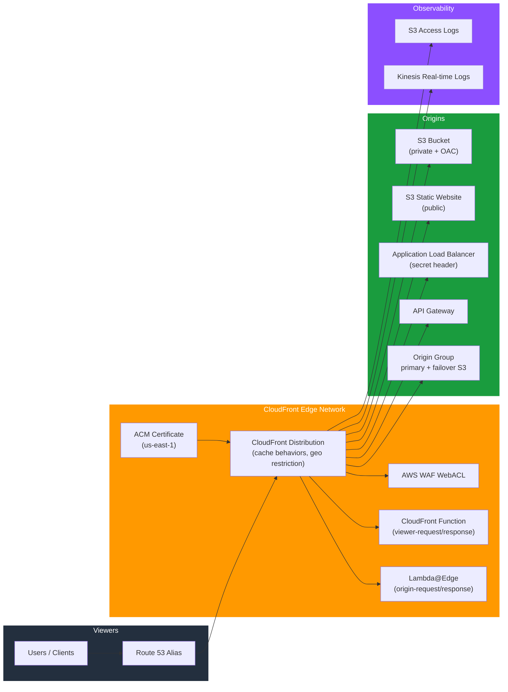

# tf-aws-cloudfront — Examples

> Quick-start examples for the `tf-aws-cloudfront` Terraform module.

## Available Examples

| Example | Description |
|---------|-------------|
| [basic-s3-website](basic-s3-website/) | Minimal config — public S3 static website with HTTPS and global edge caching; ideal starting point |
| [spa-s3-oac](spa-s3-oac/) | Private S3 bucket + Origin Access Control (OAC) for a React/Angular/Vue SPA; aggressive asset caching with cache-busting headers |
| [alb-backend](alb-backend/) | CloudFront in front of an internal ALB (ECS/EKS/EC2); secret-header protection, WAF, Origin Shield, static + dynamic cache behaviors |
| [multi-origin-path-routing](multi-origin-path-routing/) | Single distribution with three origins — S3 (static assets, OAC), ALB (API `/api/*`), and a private media bucket (`/media/*`, `/uploads/*`) |
| [lambda-edge-functions](lambda-edge-functions/) | CloudFront Functions for JWT auth + URL normalisation at the viewer layer; Lambda@Edge for A/B testing and canary traffic splitting at the origin layer |
| [origin-failover-group](origin-failover-group/) | CloudFront Origin Group with automatic S3 cross-region failover (us-east-1 → us-west-2) on 5xx errors using OAC on both buckets |
| [realtime-payment-api](realtime-payment-api/) | Full config — CloudFront in front of API Gateway for a PCI-DSS payment platform; CachingDisabled, TLS 1.2+, security headers, WAF, Origin Shield |

## Architecture



## Running an Example

```bash
cd basic-s3-website
terraform init
terraform apply -var-file="dev.tfvars"
```
