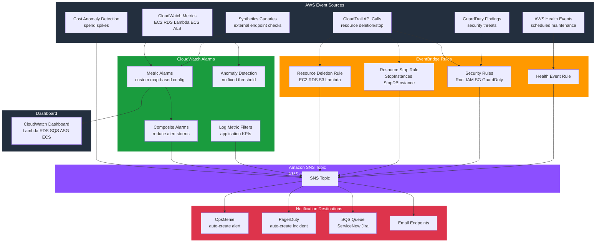

# tf-aws-cloudwatch

A production-grade Terraform module for comprehensive AWS observability. Covers every day-to-day SRE operational scenario: metric alarms, security events, resource deletion/stop detection, cost anomalies, health events, and real-time notification routing to OpsGenie, PagerDuty, and Slack.

---

## Architecture



---

## Real-Time SRE Notification Architecture

```
AWS Resources (EC2, RDS, Lambda, ECS, ALB, etc.)
        │
        │ emit metrics / API calls / events
        ▼
┌─────────────────────────────────────────────────────────┐
│            AWS Event Sources                             │
│                                                          │
│  CloudWatch Metrics ──────► CloudWatch Alarms           │
│  CloudTrail API Calls ─────► EventBridge Rules          │
│  GuardDuty Findings ───────► EventBridge Rules          │
│  AWS Health Events ────────► EventBridge Rules          │
│  Synthetics Canaries ──────► CloudWatch Alarms          │
│  Cost Explorer ────────────► Cost Anomaly Subscriptions │
└─────────────────────────────────────────────────────────┘
        │
        │ publish
        ▼
┌─────────────────────────┐
│      Amazon SNS Topic    │  ◄── All alarm sources publish here
│  (KMS-encrypted in prod) │
└─────────────────────────┘
        │
        ├─────────────────────────────┬────────────────────────────┐
        │                             │                            │
        ▼                             ▼                            ▼
┌───────────────┐          ┌──────────────────┐         ┌─────────────────┐
│   OpsGenie    │          │    PagerDuty      │         │  SQS Queue      │
│   (HTTPS)     │          │    (HTTPS)        │         │  (raw JSON)     │
│               │          │                  │         │                 │
│ - Auto-creates│          │ - Auto-creates   │         │ - ServiceNow    │
│   alert       │          │   incident       │         │ - Jira          │
│ - Routes to   │          │ - Routes to      │         │ - Custom Lambda │
│   on-call team│          │   on-call sched. │         │ - Audit log     │
│ - Auto-closes │          │ - Auto-resolves  │         │                 │
│   on OK state │          │   on OK state    │         └─────────────────┘
└───────────────┘          └──────────────────┘
        │
        │ on-call engineer is paged
        ▼
┌─────────────────────────────────────────────┐
│               OpsGenie Alert                 │
│                                              │
│  Title:   prod-myapp-lambda_errors           │
│  Message: Lambda function prod-myapp is      │
│           throwing errors. Check Logs.       │
│  Source:  CloudWatch                         │
│  Priority: P1 (Critical)                     │
│                                              │
│  Actions:                                    │
│  [Acknowledge] [Close] [Add Note]            │
│  [Escalate to team lead]                     │
└─────────────────────────────────────────────┘
```

---

## Day-to-Day Operational Scenarios

### 1. Lambda Function Errors
**Scenario**: Lambda function starts returning errors in production.

**Detection flow**:
1. Lambda emits `Errors` metric to CloudWatch
2. `lambda_errors` alarm fires (threshold: 1 error in 60s)
3. SNS → OpsGenie → pages on-call engineer in < 1 minute
4. Log metric filter also fires `AppErrors` alarm from CloudWatch Logs

**What the SRE sees in OpsGenie**:
```
ALARM: prod-myapp-lambda_errors
Lambda prod-myapp-processor is throwing errors. Check CloudWatch Logs.
Metric: Errors = 5 (threshold: 1)
```

**SRE action**: Check CloudWatch Logs Insights → identify error → hotfix or rollback.

---

### 2. RDS Database Deleted (Who Did It?)
**Scenario**: Production RDS database disappears. Customers cannot access data.

**Detection flow**:
1. Someone calls `DeleteDBInstance` API (console, CLI, or Terraform)
2. CloudTrail records the event with full `userIdentity`
3. EventBridge matches the CloudTrail event within 60 seconds
4. SNS publishes to high-priority P1 topic → immediate OpsGenie P1 alert

**What the SRE sees**:
```
RESOURCE DELETED: DeleteDBInstance

Account   : 123456789012
Region    : us-east-1
Time      : 2026-03-23T14:32:11Z
Action    : DeleteDBInstance

Who did it:
  Identity  : AssumedRole
  User ARN  : arn:aws:sts::123456789012:assumed-role/DevOpsRole/john.smith
  Username  : john.smith
  Role      : DevOpsRole
  Source IP : 203.0.113.42
  User-Agent: aws-cli/2.13.0

Request details:
  {"dBInstanceIdentifier": "prod-myapp-postgres", "skipFinalSnapshot": true}

If this deletion was unintended, check CloudTrail immediately.
```

**SRE action**: Restore from automated backup. Investigate if intentional. File incident.

---

### 3. EC2 Instance Stopped (Unexpected Downtime)
**Scenario**: A developer accidentally stops a production EC2 instance via console.

**Detection flow**:
1. Someone calls `StopInstances` API
2. CloudTrail records with full actor identity
3. EventBridge rule fires within 60 seconds
4. SNS notification includes who stopped it and the instance ID

**What the SRE sees**:
```
RESOURCE STOPPED: StopInstances

Who stopped it:
  Identity  : IAMUser
  Username  : alice.johnson
  Source IP : 198.51.100.15

Request details:
  {"instancesSet": {"items": [{"instanceId": "i-0abc123def456789"}]}}

This may be causing service downtime. Verify this was intentional.
```

**SRE action**: Restart instance if unintended. Investigate root cause. Restrict console access.

---

### 4. RDS Stopped in Production
**Scenario**: RDS database stopped — applications cannot connect.

**Detection flow**:
1. `StopDBInstance` API call recorded by CloudTrail
2. EventBridge fires within 60 seconds
3. High-priority SNS alert with who stopped it

**SRE action**: Start DB immediately. Review why it was stopped. Add SCPs to prevent in prod.

---

### 5. Root Account Used
**Scenario**: Someone logs in with the AWS root account (major security violation).

**Detection flow**:
1. CloudTrail records any root account API/console action
2. EventBridge matches `userIdentity.type = "Root"`
3. Dedicated security SNS topic → immediate P0 security alert

**What the SRE/security team sees**:
```
SECURITY ALERT: Root Account Used
Account: 123456789012
Region: us-east-1
Action: ConsoleLogin
Source IP: 203.0.113.5

Root account usage is a security violation. Investigate immediately.
```

**SRE action**: Immediately investigate. Rotate root credentials. Enable MFA if missing. File security incident.

---

### 6. IAM Privilege Escalation Attempt
**Scenario**: An attacker or misconfigured automation attaches `AdministratorAccess` to a role.

**Detection flow**:
1. `AttachRolePolicy` with `AdministratorAccess` recorded by CloudTrail
2. EventBridge `iam_policy_change` rule fires
3. Security SNS topic → immediate alert

**What the SRE sees**:
```
SECURITY ALERT: IAM Policy Changed
Event: AttachRolePolicy
Performed by: arn:aws:sts::123456789012:assumed-role/AutomationRole/terraform
Details: {"roleName": "ApiServerRole", "policyArn": "arn:aws:iam::aws:policy/AdministratorAccess"}

Possible privilege escalation. Verify this policy change was authorized.
```

---

### 7. GuardDuty: Compromised Credentials / Crypto Mining
**Scenario**: GuardDuty detects unusual EC2 activity (bitcoin mining or credential exfiltration).

**Detection flow**:
1. GuardDuty emits HIGH or CRITICAL finding
2. EventBridge matches severity >= 7.0
3. Security SNS topic → immediate alert

**What the SRE sees**:
```
SECURITY ALERT: GuardDuty Finding
Severity : 8.9
Type     : CryptoCurrency:EC2/BitcoinTool.B!DNS
Account  : 123456789012
Count    : 3 occurrence(s)

Description: EC2 instance i-0abc123def456789 is querying a domain name associated
with a bitcoin mining pool.

Affected resource: {"instanceDetails": {"instanceId": "i-0abc123def456789"}}
```

**SRE action**: Isolate instance immediately. Forensics investigation. Reset compromised credentials.

---

### 8. ASG CPU High + Maxed Out (Cannot Scale Further)
**Scenario**: Traffic spike causes CPU to saturate AND ASG hits max capacity.

**Detection flow**:
1. `asg_cpu_high` alarm fires (CPU > 75% for 2 × 5min periods)
2. `asg_maxed_out` alarm fires (GroupInServiceInstances >= 20)
3. **Composite alarm** fires (both conditions true simultaneously)
4. OpsGenie P1 alert — single page, not two pages

**What the SRE sees**:
```
ALARM: prod-myapp-asg-prod-myapp-asg-maxed-out
ASG prod-myapp-asg is at maximum capacity (20 instances). Cannot scale out further.
```

**SRE action**: Increase ASG `max_size`. Investigate traffic surge. Scale vertically if needed.

---

### 9. SQS Dead Letter Queue Has Messages
**Scenario**: Payment processor Lambda is failing — messages landing in DLQ.

**Detection flow**:
1. Lambda fails to process messages 3 times → SQS moves to DLQ
2. `sqs_dlq_depth` alarm fires (any DLQ message = alarm)
3. Composite alarm `processing_failure` fires simultaneously
4. SNS → OpsGenie P2 alert

**SRE action**: Check Lambda errors in CloudWatch Logs. Fix bug. Redrive DLQ messages.

---

### 10. AWS Backup Job Failed
**Scenario**: Nightly RDS backup fails silently. Compliance requires daily backups.

**Detection flow**:
1. AWS Backup emits `FailedBackupJobsCount` metric
2. `backup_job_failed` alarm fires (any failure = alarm)
3. SNS alert at end of backup window

**What the SRE sees**:
```
ALARM: prod-myapp-backup-job-failed
AWS Backup failed backup job count exceeded threshold. A backup job failed in the last day.
Check AWS Backup console for failure details and retry manually.
```

---

### 11. RDS Planned Maintenance Window
**Scenario**: AWS schedules a maintenance reboot of your RDS instance next Thursday.

**Detection flow**:
1. AWS Health emits `scheduledChange` event for RDS
2. EventBridge routes to SNS
3. SRE team gets advance notice (usually 2+ weeks)

**What the SRE sees**:
```
AWS HEALTH EVENT
Service   : RDS
Category  : scheduledChange
Event     : AWS_RDS_MAINTENANCE_SCHEDULED
Start     : 2026-04-01T03:00:00Z
End       : 2026-04-01T04:00:00Z

Description:
AWS will perform required maintenance on your Amazon RDS DB instance
prod-myapp-postgres on April 1, 2026 between 03:00 and 04:00 UTC.

Affected resources: [{"entityValue": "prod-myapp-postgres"}]
```

**SRE action**: Schedule maintenance window in OpsGenie. Initiate manual failover before window.

---

### 12. ACM Certificate Expiring
**Scenario**: TLS certificate for api.myapp.com is about to expire. ACM auto-renewal failed.

**Detection flow**:
1. CloudWatch checks `DaysToExpiry` metric daily
2. Warning alarm fires at 30 days
3. Critical alarm fires at 7 days
4. SNS → OpsGenie P2 (warning) or P1 (critical)

**SRE action**: Check ACM console for renewal status. Fix DNS validation if broken. Manual renewal if needed.

---

### 13. Cost Anomaly: Lambda Runaway Loop
**Scenario**: A Lambda bug causes infinite retry → Lambda invocations spike → bill increases $5,000/day.

**Detection flow**:
1. AWS Cost Anomaly Detection ML model detects spend spike
2. Alert fires when anomalous cost > $200
3. SNS notification with service breakdown

**What the SRE sees**:
```
Cost Anomaly Detected
Monitor: prod-myapp-cost-monitor
Anomalous service: AWS Lambda
Impact: $847.23 more than expected today
Expected: $12.50/day, Actual: $859.73/day

Root cause: Unusual increase in Lambda invocations and duration.
```

**SRE action**: Check Lambda invocation graphs. Find the runaway function. Fix bug. Set reserved concurrency to cap blast radius.

---

### 14. Endpoint Down (Synthetics Canary)
**Scenario**: api.myapp.com/health returns 503. Customers cannot reach the API.

**Detection flow**:
1. Synthetics canary checks endpoint every 5 minutes
2. Success rate drops below 90%
3. `canary_api_health` alarm fires
4. SNS → OpsGenie P1

**Advantage over CloudWatch alarms**: Canaries test from OUTSIDE your VPC using the same DNS path as customers. CloudWatch alarms only see metrics — they don't catch DNS failures, SSL errors, or wrong HTTP responses.

---

### 15. Security Group Opened to 0.0.0.0/0
**Scenario**: Developer adds port 22 (SSH) open to the internet on a production security group.

**Detection flow**:
1. `AuthorizeSecurityGroupIngress` recorded by CloudTrail
2. EventBridge `security_group_change` rule fires
3. Security SNS topic → immediate alert

**What the SRE sees**:
```
SECURITY ALERT: Security Group Changed
Event: AuthorizeSecurityGroupIngress
Changed by: arn:aws:sts::123456789012:assumed-role/DevRole/bob.smith
Details: {"groupId": "sg-0abc123", "ipPermissions": {"items": [{"ipProtocol": "tcp",
  "fromPort": 22, "toPort": 22, "ipRanges": {"items": [{"cidrIp": "0.0.0.0/0"}]}}]}}

Check if new ingress rules expose ports to 0.0.0.0/0 (internet).
```

---

## Notification Tools Integration Setup

### OpsGenie Setup
1. In OpsGenie: **Teams** → `<your team>` → **Integrations** → **Add Integration** → **Amazon SNS**
2. Copy the generated HTTPS endpoint URL
3. Set the URL as an environment variable (keep out of Terraform state):
   ```bash
   export TF_VAR_opsgenie_endpoint_url="https://api.opsgenie.com/v1/json/amazonsns?apiKey=YOUR_KEY"
   ```
4. In OpsGenie Integration settings:
   - Set **Alert Priority** based on CloudWatch alarm `Severity` tag: `critical` → P1, `warning` → P2
   - Enable **Auto-close on OK** — alarm resolves automatically when metric recovers
   - Set **Responders** to your on-call team schedule

### PagerDuty Setup
1. In PagerDuty: **Services** → `<service>` → **Integrations** → **Add Integration** → **Amazon CloudWatch**
2. Copy the integration URL
3. Set as environment variable:
   ```bash
   export TF_VAR_pagerduty_endpoint_url="https://events.pagerduty.com/integration/YOUR_KEY/enqueue"
   ```
4. PagerDuty automatically resolves incidents when CloudWatch sends OK state.

### Slack (AWS Chatbot)
AWS Chatbot connects CloudWatch alarms directly to Slack without this module.
Set it up separately:
1. AWS Console → **AWS Chatbot** → **Configure Slack workspace**
2. Create a Chatbot configuration pointing to your SNS topic
3. Set the Slack channel for alerts
4. Chatbot formats CloudWatch alarms into rich Slack messages automatically.

### ServiceNow / Jira (via SQS)
1. Set `alarm_sqs_queue_arn` to your SQS queue
2. Deploy a Lambda that reads from SQS and creates ServiceNow incidents or Jira tickets
3. The SQS subscription uses `raw_message_delivery = true` for easy JSON parsing

---

## What AWS Provides Natively (No Terraform Needed)

| Feature | How to enable |
|---------|--------------|
| Lambda function errors, duration, throttles | CloudWatch Lambda Insights (enable in Lambda console) |
| RDS Enhanced Monitoring | Enable in RDS parameter group |
| ECS Container Insights | `aws ecs update-cluster-settings --settings name=containerInsights,value=enabled` |
| EC2 detailed monitoring | Enable per-instance in EC2 console |
| ALB access logs | Enable in ALB settings → S3 bucket |
| VPC Flow Logs | Enable per-VPC → CloudWatch Logs |
| CloudTrail management events | Default trail in most accounts |
| AWS Config rules | Enable in Config console |
| Service Quotas dashboard | Built-in in console |
| Trusted Advisor | AWS Support plan (Business or Enterprise) |

## What This Module Adds

| Feature | Why it's needed |
|---------|----------------|
| Custom metric alarms with map-based config | Native alarms require ClickOps or per-resource Terraform |
| CloudTrail deletion + stop alerts with actor | AWS does NOT alert you when resources are deleted by default |
| Composite alarms | Reduces alert storms — page once per incident, not per symptom |
| Anomaly detection | No fixed threshold needed for time-varying metrics |
| Log metric filters | Extract business KPIs from application logs |
| Synthetics canaries | Tests from outside your network; catches DNS/SSL/WAF issues |
| GuardDuty → SNS routing | GuardDuty findings need manual EventBridge rule to reach OpsGenie |
| AWS Health → SNS | Health events don't auto-notify — need EventBridge rule |
| Cost anomaly → SNS | Cost Anomaly Detection needs Terraform for subscription config |
| Multi-service dashboard | Combines Lambda + RDS + SQS + ASG + ECS into one view |

---

## Module Structure

```
tf-aws-cloudwatch/
├── versions.tf              # Terraform + provider version constraints
├── data.tf                  # Shared data sources (partition, region, account)
├── locals.tf                # Core locals: prefix, common_tags, effective_sns_arn
├── variables.tf             # Core variables: naming, tags, SNS, integrations
├── sns.tf                   # SNS topic (BYO or create) + all subscriptions
├── alarms_generic.tf        # Any metric + anomaly detection + composite alarms
├── alarms_log_filters.tf    # CloudWatch log metric filters with alarms
├── alarms_asg.tf            # ASG CPU high/low, maxed-out, below-min
├── alarms_backup.tf         # AWS Backup job/restore/copy failures
├── alarms_rds.tf            # RDS CPU, memory, storage, connections, replica lag
├── alarms_api_gateway.tf    # API Gateway 5xx/4xx, latency p99
├── alarms_ecs.tf            # ECS CPU, memory, running task count
├── alarms_alb.tf            # ALB 5xx/4xx, target response time, unhealthy hosts
├── alarms_elasticache.tf    # ElastiCache CPU, evictions, memory, connections
├── alarms_acm.tf            # ACM certificate expiry (warning 30d + critical 7d)
├── synthetics.tf            # CloudWatch Synthetics canaries
├── cloudtrail_deletion.tf   # Resource deletion alerts with actor identity
├── cloudtrail_stop.tf       # Resource stop alerts with actor identity
├── security_alerts.tf       # Root usage, IAM changes, SG changes, GuardDuty
├── health_events.tf         # AWS Health service issues + maintenance
├── cost_anomaly.tf          # AWS Cost Anomaly Detection
├── eventbridge_routing.tf   # Route alarm state changes to SQS/Lambda for ITSM
├── dashboard.tf             # Auto-generated CloudWatch operations dashboard
├── outputs.tf               # All module outputs
└── examples/complete/       # Full working example with all features
    ├── main.tf              # Module call with all variables
    ├── variables.tf         # All example variables
    ├── outputs.tf           # Pass-through outputs
    ├── dev.tfvars           # Dev: email only, minimal features
    └── prod.tfvars          # Prod: OpsGenie + PagerDuty + all features
```

---

## Quick Start

### Minimum viable setup (dev)
```hcl
module "monitoring" {
  source = "git::https://github.com/your-org/tf-aws-cloudwatch.git"

  name            = "myapp"
  environment     = "dev"
  email_endpoints = ["dev-team@example.com"]

  metric_alarms = {
    lambda_errors = {
      namespace          = "AWS/Lambda"
      metric_name        = "Errors"
      dimensions         = { FunctionName = "dev-myapp-processor" }
      statistic          = "Sum"
      threshold          = 1
      period             = 60
      evaluation_periods = 1
      treat_missing_data = "notBreaching"
      alarm_description  = "Lambda is throwing errors"
    }
  }
}
```

### Production setup with OpsGenie + CloudTrail
```bash
# Set sensitive values via environment variables — NOT in tfvars files
export TF_VAR_opsgenie_endpoint_url="https://api.opsgenie.com/v1/json/amazonsns?apiKey=..."

terraform init
terraform apply -var-file=prod.tfvars
```

```hcl
module "monitoring" {
  source = "git::https://github.com/your-org/tf-aws-cloudwatch.git"

  name            = "myapp"
  name_prefix     = "prod"
  environment     = "prod"
  email_endpoints = ["oncall@example.com"]

  opsgenie_endpoint_url = var.opsgenie_endpoint_url  # from TF_VAR_

  # Alert when someone deletes production resources
  enable_resource_deletion_alerts = true
  deletion_alert_services         = ["ec2", "rds", "s3", "lambda"]

  # Alert when someone stops EC2 or RDS
  enable_resource_stop_alerts = true

  # Security: root usage, IAM changes, SG changes
  enable_security_alerts  = true
  enable_guardduty_alerts = true

  # Cost spikes > $500
  enable_cost_anomaly_detection  = true
  cost_anomaly_threshold_dollars = 500
}
```

---

## Outputs

| Output | Description |
|--------|-------------|
| `sns_topic_arn` | Effective SNS topic ARN |
| `metric_alarm_arns` | Map of key → alarm ARN for generic alarms |
| `anomaly_alarm_arns` | Map of key → alarm ARN for anomaly alarms |
| `composite_alarm_arns` | Map of key → composite alarm ARN |
| `rds_cpu_alarm_arns` | Map of key → RDS CPU alarm ARN |
| `rds_storage_alarm_arns` | Map of key → RDS storage alarm ARN |
| `asg_cpu_high_alarm_arns` | Map of ASG name → CPU high alarm ARN |
| `asg_cpu_low_alarm_arns` | Map of ASG name → CPU low alarm ARN |
| `alb_5xx_alarm_arns` | Map of key → ALB 5xx alarm ARN |
| `alb_unhealthy_alarm_arns` | Map of key → ALB unhealthy host alarm ARN |
| `ecs_cpu_alarm_arns` | Map of key → ECS CPU alarm ARN |
| `elasticache_cpu_alarm_arns` | Map of key → ElastiCache CPU alarm ARN |
| `acm_expiry_warning_alarm_arns` | List of ACM warning alarm ARNs |
| `acm_expiry_critical_alarm_arns` | List of ACM critical alarm ARNs |
| `backup_job_failed_alarm_arn` | Backup job failed alarm ARN |
| `canary_arns` | Map of key → Synthetics canary ARN |
| `deletion_alert_rule_arns` | Map of service → deletion EventBridge rule ARN |
| `stop_alert_rule_arns` | Map of service → stop EventBridge rule ARN |
| `security_rule_arns` | Map of security rule names → ARNs |
| `cost_anomaly_monitor_arn` | Cost Anomaly Detection monitor ARN |
| `dashboard_name` | CloudWatch dashboard name |
| `dashboard_url` | Direct URL to CloudWatch dashboard |

---

## Prerequisites

| Feature | Prerequisite |
|---------|-------------|
| CloudTrail deletion/stop alerts | CloudTrail with **management events** enabled |
| Security alerts | CloudTrail with management events |
| GuardDuty alerts | GuardDuty enabled in the account |
| Cost anomaly detection | AWS Cost Explorer enabled |
| Synthetics canaries | No special prerequisite |
| AWS Health events | No special prerequisite (global endpoint, us-east-1) |

---

## Requirements

| Name | Version |
|------|---------|
| terraform | >= 1.3.0 |
| hashicorp/aws | >= 5.0 |
| hashicorp/archive | >= 2.0 |

## Versioning

Review [CHANGELOG.md](CHANGELOG.md) before selecting a module version. Use explicit git tags such as `?ref=v1.0.0`, `?ref=v1.1.0`, or `?ref=v2.0.0` so deployments stay predictable.

