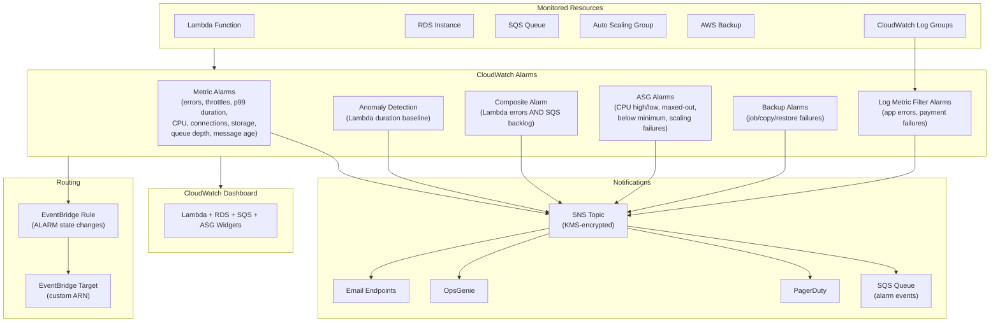

# tf-aws-cloudwatch Examples

Runnable examples for the [`tf-aws-cloudwatch`](../) Terraform module.

## Available Examples

| Example | Description |
|---------|-------------|
| [complete](complete/) | Full observability stack with metric alarms for Lambda, RDS, and SQS; ASG scaling alarms; anomaly detection; composite alarm; log metric filters with alarms; CloudWatch dashboard; AWS Backup alarms; EventBridge routing; and SNS topic with email/OpsGenie/PagerDuty subscriptions |

## Architecture



## Quick Start

```bash
cd complete/
terraform init
terraform apply -var-file="dev.tfvars"
```
