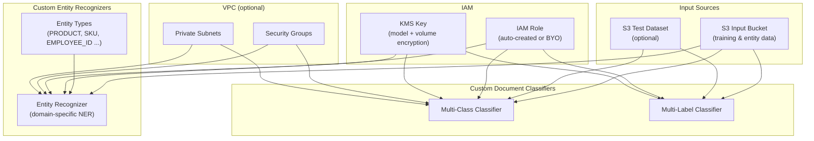

# tf-aws-comprehend

Terraform module for deploying **AWS Comprehend** custom NLP models — including
custom document classifiers and custom entity recognizers — with production-grade
IAM, KMS encryption, and VPC support.

## Purpose

AWS Comprehend Custom allows you to train domain-specific NLP models on your own
data. This module manages the full lifecycle of:

- **Custom document classifiers** — categorise documents into your own taxonomy
  (multi-class or multi-label).
- **Custom entity recognizers** — extract domain-specific entities (e.g. product
  SKUs, medical terms, legal clauses) that the built-in Comprehend models do not
  cover.

Common use cases:
- **Sentiment analysis pipelines** — route customer feedback by topic before
  running built-in sentiment detection.
- **PII detection & redaction** — train a recognizer to identify proprietary
  ID formats alongside standard PII.
- **Industry-specific NER** — extract pharmaceutical compound names, financial
  instrument identifiers, or manufacturing part numbers.
- **Content moderation triage** — classify support tickets by product area to
  improve auto-routing accuracy.

---

## File layout

```
tf-aws-comprehend/
├── versions.tf              # Provider & Terraform version constraints
├── variables.tf             # All input variables with validation
├── outputs.tf               # All output values
├── locals.tf                # Derived locals (name_prefix, tags, role_arn)
├── data.tf                  # Data sources (region, account, partition)
├── document_classifiers.tf  # aws_comprehend_document_classifier resources
├── entity_recognizers.tf    # aws_comprehend_entity_recognizer resources
├── iam.tf                   # Auto-created IAM role (opt-in)
└── tests/
    ├── unit/
    │   ├── defaults.tftest.hcl    # Verify default variable values
    │   └── validation.tftest.hcl  # Verify input validation rules
    └── integration/
        └── basic.tftest.hcl       # Plan-only integration test (cost note)
```

---

## Design principles

| Principle | Implementation |
|---|---|
| Opt-in features | All resource creation behind boolean gates (default `false`) |
| BYO pattern | `role_arn = null` → auto-create; `role_arn = "arn:..."` → use existing |
| `for_each` everywhere | All primary resources use `for_each` for safe drift detection |
| KMS from tf-aws-kms | `kms_key_arn` / `volume_kms_key_arn` wired through; `null` = no encryption |
| Least-privilege IAM | Inline policy scoped to declared S3 buckets and KMS key ARNs |

---

## Minimal example — entity recognizer for product names

```hcl
module "comprehend" {
  source  = "./tf-aws-comprehend"

  name_prefix = "acme-prod"

  create_entity_recognizers = true

  entity_recognizers = {
    product-ner = {
      language_code = "en"

      entity_types = [
        { type = "PRODUCT" },
        { type = "SKU" },
      ]

      entity_list = {
        s3_uri = "s3://acme-ml-data/comprehend/product-entity-list.csv"
      }

      tags = { Team = "data-science" }
    }
  }

  tags = {
    Environment = "production"
    CostCenter  = "ml-platform"
  }
}

output "recognizer_arns" {
  value = module.comprehend.entity_recognizer_arns
}
```

---

## BYO IAM role (tf-aws-iam integration)

When you manage IAM centrally via **tf-aws-iam**, pass the role ARN and disable
auto-creation:

```hcl
module "iam" {
  source = "./tf-aws-iam"
  # ... your IAM module config
}

module "comprehend" {
  source  = "./tf-aws-comprehend"

  name_prefix = "acme-prod"

  # BYO IAM
  create_iam_role = false
  role_arn        = module.iam.comprehend_role_arn

  create_entity_recognizers = true

  entity_recognizers = {
    support-classifier = {
      language_code = "en"
      entity_types  = [{ type = "TICKET_CATEGORY" }]
      entity_list   = { s3_uri = "s3://acme-ml-data/support/entity-list.csv" }
    }
  }
}
```

---

## BYO KMS keys (tf-aws-kms integration)

```hcl
module "kms" {
  source = "./tf-aws-kms"
  # ... your KMS module config
}

module "comprehend" {
  source  = "./tf-aws-comprehend"

  name_prefix = "acme-prod"

  # Module-level keys apply to all resources unless overridden per-resource
  kms_key_arn        = module.kms.model_key_arn
  volume_kms_key_arn = module.kms.volume_key_arn

  create_document_classifiers = true

  document_classifiers = {
    legal-docs = {
      language_code = "en"
      mode          = "MULTI_CLASS"
      s3_uri        = "s3://acme-legal/training/train.csv"

      # Override with a separate key for this classifier
      model_kms_key_id = module.kms.legal_key_arn
    }
  }
}
```

---

## Multi-label document classifier

```hcl
module "comprehend" {
  source  = "./tf-aws-comprehend"

  name_prefix = "acme"

  create_document_classifiers = true

  document_classifiers = {
    support-topics = {
      language_code   = "en"
      mode            = "MULTI_LABEL"
      label_delimiter = "|"
      s3_uri          = "s3://acme-support/training/labels.csv"
      test_s3_uri     = "s3://acme-support/training/test.csv"
      version_name    = "v2"
    }
  }
}
```

---

## VPC-isolated training

```hcl
module "comprehend" {
  source  = "./tf-aws-comprehend"

  name_prefix = "acme"

  create_entity_recognizers = true

  entity_recognizers = {
    pii-detector = {
      language_code = "en"
      entity_types  = [{ type = "EMPLOYEE_ID" }, { type = "SSN" }]
      entity_list   = { s3_uri = "s3://acme-secure/pii/entity-list.csv" }

      vpc_config = {
        security_group_ids = ["sg-0abc123def456"]
        subnets            = ["subnet-0111aaa", "subnet-0222bbb"]
      }
    }
  }
}
```

---

## Inputs

### Feature gates

| Name | Type | Default | Description |
|---|---|---|---|
| `create_document_classifiers` | `bool` | `false` | Create custom document classifiers |
| `create_entity_recognizers` | `bool` | `false` | Create custom entity recognizers |
| `create_iam_role` | `bool` | `true` | Auto-create IAM role for Comprehend |

### BYO / shared references

| Name | Type | Default | Description |
|---|---|---|---|
| `role_arn` | `string` | `null` | Existing role ARN (used when `create_iam_role = false`) |
| `kms_key_arn` | `string` | `null` | KMS key for model encryption |
| `volume_kms_key_arn` | `string` | `null` | KMS key for training volume encryption |

### Naming & tagging

| Name | Type | Default | Description |
|---|---|---|---|
| `name_prefix` | `string` | `""` | Prefix for all resource names |
| `tags` | `map(string)` | `{}` | Tags applied to all resources |

### Resource maps

| Name | Type | Default | Description |
|---|---|---|---|
| `document_classifiers` | `map(object)` | `{}` | Document classifiers to create |
| `entity_recognizers` | `map(object)` | `{}` | Entity recognizers to create |

---

## Outputs

| Name | Description |
|---|---|
| `document_classifier_arns` | Map of classifier key → ARN |
| `document_classifier_names` | Map of classifier key → name |
| `entity_recognizer_arns` | Map of recognizer key → ARN |
| `entity_recognizer_names` | Map of recognizer key → name |
| `iam_role_arn` | ARN of the IAM role (auto-created or BYO) |
| `iam_role_name` | Name of the auto-created IAM role (empty when BYO) |

---

## Architecture



## Cost & timing notes

Custom model training in AWS Comprehend:

- **Training time**: 30–90 minutes per model (varies with data size).
- **Cost**: approximately $3.00/hour of training compute (us-east-1, as of 2026).
- **Inference**: charged per unit (100 characters) for real-time or async endpoints.

Always test with `terraform plan` before `terraform apply` and destroy training
jobs promptly when not needed to avoid ongoing charges.

---

## Requirements

| Name | Version |
|---|---|
| Terraform | >= 1.3.0 |
| hashicorp/aws | >= 5.0 |

## Versioning

Review [CHANGELOG.md](CHANGELOG.md) before selecting a module version. Use explicit git tags such as `?ref=v1.0.0`, `?ref=v1.1.0`, or `?ref=v2.0.0` so deployments stay predictable.

