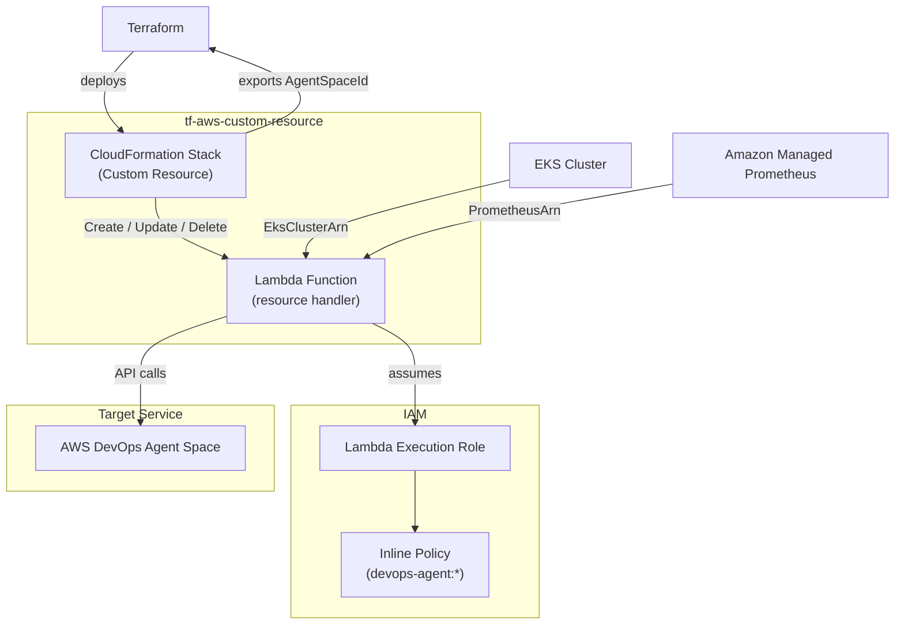

# tf-aws-custom-resource Examples

Runnable examples for the [`tf-aws-custom-resource`](../) Terraform module.

## Available Examples

| Example | Description |
|---------|-------------|
| [devops-agent](devops-agent/) | Provisions an AWS DevOps Agent Space (a service not natively supported by the Terraform AWS provider) via a CloudFormation Custom Resource backed by a Lambda function; demonstrates the pattern for wrapping any unsupported AWS API |

## Architecture



## Quick Start

```bash
cd devops-agent/
terraform init
terraform apply \
  -var="eks_cluster_arn=arn:aws:eks:us-east-1:123456789012:cluster/my-cluster" \
  -var="prometheus_workspace_arn=arn:aws:aps:us-east-1:123456789012:workspace/ws-abc123"
```
