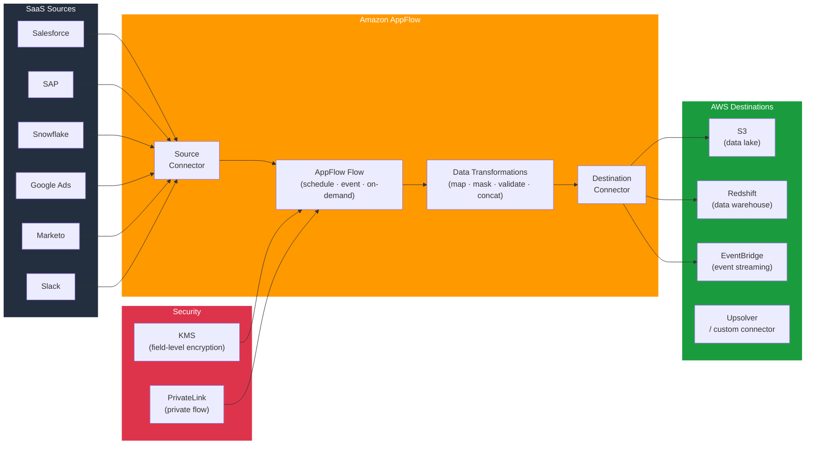

# tf-aws-data-e-appflow

Data Engineering module for Amazon AppFlow — no-code / low-code data integration flows between SaaS applications and AWS services for analytics pipelines.

---

## Architecture



---

## Features

- Connects 50+ SaaS sources (Salesforce, SAP, Marketo, Google Analytics, Slack, Zendesk, and more)
- Flow triggers: scheduled (cron), event-driven, or on-demand
- Built-in transformations: field mapping, masking, validation, concatenation
- Destinations: S3, Redshift, Salesforce, EventBridge, and custom connectors
- KMS field-level encryption for sensitive data
- PrivateLink support for private flows that never traverse the public internet
- No ETL infrastructure to manage — fully serverless

## Supported Connectors

| Category | Connectors |
|----------|-----------|
| CRM | Salesforce, HubSpot, Zoho, Microsoft Dynamics |
| Marketing | Marketo, Pardot, Google Ads, Facebook Ads |
| Analytics | Google Analytics, Amplitude, Mixpanel |
| Productivity | Slack, Zendesk, ServiceNow |
| Databases | Snowflake, SAP OData, Veeva |
| AWS | S3, Redshift, EventBridge |

## Security Controls

| Control | Implementation |
|---------|---------------|
| Encryption in transit | TLS 1.2+ for all connector traffic |
| Encryption at rest | KMS CMK field-level encryption |
| Private connectivity | PrivateLink for supported connectors |
| OAuth token management | AppFlow stores tokens in AWS Secrets Manager |

## Versioning

Use explicit git tags such as `?ref=v1.0.0` to pin your deployments.

## Usage

```hcl
# AppFlow connections and flows are configured via the AWS Console or AWS CLI.
# This module provides supporting infrastructure (IAM, KMS, S3 destinations).

module "appflow_infra" {
  source = "git::https://github.com/your-org/golden_modules.git//tf-aws-data-e-appflow?ref=v1.0.0"

  # Supporting data sources expose current region and account for policy construction
  # Use module.appflow_infra.region and module.appflow_infra.account_id in other resources
}

# Example: S3 bucket policy allowing AppFlow to write
resource "aws_s3_bucket_policy" "appflow" {
  bucket = aws_s3_bucket.datalake.id
  policy = jsonencode({
    Statement = [{
      Principal = { Service = "appflow.amazonaws.com" }
      Action    = ["s3:PutObject", "s3:AbortMultipartUpload", "s3:ListMultipartUploadParts"]
      Effect    = "Allow"
      Resource  = "${aws_s3_bucket.datalake.arn}/*"
      Condition = {
        StringEquals = {
          "aws:SourceAccount" = module.appflow_infra.account_id
        }
      }
    }]
    Version = "2012-10-17"
  })
}
```

## Common Flow Patterns

| Pattern | Trigger | Use Case |
|---------|---------|---------|
| Salesforce → S3 | Hourly schedule | CRM data lake ingestion |
| Marketo → Redshift | Daily schedule | Campaign analytics |
| Zendesk → S3 | Event (new ticket) | Support ticket archive |
| Google Analytics → S3 | Daily | Web analytics warehouse |

## Examples

- [Salesforce to S3](examples/salesforce-to-s3/)
- [Marketo to Redshift](examples/marketo-to-redshift/)
