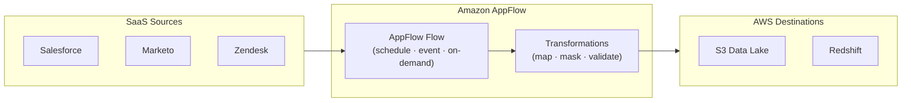

# tf-aws-data-e-appflow Examples

Runnable examples for the [`tf-aws-data-e-appflow`](../) Terraform module.

## Available Examples

| Example | Description |
|---------|-------------|
| [minimal](minimal/) | Minimal configuration — supporting IAM and S3 bucket policy for a single Salesforce-to-S3 AppFlow flow |
| [complete](complete/) | Full configuration with KMS field-level encryption, PrivateLink, multiple SaaS connectors (Salesforce, Marketo, Zendesk), and S3/Redshift destinations |

## Architecture



## Quick Start

```bash
cd minimal/
terraform init
terraform apply -var-file="dev.tfvars"
```
