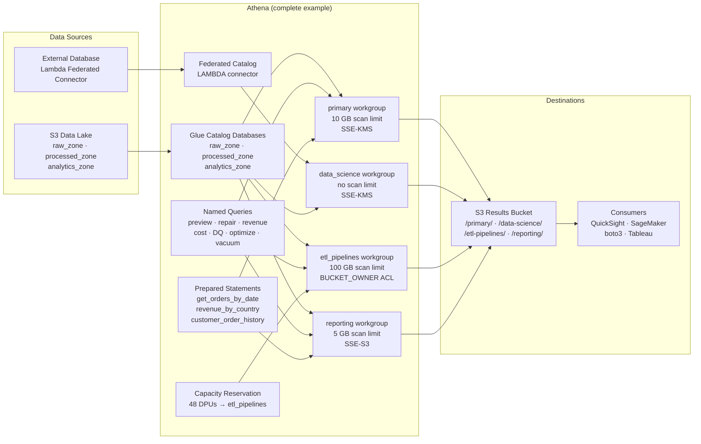

# tf-aws-data-e-athena Examples

Runnable examples for the [`tf-aws-data-e-athena`](../) Terraform module.

## Available Examples

| Example | Description |
|---------|-------------|
| [complete](complete/) | Production-ready setup with four workgroups (primary, data_science, etl_pipelines, reporting), three Glue catalog databases (raw/processed/analytics), eight named queries, three prepared statements, a federated Lambda data catalog, and a 48-DPU capacity reservation. Demonstrates KMS encryption, per-workgroup scan limits, and full IAM wiring. |

## Architecture



## Quick Start

```bash
cd complete/
terraform init
terraform apply -var-file="prod.tfvars"
```

### Required variables (`prod.tfvars`)

```hcl
name_prefix          = "prod"
account_id           = "123456789012"
results_bucket_name  = "my-athena-results"
results_bucket_arn   = "arn:aws:s3:::my-athena-results"
results_kms_key_arn  = "arn:aws:kms:us-east-1:123456789012:key/..."
data_lake_bucket_name = "my-data-lake"
data_lake_bucket_arn  = "arn:aws:s3:::my-data-lake"
lambda_connector_arn  = "arn:aws:lambda:us-east-1:123456789012:function:athena-connector"
```
