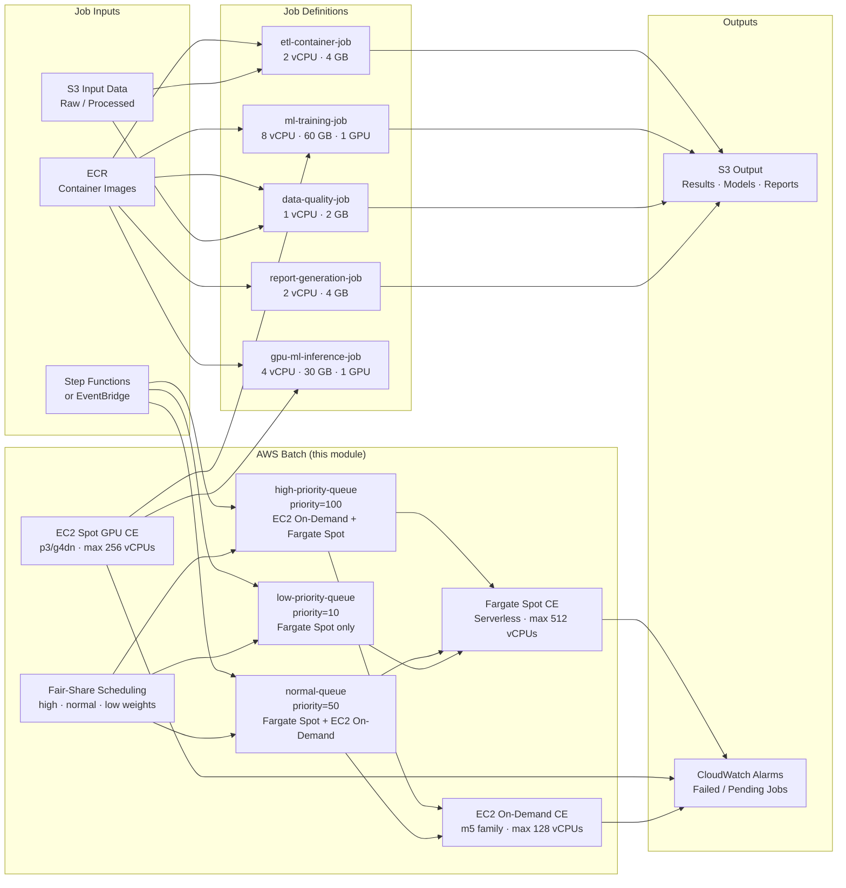

# tf-aws-data-e-batch Examples

Runnable examples for the [`tf-aws-data-e-batch`](../) Terraform module.

## Available Examples

| Example | Description |
|---------|-------------|
| [minimal](minimal/) | Single Fargate Spot compute environment, one default job queue, and one simple ETL job definition. Ideal for getting started or development workloads. IAM roles are auto-created. |
| [complete](complete/) | Production-grade setup with three compute environments (Fargate Spot, EC2 Spot GPU, EC2 On-Demand), three priority-tiered job queues, five job definitions (ETL, ML training, data quality, report generation, GPU inference), fair-share scheduling, and CloudWatch alarms. |

## Architecture



## Quick Start

```bash
# Minimal — Fargate Spot ETL job
cd minimal/
terraform init
terraform apply

# Complete — multi-tier production setup
cd complete/
terraform init
terraform apply -var-file="prod.tfvars"
```

### Required variables for `complete/` (`prod.tfvars`)

```hcl
subnet_ids          = ["subnet-0abc123", "subnet-0def456"]
security_group_ids  = ["sg-0abc123"]
alarm_sns_topic_arn = "arn:aws:sns:us-east-1:123456789012:batch-alerts"
ecr_account_id      = "123456789012"
aws_region          = "us-east-1"
```
