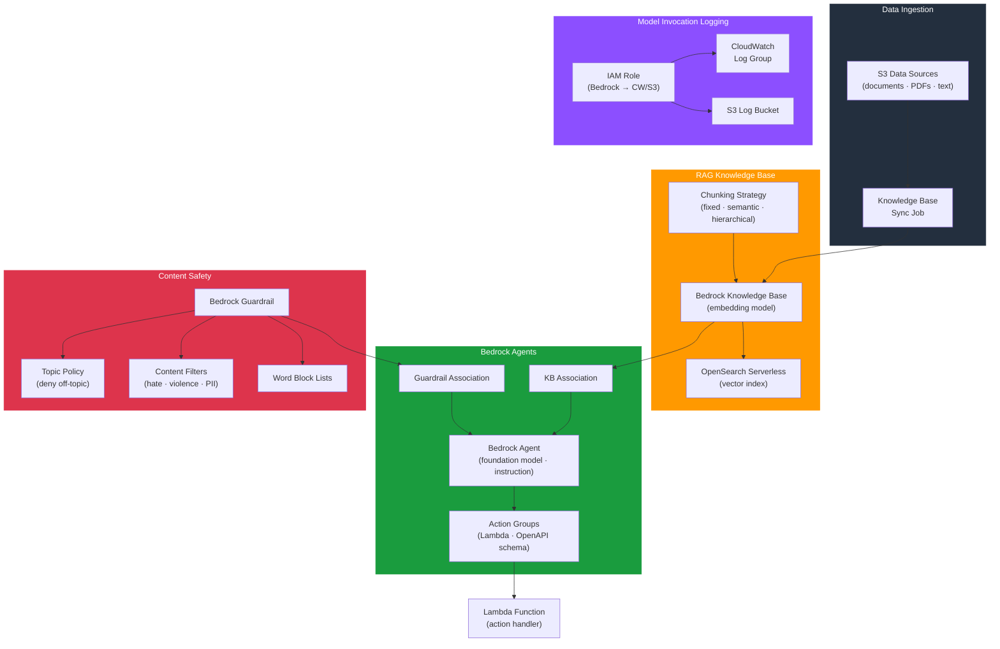

# tf-aws-data-e-bedrock

Data Engineering module for Amazon Bedrock — generative AI infrastructure for data pipelines including guardrails, RAG knowledge bases with vector storage, agents with action groups, and model invocation logging.

---

## Architecture



---

## Features

- Bedrock Guardrails with topic policies, content filters (HATE, VIOLENCE, MISCONDUCT), PII redaction, and custom word block lists
- Guardrail versioning for production-safe rollouts
- RAG Knowledge Bases with configurable embedding models and chunking strategies
- OpenSearch Serverless, Aurora, or Pinecone vector storage backends
- S3 data sources with incremental sync
- Bedrock Agents with foundation model selection, system prompt, and session configuration
- Agent action groups backed by Lambda or inline OpenAPI schema
- Agent ↔ Knowledge Base and Agent ↔ Guardrail associations
- Model invocation logging to CloudWatch Logs and/or S3
- Least-privilege IAM role for logging

## Security Controls

| Control | Implementation |
|---------|---------------|
| Content safety | Guardrails block harmful topics and content |
| PII protection | Sensitive information policy redacts PII |
| Audit logging | Model invocation logs with prompt/response capture |
| Least privilege | Scoped IAM for logging; agents use resource-based policies |

## Versioning

Use explicit git tags such as `?ref=v1.0.0` to pin your deployments.

## Usage

```hcl
module "bedrock_data" {
  source = "git::https://github.com/your-org/golden_modules.git//tf-aws-data-e-bedrock?ref=v1.0.0"

  # Model invocation logging
  enable_model_invocation_logging       = true
  invocation_log_cloudwatch_log_group   = "/aws/bedrock/invocations"

  # Guardrails
  guardrails = {
    main = {
      name        = "data-pipeline-guardrail"
      description = "Content safety for data pipeline"
      topic_policy_topics = [
        { name = "OffTopic", definition = "Queries unrelated to data analytics", type = "DENY" }
      ]
      content_policy_filters = [
        { type = "HATE",     input_strength = "HIGH",   output_strength = "HIGH" },
        { type = "VIOLENCE", input_strength = "MEDIUM", output_strength = "HIGH" },
      ]
      sensitive_information_policy_config = [
        { type = "EMAIL", action = "ANONYMIZE" },
        { type = "SSN",   action = "BLOCK" },
      ]
    }
  }

  # Knowledge Base
  knowledge_bases = {
    docs_kb = {
      name               = "documentation-kb"
      embedding_model_arn = "arn:aws:bedrock:us-east-1::foundation-model/amazon.titan-embed-text-v2:0"
      storage_type       = "OPENSEARCH_SERVERLESS"
      opensearch_collection_arn = module.opensearch.collection_arn
      s3_data_sources = {
        docs = { s3_bucket_arn = module.docs_bucket.arn }
      }
    }
  }
}
```

## Supported Foundation Models

| Model | Provider | Best For |
|-------|----------|---------|
| `anthropic.claude-3-5-sonnet-20241022-v2:0` | Anthropic | Complex reasoning, agents |
| `amazon.titan-embed-text-v2:0` | Amazon | Text embeddings (KB) |
| `anthropic.claude-3-haiku-20240307-v1:0` | Anthropic | Fast, cost-efficient |
| `amazon.nova-pro-v1:0` | Amazon | Multimodal |

## Examples

- [Guardrails only](examples/guardrails/)
- [RAG with OpenSearch](examples/knowledge-base/)
- [Full agent with KB + guardrails](examples/agent/)
