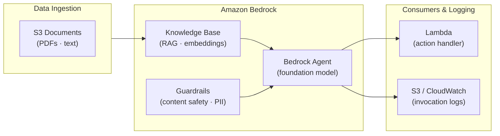

# tf-aws-data-e-bedrock Examples

Runnable examples for the [`tf-aws-data-e-bedrock`](../) Terraform module.

## Available Examples

| Example | Description |
|---------|-------------|
| [complete](complete/) | Full configuration with KMS encryption, model invocation logging to S3, content-safety guardrails, a RAG knowledge base backed by OpenSearch Serverless, and a Bedrock agent with action groups |

## Architecture



## Quick Start

```bash
cd complete/
terraform init
terraform apply -var-file="dev.tfvars"
```
