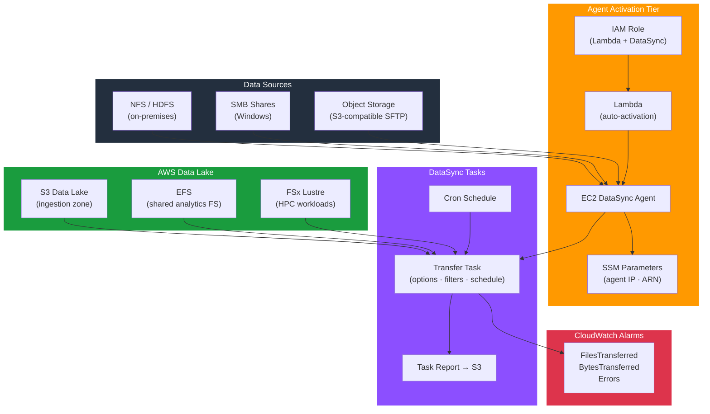

# tf-aws-data-e-datasync

Data Engineering module for AWS DataSync — enterprise-grade data transfer for analytics pipelines with automated agent activation, multi-protocol locations, scheduled tasks, CloudWatch alarms, and IAM.

---

## Architecture



---

## Features

- Auto-activating DataSync agents via EC2 + Lambda (no manual console steps)
- SSM Parameter Store integration for agent discovery across stacks
- Location support: S3, EFS, FSx (Windows/Lustre), NFS, SMB, HDFS, object storage
- Transfer tasks with include/exclude filters, atime/mtime/checksum options
- Scheduled transfers using cron expressions
- Task reporting to S3 for audit and compliance
- CloudWatch alarms on transfer errors and throughput
- Least-privilege IAM for Lambda activation and DataSync S3 access

## Security Controls

| Control | Implementation |
|---------|---------------|
| Encrypted transport | TLS DataSync protocol |
| KMS integration | `kms_key_arn` for S3 location access |
| Agent isolation | Private subnet + security group |
| Credential protection | SMB/HDFS credentials via Secrets Manager |

## Versioning

Use explicit git tags such as `?ref=v1.0.0` to pin your deployments.

## Usage

```hcl
module "datasync_pipeline" {
  source = "git::https://github.com/your-org/golden_modules.git//tf-aws-data-e-datasync?ref=v1.0.0"

  create_agents       = true
  auto_activate_agents = true

  agents = {
    ingest_agent = {
      subnet_id          = module.vpc.private_subnet_ids[0]
      security_group_ids = [aws_security_group.datasync.id]
      instance_type      = "m5.2xlarge"
    }
  }

  create_s3_locations = true
  s3_locations = {
    landing_zone = {
      s3_bucket_arn   = module.datalake.landing_bucket_arn
      s3_subdirectory = "/raw"
      agent_keys      = ["ingest_agent"]
    }
  }

  tasks = {
    nfs_to_s3 = {
      source_location_type      = "nfs"
      source_location_key       = "nfs_prod"
      destination_location_type = "s3"
      destination_location_key  = "landing_zone"
      schedule_expression       = "cron(0 2 * * ? *)"
    }
  }

  datasync_role_name       = "datasync-data-pipeline"
  s3_bucket_arns_for_role  = [module.datalake.landing_bucket_arn]
  kms_key_arn              = module.kms.key_arn
}
```

## Examples

- [On-premises NFS ingest](examples/nfs-ingest/)
- [Multi-source to S3 Data Lake](examples/multi-source/)
