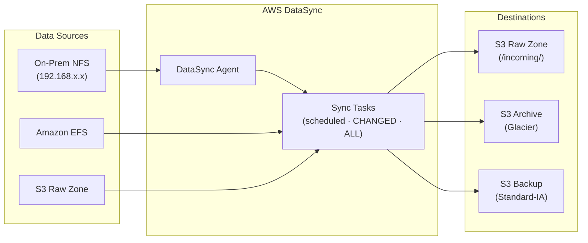

# tf-aws-data-e-datasync Examples

Runnable examples for the [`tf-aws-data-e-datasync`](../) Terraform module.

## Available Examples

| Example | Description |
|---------|-------------|
| [minimal](minimal/) | Minimal configuration — S3-to-S3 cross-account data copy with a single CHANGED-mode sync task |
| [complete](complete/) | Full configuration with on-premises NFS-to-S3 raw ingestion, S3 raw-to-Glacier archive, EFS-to-S3 backup, nightly cron schedules, task reports, CloudWatch alarms, and bandwidth throttling |

## Architecture



## Quick Start

```bash
cd minimal/
terraform init
terraform apply -var-file="dev.tfvars"
```
