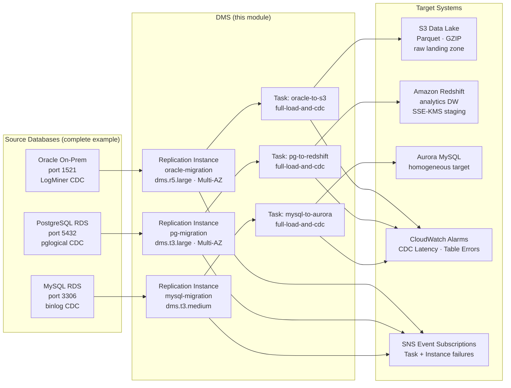

# tf-aws-data-e-dms Examples

Runnable examples for the [`tf-aws-data-e-dms`](../) Terraform module.

## Available Examples

| Example | Description |
|---------|-------------|
| [minimal](minimal/) | Single replication instance migrating MySQL to PostgreSQL using full-load-and-CDC. Demonstrates the minimum required configuration: subnet group, one replication instance, two endpoints, and one task. |
| [complete](complete/) | Three concurrent migration scenarios: Oracle on-premises to S3 (Parquet CDC), RDS PostgreSQL to Redshift (analytics), and MySQL RDS to Aurora MySQL (homogeneous). Includes CloudWatch alarms, DMS event subscriptions, KMS encryption, and Secrets Manager credential references. |

## Architecture



## Quick Start

```bash
# Minimal — MySQL → PostgreSQL
cd minimal/
terraform init
terraform apply

# Complete — three-scenario production migration
cd complete/
terraform init
terraform apply -var-file="prod.tfvars"
```

### Required variables for `complete/` (`prod.tfvars`)

```hcl
alarm_sns_topic_arn    = "arn:aws:sns:us-east-1:123456789012:dms-alerts"
kms_key_arn            = "arn:aws:kms:us-east-1:123456789012:key/..."
oracle_server_name     = "oracle.internal.example.com"
pg_server_name         = "mydb.cluster-xxxx.us-east-1.rds.amazonaws.com"
mysql_server_name      = "mysql.xxxx.us-east-1.rds.amazonaws.com"
aurora_server_name     = "aurora.cluster-xxxx.us-east-1.rds.amazonaws.com"
redshift_server_name   = "my-cluster.xxxx.us-east-1.redshift.amazonaws.com"
s3_landing_bucket      = "my-dms-landing-bucket"
dms_s3_service_role_arn = "arn:aws:iam::123456789012:role/dms-s3-access-role"
```
