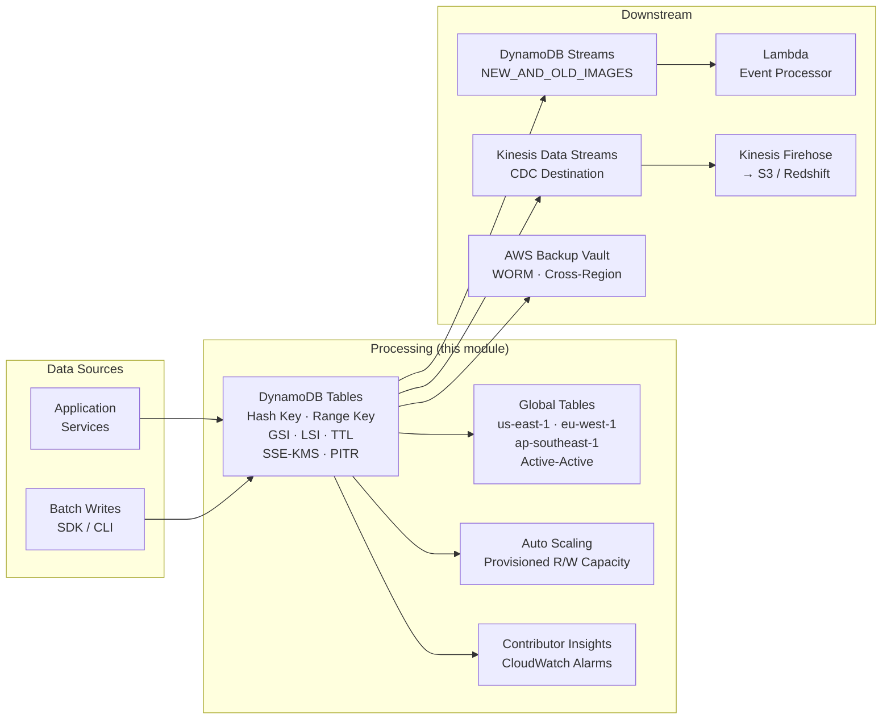

# tf-aws-dynamodb

Production-grade Terraform module for AWS DynamoDB — tables, global tables, GSI/LSI, autoscaling, backups, Kinesis streaming, CloudWatch alarms, fine-grained IAM, and Contributor Insights.

---

## Architecture



## Architecture Diagram

```
                        ┌──────────────────────────────────────────┐
                        │           DynamoDB Table                 │
                        │  ┌─────────┐  ┌─────┐  ┌────────────┐  │
                        │  │ Hash Key│  │ LSI │  │    GSIs    │  │
                        │  └─────────┘  └─────┘  └────────────┘  │
                        │        SSE-KMS │ PITR │ TTL             │
                        └───────────────┬──────────────────────────┘
                                        │
                    ┌───────────────────┼────────────────────┐
                    │                   │                    │
                    ▼                   ▼                    ▼
          ┌──────────────────┐ ┌────────────────┐  ┌─────────────────────┐
          │ DynamoDB Streams │ │  AWS Backup    │  │  CloudWatch Alarms  │
          │ (CDC records)    │ │  Vault (WORM)  │  │  Throttle/Latency   │
          └────────┬─────────┘ └───────┬────────┘  └─────────────────────┘
                   │                   │
         ┌─────────┴────┐      ┌───────┴───────┐
         │              │      │ Cross-region  │
         ▼              ▼      │ vault copy    │
  ┌─────────────┐ ┌──────────┐ └───────────────┘
  │   Lambda    │ │ Kinesis  │
  │  (event     │ │  Data    │
  │  processor) │ │ Streams  │
  └─────────────┘ └────┬─────┘
                        │
                   ┌────▼──────────┐
                   │   Firehose    │
                   │  (S3 / ES /   │
                   │  Redshift)    │
                   └───────────────┘
```

---

## Global Table Replication Topology

```
        ┌─────────────────────────────────────┐
        │         us-east-1 (primary)         │
        │     aws_dynamodb_table "global"      │
        └────────────┬──────────┬─────────────┘
                     │          │
          ┌──────────▼──┐    ┌──▼──────────────┐
          │  eu-west-1  │    │ ap-southeast-1  │
          │  (replica)  │    │   (replica)     │
          └─────────────┘    └─────────────────┘

  All regions: active-active writes
  Conflict resolution: last-writer-wins (timestamp-based)
  Streams: NEW_AND_OLD_IMAGES (required)
  Billing: PAY_PER_REQUEST only
  PITR: enabled per replica
  Replication latency alarm: < 500 ms (configurable)
```

---

## Module Structure

```
tf-aws-dynamodb/
├── versions.tf             — Terraform + provider version constraints
├── variables.tf            — All input variables
├── outputs.tf              — All outputs
├── tables.tf               — aws_dynamodb_table (standard tables)
├── global_tables.tf        — aws_dynamodb_table with replica blocks
├── indexes.tf              — Placeholder (GSI/LSI defined inline)
├── autoscaling.tf          — App Auto Scaling for PROVISIONED tables
├── backups.tf              — AWS Backup plan + vault + selection
├── kinesis_streaming.tf    — DynamoDB → Kinesis Data Streams
├── alarms.tf               — CloudWatch metric alarms per table
├── iam.tf                  — IAM roles and fine-grained policies
├── contributor_insights.tf — Contributor Insights per table/GSI
└── examples/
    ├── complete/           — Full e-commerce platform (6 tables)
    └── global-table/       — Dedicated multi-region example
```

---

## Key Design Patterns

### Single-Table Design vs Multi-Table

**Single-Table Design** collocates all entity types in one table using a
composite primary key convention such as `PK=USER#<id>` / `SK=ORDER#<id>`.
Benefits: single round-trip for related data, lower cost at scale. Trade-offs:
complex access patterns must be modelled up front; harder to introspect.

**Multi-Table Design** maps one DynamoDB table to one entity type, mirroring
a relational schema. Better for teams new to DynamoDB, easier IAM scoping,
simpler Streams processing.

This module supports both — use the `tables` map to create as many tables as
needed with independent billing, autoscaling, and encryption settings.

### GSI Overloading

A single GSI can serve multiple query patterns by writing a generic
`gsi1pk` / `gsi1sk` attribute whose value is set differently per entity type.

```
Entity       gsi1pk              gsi1sk
Order        STATUS#pending      2024-01-15T10:00:00Z
Product      CATEGORY#electronics PRICE#99.99
User         EMAIL#user@ex.com   CREATED#2024-01-01
```

All three patterns resolved by one GSI with `projection_type = "ALL"`.

### Sparse Indexes

Only items that contain the GSI key attributes are projected into the index.
Use this for conditional queries:

```hcl
global_secondary_indexes = [{
  name            = "flagged-items-index"
  hash_key        = "flagged"   # only set when item needs review
  projection_type = "ALL"
}]
```

Items without the `flagged` attribute are invisible in this index, keeping
storage and RCU costs low.

### Adjacency List Pattern (Graphs / Relationships)

Model many-to-many relationships in a single table:

```
PK              SK               Data
USER#alice      USER#alice       { name, email }
USER#alice      FOLLOWS#bob      { created_at }
USER#alice      FOLLOWS#carol    { created_at }
POST#p1         POST#p1          { title, body }
POST#p1         LIKED_BY#alice   { liked_at }
```

GSI: `SK` → `PK` (inverted index) lets you query "all users that user Bob
follows" and "all users who liked post p1" without a full scan.

### Time-Series Data Pattern

```
hash_key  = "device_id"      # partition by device
range_key = "timestamp"      # sort chronologically within partition
ttl       = "expires_at"     # auto-expire old records
```

Add a GSI `hash=date_bucket, range=timestamp` to query across devices for a
given day without a full table scan.

---

## Capacity Planning

```
                    Is traffic pattern predictable?
                              │
             ┌────────────────┴────────────────┐
            YES                                NO
             │                                  │
    Can you forecast                    → PAY_PER_REQUEST
    peak RCU/WCU?                         (recommended default)
             │
    ┌────────┴────────┐
   YES                NO
    │                  │
PROVISIONED       PAY_PER_REQUEST
 + Autoscaling    (spiky workload)
    │
    └── Set min/max capacity
        target utilization = 70%
        scale_in_cooldown  = 60s
        scale_out_cooldown = 60s
```

**PAY_PER_REQUEST** — best for: new tables, variable traffic, microservices,
dev/test environments. No capacity planning required.

**PROVISIONED + Autoscaling** — best for: sustained high-throughput workloads
with predictable traffic patterns (>1M req/hour steady state). Up to 30-40%
cheaper than on-demand at scale.

**STANDARD_INFREQUENT_ACCESS** — best for: tables accessed less than once per
month on average. 60% cheaper storage, same performance, slightly higher
per-request cost.

---

## Versioning

Review [CHANGELOG.md](CHANGELOG.md) before selecting a module version. Use explicit git tags such as `?ref=v1.0.0`, `?ref=v1.1.0`, or `?ref=v2.0.0` so deployments stay predictable.
## Usage

### Minimal — Single PAY_PER_REQUEST Table

```hcl
module "dynamodb" {
  source = "path/to/tf-aws-dynamodb"

  name_prefix = "prod"

  tables = {
    users = {
      hash_key = "user_id"
    }
  }
}
```

### PROVISIONED with Autoscaling

```hcl
module "dynamodb" {
  source = "path/to/tf-aws-dynamodb"

  name_prefix = "prod"

  tables = {
    inventory = {
      billing_mode   = "PROVISIONED"
      hash_key       = "product_id"
      read_capacity  = 10
      write_capacity = 10

      autoscaling = {
        min_read_capacity  = 5
        max_read_capacity  = 500
        min_write_capacity = 5
        max_write_capacity = 500
      }
    }
  }
}
```

### Global Table (Multi-Region)

```hcl
module "dynamodb" {
  source = "path/to/tf-aws-dynamodb"

  name_prefix = "prod"

  global_tables = {
    orders = {
      hash_key  = "order_id"
      range_key = "created_at"

      replicas = [
        { region_name = "eu-west-1" },
        { region_name = "ap-southeast-1" },
      ]
    }
  }
}
```

---

## Real-World SRE / Developer Scenarios

### 1. User Session Management (TTL-Based Expiry)

Store sessions with a Unix-epoch `expires_at` attribute. DynamoDB's TTL daemon
deletes expired items within 48 hours at no cost.

```hcl
sessions = {
  hash_key      = "session_id"
  ttl_attribute = "expires_at"
  table_class   = "STANDARD_INFREQUENT_ACCESS"
}
```

SRE tip: monitor `TimeToLiveDeletedItemCount` in CloudWatch to track TTL
throughput. Expired items appear in Streams before deletion — filter them
in Lambda with `eventName == "REMOVE" && userIdentity.type == "Service"`.

---

### 2. E-Commerce Order Tracking (GSI for User → Orders)

Query all orders for a user using a GSI with `hash_key = "user_id"` and
`range_key = "created_at"`. Use `ScanIndexForward = false` in the SDK to get
newest orders first.

```
GET /users/{user_id}/orders
→ Query GSI: user-orders-index
  KeyConditionExpression: user_id = :uid AND created_at > :thirty_days_ago
```

This module creates the GSI inline and outputs its ARN for IAM scoping.

---

### 3. Real-Time Leaderboard (Sorted Set via Range Key)

```hcl
leaderboard = {
  hash_key       = "game_id"
  hash_key_type  = "S"
  range_key      = "score"
  range_key_type = "N"
}
```

Query top-N players: `KeyConditionExpression: game_id = :gid`,
`ScanIndexForward = false`, `Limit = 10`. Add a GSI on `player_id → score`
for per-player rank lookup without a scan.

---

### 4. Multi-Region Active-Active with Global Tables

Use the `global_tables` variable. DynamoDB replicates writes asynchronously
across all replica regions. Monitor `ReplicationLatency` per receiving region —
this module creates a CloudWatch alarm at 500 ms by default.

Design rules for conflict-free active-active:
- Prefer conditional writes (`ConditionExpression`)
- Use monotonically increasing version counters
- Prefer append-only patterns (event log) in conflicting regions

---

### 5. Event Sourcing / Audit Log with Streams → Lambda

Enable `stream_enabled = true` and `stream_view_type = "NEW_AND_OLD_IMAGES"`.
Wire a Lambda event source mapping to the stream ARN (output:
`table_stream_arns`). Lambda receives ordered, at-least-once records per shard.

```
DynamoDB → Streams → Lambda → EventBridge / SQS / SNS
```

Use `stream_consumer_role_arn` output to grant the Lambda execution role
stream read permissions.

---

### 6. Rate Limiting / Throttle Table (Atomic Counters)

Use `UpdateItem` with `ADD #counter :one` on a rate-limit key. The atomic
counter guarantees correctness under concurrent requests without transactions.

```
PK=RATELIMIT#user_id#api_endpoint
counter (N) — incremented per request
window_start (N) — Unix epoch of current window start
ttl (N) — auto-expire after window
```

Keep the table PROVISIONED with autoscaling for predictable latency under load.

---

### 7. Shopping Cart (Single-Table, Item-Level Operations)

```
PK=CART#user_id  SK=PRODUCT#product_id
quantity (N), added_at (S), price_snapshot (N)
```

Use `TransactWriteItems` to atomically: (1) reserve inventory, (2) write cart
item, (3) update cart total. On checkout, delete all `SK` starts-with
`PRODUCT#` for the cart in a single `BatchWriteItem`.

---

### 8. Time-Series IoT Data (device_id + timestamp + TTL)

```hcl
telemetry = {
  hash_key       = "device_id"
  hash_key_type  = "S"
  range_key      = "ts"
  range_key_type = "S"  # ISO8601 sorts lexicographically
  ttl_attribute  = "expires_at"
  stream_enabled = true
}
```

Query: `device_id = :did AND ts BETWEEN :start AND :end`.
For cross-device aggregation add a GSI `hash=date_bucket (YYYY-MM-DD),
range=ts` to avoid full scans.

---

### 9. Feature Flags / Configuration Store

```
PK=FLAG#flag_name  SK=ENV#environment
enabled (BOOL), rollout_pct (N), updated_at (S), updated_by (S)
```

Application reads with `GetItem` — sub-millisecond latency. Use DynamoDB
Streams + Lambda to push invalidation events to an in-process cache (e.g.
Redis or local memory with 5-second TTL) so flag reads never add API latency.

---

### 10. Distributed Locking (Conditional Writes)

```python
# Acquire lock
put_item(
  Item={"lock_id": "resource-x", "owner": instance_id, "ttl": now+30},
  ConditionExpression="attribute_not_exists(lock_id)"
)

# Release lock
delete_item(
  Key={"lock_id": "resource-x"},
  ConditionExpression="owner = :owner"
)
```

TTL on the lock item prevents stale locks from blocking indefinitely.
Use `ReturnValuesOnConditionCheckFailure = "ALL_OLD"` to retrieve the current
owner when the acquire fails.

---

### 11. CDC to S3 Data Lake via DynamoDB → Kinesis → Firehose

Set `kinesis_stream_arn` on the table. DynamoDB writes every change as a
Kinesis record. Wire Kinesis Data Firehose to the same stream with S3
destination and dynamic partitioning by `table_name` and `event_date`.

```
DynamoDB → Kinesis Data Streams → Kinesis Firehose → S3
                                         │
                                    Parquet conversion
                                    (Glue Schema Registry)
```

This module creates `aws_dynamodb_kinesis_streaming_destination` and outputs
the stream ARN for Firehose configuration.

---

### 12. Point-in-Time Recovery Drill (Restore to Specific Second)

PITR is enabled by default (`point_in_time_recovery = true`). To restore:

```bash
aws dynamodb restore-table-to-point-in-time \
  --source-table-name prod-orders \
  --target-table-name prod-orders-restored-20240115-1430 \
  --restore-date-time 2024-01-15T14:30:00Z \
  --billing-mode-override PAY_PER_REQUEST
```

Run restores monthly as a reliability drill. Validate row counts and spot-check
5–10 records against the source. The restored table has no streams, TTL, or
autoscaling — re-apply those after validation.

---

### 13. GSI Backfill Monitoring (OnlineIndexPercentageProgress Alarm)

When you add a GSI to an existing table, DynamoDB backfills it online. This
module creates a CloudWatch alarm that fires when `OnlineIndexPercentageProgress`
has not changed by at least 1% over 25 minutes, indicating a stuck backfill.

Remediation:
1. Check `ThrottledRequests` on the table — reduce traffic or increase capacity.
2. Verify the GSI key attributes are present in a majority of items.
3. Consider pausing large batch writes during the backfill window.

---

### 14. Cost Control — STANDARD_INFREQUENT_ACCESS for Cold Tables

Tables with infrequent access patterns (< once per month per item on average)
qualify for `STANDARD_INFREQUENT_ACCESS`. Storage costs ~60% less; read/write
costs are slightly higher per request.

```hcl
sessions = {
  table_class = "STANDARD_INFREQUENT_ACCESS"
}
```

SRE tip: tag cold tables with `DataTier = "cold"` and run a monthly AWS Cost
Explorer report filtered by that tag to measure savings vs standard tables.

---

### 15. Security Audit — Per-User Data Isolation with LeadingKey IAM Condition

This module creates an `aws_iam_policy` (`per_user_isolation`) that restricts
each IAM principal to DynamoDB rows where the partition key equals their own
`aws:userId`. Attach this policy to the application's IAM role.

```json
{
  "Condition": {
    "ForAllValues:StringEquals": {
      "dynamodb:LeadingKeys": ["${aws:userId}"],
      "dynamodb:Attributes": ["user_id","email","created_at"]
    }
  }
}
```

Quarterly audit checklist:
- Confirm no application role has `dynamodb:*` or `dynamodb:Scan` without a
  condition key.
- Run AWS IAM Access Analyzer to detect cross-account table access.
- Verify KMS key policies restrict DynamoDB decryption to specific roles.
- Check CloudTrail for `ConditionNotMet` exceptions — potential access violations.

---

## Inputs

| Name | Description | Type | Default |
|------|-------------|------|---------|
| `name_prefix` | Prefix for all resource names | `string` | `"prod"` |
| `tags` | Tags applied to every resource | `map(string)` | `{}` |
| `tables` | Map of DynamoDB tables to create | `map(object)` | `{}` |
| `global_tables` | Map of Global Tables with replicas | `map(object)` | `{}` |
| `create_alarms` | Create CloudWatch alarms | `bool` | `true` |
| `alarm_sns_topic_arn` | SNS topic for alarm notifications | `string` | `null` |
| `latency_threshold_ms` | p99 latency alarm threshold (ms) | `number` | `100` |
| `replication_latency_threshold_ms` | Global table replication alarm (ms) | `number` | `500` |
| `create_backup_plan` | Create AWS Backup plan | `bool` | `true` |
| `backup_vault_name` | Backup vault name (auto-generated if null) | `string` | `null` |
| `backup_secondary_vault_arn` | Secondary region vault for copy actions | `string` | `null` |
| `backup_vault_lock_min_retention_days` | WORM lock minimum retention | `number` | `7` |
| `backup_vault_lock_max_retention_days` | WORM lock maximum retention | `number` | `365` |
| `create_iam_roles` | Create IAM roles and policies | `bool` | `true` |
| `iam_role_principal_arns` | Principals allowed to assume created roles | `list(string)` | `[]` |

---

## Outputs

| Name | Description |
|------|-------------|
| `table_arns` | Map of table key → ARN |
| `table_names` | Map of table key → table name |
| `table_stream_arns` | Map of table key → stream ARN |
| `global_table_arns` | Map of global table key → ARN |
| `autoscaling_policy_arns` | Map of all autoscaling policy ARNs |
| `backup_plan_arn` | AWS Backup plan ARN |
| `backup_vault_arn` | AWS Backup vault ARN |
| `read_only_role_arn` | Read-only IAM role ARN |
| `read_write_role_arn` | Read-write IAM role ARN |
| `stream_consumer_role_arn` | Stream consumer IAM role ARN |
| `read_only_policy_json` | Read-only policy JSON |
| `read_write_policy_json` | Read-write policy JSON |
| `alarm_arns` | Map of `"table_key/alarm_type"` → alarm ARN |

---

## Requirements

| Name | Version |
|------|---------|
| Terraform | >= 1.5.0 |
| hashicorp/aws | >= 5.0.0 |

---

## License

MIT

