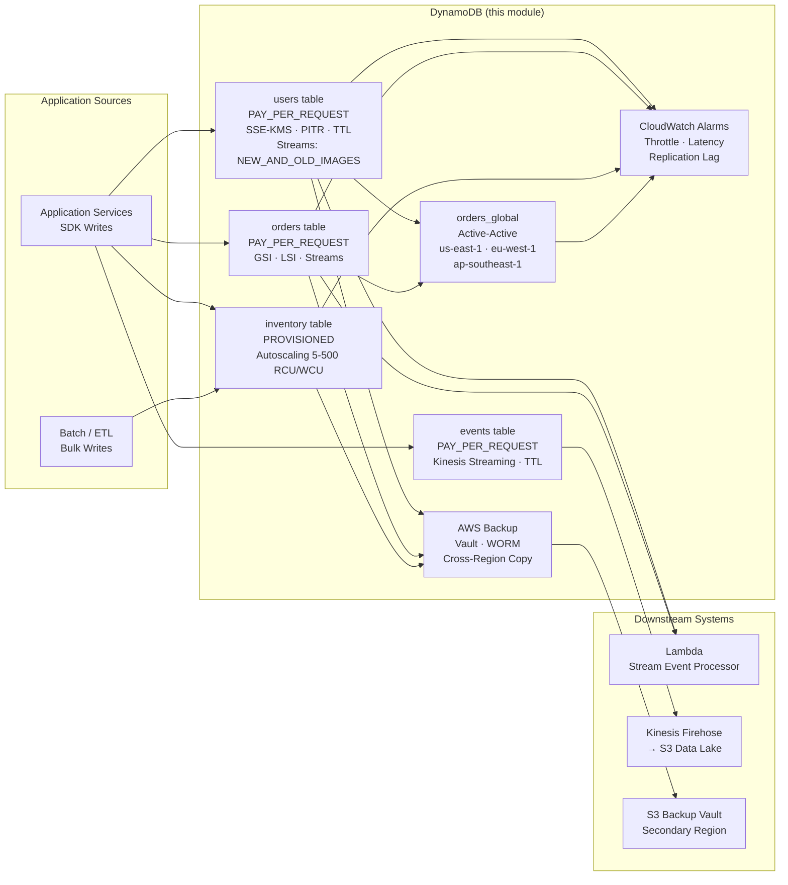

# tf-aws-data-e-dynamodb Examples

Runnable examples for the [`tf-aws-data-e-dynamodb`](../) Terraform module.

## Available Examples

| Example | Description |
|---------|-------------|
| [complete](complete/) | Production e-commerce platform with six DynamoDB tables (users, orders, products, sessions, events, inventory), a three-region global table (orders_global), GSIs/LSIs, TTL, DynamoDB Streams, Kinesis streaming, AWS Backup with cross-region copy, autoscaling for the inventory table, CloudWatch alarms, and IAM roles. |
| [global-table](global-table/) | Dedicated multi-region active-active example with two global tables (user_profiles, sessions_global) replicated across us-east-1, eu-west-1, and ap-southeast-1. Demonstrates replication latency alarms and per-replica PITR settings. |

## Architecture



## Quick Start

```bash
# Complete e-commerce setup
cd complete/
terraform init
terraform apply -var-file="prod.tfvars"

# Global table multi-region setup
cd global-table/
terraform init
terraform apply -var-file="prod.tfvars"
```

### Required variables for `complete/` (`prod.tfvars`)

```hcl
name_prefix                 = "prod"
kms_key_arn                 = "arn:aws:kms:us-east-1:123456789012:key/..."
alarm_sns_topic_arn         = "arn:aws:sns:us-east-1:123456789012:dynamodb-alerts"
inventory_kinesis_stream_arn = "arn:aws:kinesis:us-east-1:123456789012:stream/inventory-events"
backup_secondary_vault_arn  = "arn:aws:backup:eu-west-1:123456789012:backup-vault/secondary"
```
