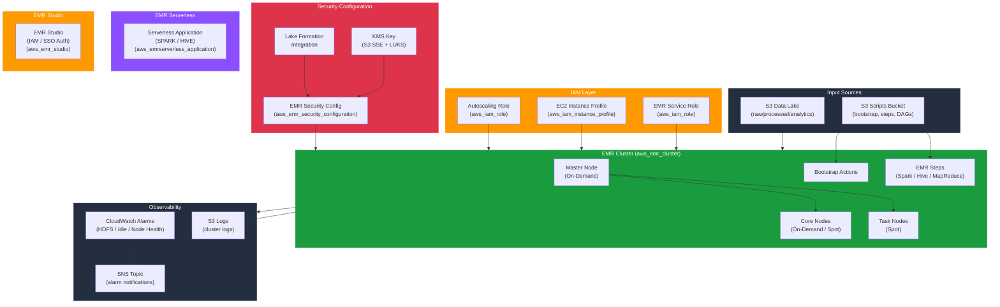

# tf-aws-data-e-emr

Production-grade Terraform module for Amazon EMR (Elastic MapReduce). Supports long-running clusters, transient job clusters, EMR Serverless, EMR Studio, security configurations with KMS encryption, CloudWatch alarms, and full IAM role management.

## Architecture



## Features

- Map-driven `for_each` on all primary resources (no `count`)
- Choice-based: every advanced feature is opt-in via boolean gate defaulting to `false`
- BYO foundational resources: supply `role_arn` and `instance_profile_arn` from external IAM module, `kms_key_arn` from external KMS module
- `create_iam_role = true` by default for zero-config getting started
- EMR clusters: long-running and transient with bootstrap actions, steps, Spot, task groups, Kerberos
- EMR Serverless: map-driven SPARK and HIVE application definitions
- EMR Security Configurations: S3 SSE-KMS, local disk LUKS, in-transit TLS, Kerberos, Lake Formation
- EMR Studio: IAM and SSO auth modes
- CloudWatch alarms: HDFS, idle detection, node health, capacity
- All files pass `terraform fmt -check`

## Versioning

Review [CHANGELOG.md](CHANGELOG.md) before selecting a module version. Use explicit git tags such as `?ref=v1.0.0`, `?ref=v1.1.0`, or `?ref=v2.0.0` so deployments stay predictable.
## Usage

### Minimal — transient Spark job cluster

```hcl
module "emr" {
  source = "git::https://github.com/your-org/tf-aws-data-e-emr.git"

  clusters = {
    "spark-etl-job" = {
      release_label        = "emr-7.0.0"
      applications         = ["Spark"]
      subnet_id            = "subnet-0abc123"
      log_uri              = "s3://my-logs/emr/"
      master_instance_type = "m5.xlarge"
      core_instance_type   = "m5.xlarge"
      core_instance_count  = 2
      keep_alive           = false
      steps = [
        {
          name              = "run-etl"
          action_on_failure = "TERMINATE_CLUSTER"
          hadoop_jar        = "command-runner.jar"
          hadoop_jar_args   = ["spark-submit", "--deploy-mode", "cluster", "s3://scripts/etl.py"]
        }
      ]
    }
  }
}
```

### BYO IAM roles

```hcl
module "emr" {
  source = "git::https://github.com/your-org/tf-aws-data-e-emr.git"

  create_iam_role      = false
  role_arn             = module.iam.emr_service_role_arn
  instance_profile_arn = module.iam.emr_instance_profile_arn

  clusters = { ... }
}
```

## Scenarios

### 1. PySpark Batch ETL

Run a transient cluster that auto-terminates after the Spark job completes. Ideal for scheduled nightly ETL pipelines.

```hcl
clusters = {
  "pyspark-nightly-etl" = {
    release_label        = "emr-7.0.0"
    applications         = ["Spark"]
    subnet_id            = var.private_subnet_id
    log_uri              = "s3://my-logs/pyspark-etl/"
    master_instance_type = "m5.xlarge"
    core_instance_type   = "m5.2xlarge"
    core_instance_count  = 4
    keep_alive           = false
    idle_timeout_seconds = 1800
    configurations_json  = jsonencode([{
      Classification = "spark-defaults"
      Properties = {
        "spark.sql.adaptive.enabled" = "true"
        "spark.serializer" = "org.apache.spark.serializer.KryoSerializer"
      }
    }])
    steps = [{
      name              = "pyspark-etl"
      action_on_failure = "TERMINATE_CLUSTER"
      hadoop_jar        = "command-runner.jar"
      hadoop_jar_args   = ["spark-submit", "--deploy-mode", "cluster",
                           "--py-files", "s3://scripts/utils.zip",
                           "s3://scripts/etl_main.py"]
    }]
    tags = { Pipeline = "nightly-etl" }
  }
}
```

### 2. Hive Data Warehouse

Long-running cluster with Glue Catalog integration, partitioned tables, and Tez execution engine.

```hcl
clusters = {
  "hive-dwh" = {
    release_label        = "emr-6.15.0"
    applications         = ["Hive", "Hadoop", "Tez"]
    subnet_id            = var.private_subnet_id
    master_instance_type = "r5.2xlarge"
    core_instance_type   = "r5.4xlarge"
    core_instance_count  = 8
    keep_alive           = true
    termination_protection = true
    configurations_json  = jsonencode([{
      Classification = "hive-site"
      Properties = {
        "hive.metastore.client.factory.class" = "com.amazonaws.glue.catalog.metastore.AWSGlueDataCatalogHiveClientFactory"
        "hive.exec.dynamic.partition"         = "true"
        "hive.exec.dynamic.partition.mode"    = "nonstrict"
      }
    }])
    tags = { Role = "data-warehouse" }
  }
}
```

### 3. Transient Job Cluster

Spin up, run a single MapReduce/Spark job, and shut down automatically. Optimal for infrequent heavy workloads.

```hcl
clusters = {
  "transient-job" = {
    release_label        = "emr-7.0.0"
    applications         = ["Spark"]
    keep_alive           = false
    idle_timeout_seconds = 900
    termination_protection = false
    steps = [{
      name              = "job"
      action_on_failure = "TERMINATE_CLUSTER"
      hadoop_jar        = "command-runner.jar"
      hadoop_jar_args   = ["spark-submit", "s3://scripts/job.py"]
    }]
  }
}
```

### 4. EMR Serverless for Serverless Spark

No cluster management — submit jobs to a serverless Spark application and pay only for compute used.

```hcl
create_serverless_applications = true

serverless_applications = {
  "spark-serverless" = {
    type                 = "SPARK"
    release_label        = "emr-7.0.0"
    max_cpu              = "400vCPU"
    max_memory           = "3000GB"
    max_disk             = "20000GB"
    auto_start           = true
    auto_stop            = true
    idle_timeout_minutes = 15
    subnet_ids           = var.private_subnet_ids
    security_group_ids   = [var.emr_sg_id]
    initial_capacity = {
      "Driver"   = { worker_count = 2, worker_cpu = "4vCPU", worker_memory = "16GB", worker_disk = "200GB" }
      "Executor" = { worker_count = 10, worker_cpu = "4vCPU", worker_memory = "16GB", worker_disk = "200GB" }
    }
  }
}
```

### 5. Cost Optimization with Spot Instances

Use Spot instances for core and task nodes to reduce costs up to 70%.

```hcl
clusters = {
  "spot-optimized-cluster" = {
    release_label        = "emr-7.0.0"
    applications         = ["Spark"]
    master_instance_type = "m5.xlarge"   # On-Demand for stability
    core_instance_type   = "m5.2xlarge"
    core_instance_count  = 6
    use_spot_for_core    = true
    core_bid_price       = "0.25"
    task_instance_type   = "m5.4xlarge"
    task_instance_count  = 4
    task_bid_price       = "0.35"
    keep_alive           = true
    tags = { CostStrategy = "spot-optimized" }
  }
}
```

### 6. Custom Bootstrap Actions

Install custom Python packages, configure system settings, or deploy application configs before the cluster starts jobs.

```hcl
clusters = {
  "custom-bootstrap-cluster" = {
    release_label = "emr-7.0.0"
    applications  = ["Spark"]
    bootstrap_actions = [
      {
        name = "install-python-packages"
        path = "s3://my-bootstrap-scripts/install-python.sh"
        args = ["--packages", "pandas==2.0.0,pyarrow==12.0.0,scikit-learn==1.3.0"]
      },
      {
        name = "configure-environment"
        path = "s3://my-bootstrap-scripts/configure-env.sh"
        args = ["--env", "production"]
      }
    ]
  }
}
```

### 7. EMR Studio Notebooks

Set up a collaborative notebook IDE for data scientists, connected to your EMR clusters.

```hcl
create_studios = true

studios = {
  "data-science-studio" = {
    auth_mode                   = "IAM"
    vpc_id                      = var.vpc_id
    subnet_ids                  = var.private_subnet_ids
    workspace_security_group_id = aws_security_group.studio_workspace.id
    engine_security_group_id    = aws_security_group.studio_engine.id
    s3_url                      = "s3://my-studio-bucket/workspaces/"
  }
}
```

### 8. KMS Encryption with Security Configuration

Encrypt S3 data at rest with KMS and enable local disk encryption for HDFS.

```hcl
create_security_configurations = true
kms_key_arn = "arn:aws:kms:us-east-1:123456789012:key/mrk-..."

security_configurations = {
  "emr-encryption" = {
    enable_s3_encryption         = true
    enable_local_disk_encryption = true
    kms_key_arn                  = "arn:aws:kms:us-east-1:123456789012:key/mrk-..."
  }
}

clusters = {
  "encrypted-cluster" = {
    security_configuration = "emr-encryption"
    # ...
  }
}
```

### 9. Lake Formation Integration

Enable fine-grained access control using AWS Lake Formation with EMR.

```hcl
create_security_configurations = true

security_configurations = {
  "lake-formation-sec" = {
    enable_s3_encryption   = true
    enable_lake_formation  = true
    kms_key_arn            = var.kms_key_arn
  }
}
```

### 10. Auto-Scaling for Variable Workloads

Long-running cluster with a task group to handle burst workloads cost-effectively using Spot instances.

```hcl
clusters = {
  "autoscaling-cluster" = {
    release_label        = "emr-7.0.0"
    applications         = ["Spark", "Hadoop"]
    master_instance_type = "m5.xlarge"
    core_instance_type   = "m5.2xlarge"
    core_instance_count  = 4
    task_instance_type   = "m5.4xlarge"
    task_instance_count  = 2
    task_bid_price       = "0.30"
    keep_alive           = true
    tags = { ScalingStrategy = "task-spot-burst" }
  }
}
```

### 11. Presto/Trino for Ad-Hoc SQL

Deploy Presto on EMR for interactive, ad-hoc SQL queries across S3, Glue, and Hive metastore.

```hcl
clusters = {
  "presto-adhoc" = {
    release_label        = "emr-6.15.0"
    applications         = ["Presto", "Hadoop", "Hive"]
    master_instance_type = "r5.2xlarge"
    core_instance_type   = "r5.4xlarge"
    core_instance_count  = 4
    keep_alive           = true
    configurations_json  = jsonencode([{
      Classification = "presto-connector-hive"
      Properties = {
        "hive.metastore" = "glue"
        "hive.s3.use-instance-credentials" = "true"
      }
    }])
  }
}
```

### 12. Kerberos Authentication

Enable Kerberos for secure cluster authentication in regulated environments.

```hcl
create_security_configurations = true

security_configurations = {
  "kerberos-sec" = {
    enable_s3_encryption = true
    enable_kerberos      = true
    kms_key_arn          = var.kms_key_arn
  }
}

clusters = {
  "kerberos-cluster" = {
    security_configuration      = "kerberos-sec"
    kerberos_realm              = "EC2.INTERNAL"
    kerberos_kdc_admin_password = var.kdc_admin_password
  }
}
```

## Module Inputs

| Name | Type | Default | Description |
|------|------|---------|-------------|
| `create_iam_role` | bool | `true` | Create EMR service role, EC2 instance profile, and autoscaling role |
| `create_serverless_applications` | bool | `false` | Create EMR Serverless applications |
| `create_security_configurations` | bool | `false` | Create EMR security configurations |
| `create_studios` | bool | `false` | Create EMR Studio resources |
| `create_alarms` | bool | `false` | Create CloudWatch alarms |
| `kms_key_arn` | string | `null` | KMS key ARN for encryption |
| `role_arn` | string | `null` | Existing EMR service role ARN (when `create_iam_role = false`) |
| `instance_profile_arn` | string | `null` | Existing EC2 instance profile ARN |
| `alarm_sns_topic_arn` | string | `null` | SNS topic ARN for alarm notifications |
| `clusters` | map(object) | `{}` | Map of EMR cluster configurations |
| `serverless_applications` | map(object) | `{}` | Map of EMR Serverless app configurations |
| `security_configurations` | map(object) | `{}` | Map of EMR security configurations |
| `studios` | map(object) | `{}` | Map of EMR Studio configurations |
| `alarm_thresholds` | object | `{}` | Thresholds for CloudWatch alarms |
| `tags` | map(string) | `{}` | Default tags applied to all resources |

## Module Outputs

| Name | Description |
|------|-------------|
| `cluster_ids` | Map of cluster name to EMR cluster ID |
| `cluster_arns` | Map of cluster name to EMR cluster ARN |
| `cluster_master_public_dns` | Map of cluster name to master node public DNS |
| `serverless_application_arns` | Map of app name to EMR Serverless ARN |
| `studio_urls` | Map of studio name to Studio URL |
| `emr_service_role_arn` | ARN of the EMR service IAM role |
| `emr_instance_profile_arn` | ARN of the EMR EC2 instance profile |
| `emr_autoscaling_role_arn` | ARN of the EMR autoscaling IAM role |

## Requirements

| Name | Version |
|------|---------|
| terraform | >= 1.5.0 |
| aws | >= 5.0.0 |

