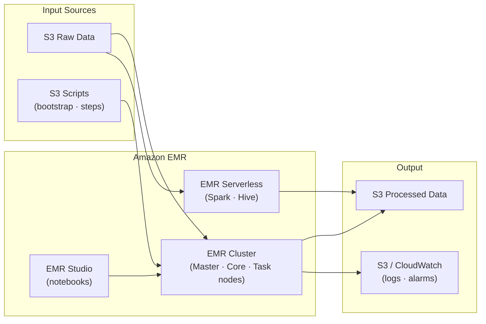

# tf-aws-data-e-emr Examples

Runnable examples for the [`tf-aws-data-e-emr`](../) Terraform module.

## Available Examples

| Example | Description |
|---------|-------------|
| [minimal](minimal/) | Minimal configuration — single transient Spark cluster that runs a PySpark ETL step and auto-terminates on completion |
| [complete](complete/) | Full configuration with a long-running Spark cluster, transient Hive cluster, two EMR Serverless applications (Spark + Hive), an EMR Studio, KMS-backed security configuration, and CloudWatch alarms |

## Architecture



## Quick Start

```bash
cd minimal/
terraform init
terraform apply -var-file="dev.tfvars"
```
