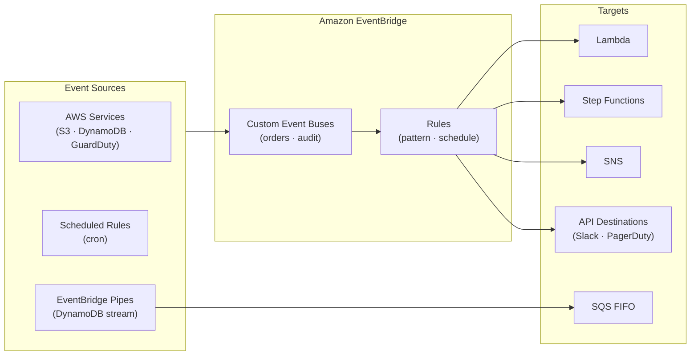

# tf-aws-data-e-eventbridge Examples

Runnable examples for the [`tf-aws-data-e-eventbridge`](../) Terraform module.

## Available Examples

| Example | Description |
|---------|-------------|
| [minimal](minimal/) | Minimal configuration — single scheduled rule (daily cron) with a Lambda target |
| [complete](complete/) | Full configuration with custom event buses (orders, inventory, audit), 8 pattern and scheduled rules, API destinations (Slack, PagerDuty), EventBridge Pipes with DynamoDB stream filtering and SQS delivery, schema registry with auto-discovery, event archives, and CloudWatch alarms |

## Architecture



## Quick Start

```bash
cd minimal/
terraform init
terraform apply -var-file="dev.tfvars"
```
