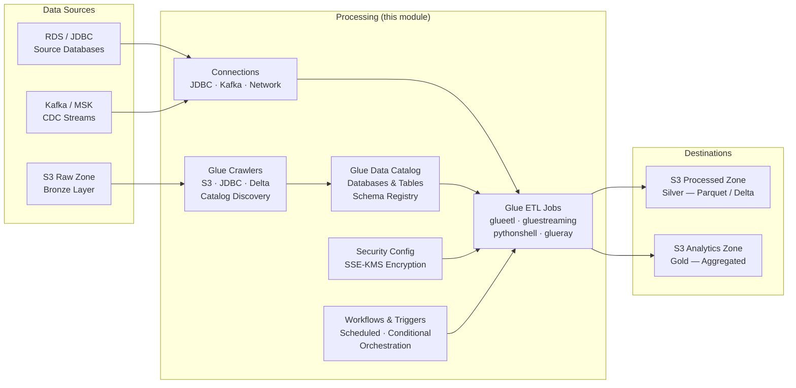

# tf-aws-glue

A production-grade Terraform module for AWS Glue covering the full ETL
platform: data catalog, crawlers, ETL jobs, triggers, workflows, connections,
schema registry, security configurations, and IAM.

---

## Quick Start — minimal setup (one ETL job)

```hcl
module "glue" {
  source = "github.com/your-org/tf-aws-glue"

  data_lake_bucket_arns = ["arn:aws:s3:::my-datalake"]

  jobs = {
    my_etl = {
      script_location   = "s3://my-scripts/etl.py"
      worker_type       = "G.1X"
      number_of_workers = 2
    }
  }
}
```

One Glue ETL job + auto-created IAM role. Nothing else.

## Feature flags

| Flag | Default | What it creates |
|------|---------|-----------------|
| `create_iam_role` | `true` | Glue service IAM role with S3 + KMS + Glue catalog permissions |
| `create_catalog_databases` | `false` | Glue Data Catalog databases |
| `create_crawlers` | `false` | Glue crawlers (S3/JDBC/Delta/Kafka targets) |
| `create_triggers` | `false` | Scheduled/conditional/on-demand triggers |
| `create_workflows` | `false` | Glue workflow orchestration |
| `create_connections` | `false` | JDBC/Kafka/Network connections |
| `create_schema_registries` | `false` | Avro/JSON/Protobuf schema registries |
| `create_security_configurations` | `false` | KMS encryption for S3, CloudWatch, bookmarks |
| `create_catalog_encryption` | `false` | KMS encryption for the Glue Data Catalog |

---

## Architecture



## ETL Pipeline Architecture

```
                        ┌──────────────────────────────────────┐
                        │         Daily ETL Pipeline            │
                        │       (aws_glue_workflow)             │
                        └──────────────────────────────────────┘
                                         │
                   ┌─────────────────────▼──────────────────────┐
                   │  SCHEDULED Trigger (01:00 UTC)              │
                   │  cron(0 1 * * ? *)                          │
                   └─────────────────────┬──────────────────────┘
                                         │
                   ┌─────────────────────▼──────────────────────┐
                   │       S3 Raw Zone Crawler                   │
                   │  Discovers tables in s3://datalake/raw/     │
                   └─────────────────────┬──────────────────────┘
                                         │ SUCCEEDED
                   ┌─────────────────────▼──────────────────────┐
                   │  CONDITIONAL Trigger (after_crawl)          │
                   └─────────────────────┬──────────────────────┘
                                         │
                   ┌─────────────────────▼──────────────────────┐
                   │       ingest_raw (glueetl, G.1X x4)        │
                   │  Raw JSON/CSV → Parquet (Processed Zone)    │
                   └──────────────┬──────────────────────────────┘
                                  │ SUCCEEDED
                   ┌──────────────▼──────────────────────────────┐
                   │  CONDITIONAL Trigger (after_ingest)         │
                   └────────┬──────────────────────┬─────────────┘
                            │                      │
           ┌────────────────▼──────┐   ┌───────────▼────────────────┐
           │  transform_orders     │   │  aggregate_daily            │
           │  (glueetl, G.2X x8)  │   │  (glueetl, FLEX, G.1X x4)  │
           │  orders + customers   │   │  Daily aggregates           │
           └────────────────┬──────┘   └───────────┬────────────────┘
                            │                      │
                   ┌────────▼──────────────────────▼─────────────┐
                   │              Analytics Zone                   │
                   │     s3://datalake/analytics/                  │
                   └─────────────────────────────────────────────┘

Side processes (independent of workflow):
   MSK/Kafka ──► streaming_cdc (gluestreaming, G.025X x2) ──► s3://datalake/raw/cdc/
   Metadata  ──► python_utility (pythonshell)              ──► partition repair / stats
```

---

## Data Lake Zone Architecture

```
S3 Data Lake
├── raw/                   Bronze layer — raw/immutable source data
│   ├── orders/            JSON from application events
│   ├── customers/         CSV exports
│   └── cdc/               Kafka CDC micro-batches (Parquet)
│
├── processed/             Silver layer — cleansed, typed, partitioned Parquet
│   ├── orders/            partition_by=order_date
│   ├── customers/         SCD Type-2 merged
│   └── orders_delta/      Delta Lake format (ACID transactions)
│
└── analytics/             Gold layer — aggregated, BI-ready
    ├── orders_enriched/   Joined orders + customer dimension
    └── daily_aggregates/  Pre-aggregated daily metrics
```

| Zone      | Layer  | Format       | Partition     | Purpose                      |
|-----------|--------|--------------|---------------|------------------------------|
| raw       | Bronze | JSON / CSV   | ingestion_date | Immutable source landing area |
| processed | Silver | Parquet/Delta | business_date | Cleansed, validated data     |
| analytics | Gold   | Parquet       | metric_date   | Query-optimised aggregations  |

---

## Glue Version Comparison

| Feature                    | Glue 2.0      | Glue 3.0       | Glue 4.0        |
|----------------------------|---------------|----------------|-----------------|
| Spark version              | 2.4           | 3.1            | 3.3             |
| Python version             | 3.7           | 3.8            | 3.10            |
| Startup time               | ~2 min        | ~1 min         | <1 min          |
| Job Insights               | No            | Yes            | Yes             |
| Flex execution             | No            | Yes            | Yes             |
| Ray support                | No            | No             | Yes             |
| Delta Lake native          | No            | Partial        | Yes             |
| Iceberg support            | No            | Partial        | Yes             |
| Recommendation             | Legacy only   | Migration path | New workloads   |

Always use **Glue 4.0** for new workloads.

---

## Worker Type Guide

| Worker Type | vCPU | Memory | DPU   | Best For                                  |
|-------------|------|--------|-------|-------------------------------------------|
| G.025X      | 2    | 4 GB   | 0.25  | Glue Streaming (low-throughput)           |
| G.1X        | 4    | 16 GB  | 1.0   | Standard batch ETL, most workloads        |
| G.2X        | 8    | 32 GB  | 2.0   | Memory-intensive joins, wide tables       |
| G.4X        | 16   | 64 GB  | 4.0   | Very large datasets, complex aggregations |
| G.8X        | 32   | 128 GB | 8.0   | Extreme scale, ML feature engineering    |
| Z.2X        | 8    | 64 GB  | 2.0   | Ray jobs for ML workloads                 |
| Standard    | 4    | 16 GB  | 0.5   | Legacy only (Glue 1.0/2.0)               |

**Rule of thumb:**
- Start with G.1X x 2-4 workers for most batch jobs
- Use G.2X when you see OOM errors or join-heavy workloads
- Use G.025X x 2 for streaming (cost optimisation)
- Use Z.2X for Ray-based ML feature pipelines

---

## Job Bookmark

Job bookmarks let Glue track which data has already been processed so
re-runs only pick up new data. This is critical for incremental pipelines.

```hcl
bookmark_option = "job-bookmark-enable"   # default — incremental processing
bookmark_option = "job-bookmark-disable"  # full re-scan on every run
bookmark_option = "job-bookmark-pause"    # keep state but do not advance
```

**How it works:**
1. On first run, Glue reads all available data and records a bookmark.
2. On subsequent runs, Glue starts from where the last successful run ended.
3. Failed runs do not advance the bookmark — retries re-process the same data.

**When to disable bookmarks:**
- Streaming jobs (state managed by Spark checkpoints instead)
- Full-refresh dimension tables
- Python shell utility jobs

---

## FLEX Execution Class

FLEX execution uses spare AWS capacity, delivering **up to 34% cost savings**
compared to STANDARD execution. Trade-off: startup time is longer (minutes
vs. seconds) and capacity is not guaranteed.

```hcl
execution_class = "FLEX"     # Cost-optimised, non-time-sensitive
execution_class = "STANDARD" # Guaranteed capacity, predictable SLA
```

**Use FLEX for:**
- Non-SLA-critical aggregation jobs
- Historical backfills
- Data quality scans
- Jobs that can tolerate variable start times

**Use STANDARD for:**
- Time-sensitive pipelines with SLA requirements
- Streaming jobs
- Crawler-triggered workflows with tight windows

---

## Schema Evolution with Compatibility Modes

```
          Producer             Registry             Consumer
          ────────             ────────             ────────
writes ──► new schema ──► compatibility check ──► reads old/new

BACKWARD   : new schema can read data written with old schema
             (consumers can be upgraded before producers)
FORWARD    : old schema can read data written with new schema
             (producers can be upgraded before consumers)
FULL       : both BACKWARD and FORWARD simultaneously
NONE       : no compatibility checking (dangerous in production)
DISABLED   : schema validation disabled
```

**Recommended compatibility by use case:**

| Use Case               | Compatibility  | Reason                                  |
|------------------------|----------------|------------------------------------------|
| Event streaming (Kafka) | BACKWARD       | Consumers upgrade at their own pace     |
| CDC schemas            | FORWARD        | Source DB schema changes first          |
| Internal services      | FULL           | Maximum safety                          |
| Prototyping            | NONE           | Fast iteration, not for production      |

---

## 12 Real-World Data Engineering Scenarios

### 1. Daily Batch ETL with S3 + Parquet

```hcl
module "glue" {
  source = "path/to/tf-aws-glue"

  catalog_databases = {
    raw_zone = { location_uri = "s3://my-lake/raw/" }
    processed_zone = { location_uri = "s3://my-lake/processed/" }
  }

  crawlers = {
    raw_crawler = {
      database_name = "raw_zone"
      s3_targets    = [{ path = "s3://my-lake/raw/orders/" }]
      schedule      = "cron(0 2 * * ? *)"
    }
  }

  jobs = {
    ingest_job = {
      script_location   = "s3://my-assets/scripts/ingest.py"
      glue_version      = "4.0"
      worker_type       = "G.1X"
      number_of_workers = 4
      bookmark_option   = "job-bookmark-enable"
      default_arguments = {
        "--output_format"    = "parquet"
        "--compression_type" = "snappy"
      }
    }
  }
}
```

### 2. CDC from RDS to S3 Data Lake

```hcl
connections = {
  rds_source = {
    connection_type = "JDBC"
    connection_properties = {
      JDBC_CONNECTION_URL = "jdbc:postgresql://mydb.rds.amazonaws.com:5432/app"
      USERNAME            = "glue_reader"
      PASSWORD            = var.db_password
    }
    subnet_id          = var.rds_subnet_id
    security_group_ids = [var.rds_sg_id]
  }
}

jobs = {
  cdc_extract = {
    script_location = "s3://assets/scripts/cdc_extract.py"
    job_type        = "glueetl"
    connections     = ["rds_source"]
    bookmark_option = "job-bookmark-enable"
    default_arguments = {
      "--source_table"  = "public.orders"
      "--target_path"   = "s3://datalake/raw/cdc/orders/"
      "--cdc_column"    = "updated_at"
    }
  }
}
```

### 3. Streaming from Kafka / Kinesis

```hcl
connections = {
  kafka_msk = {
    connection_type = "KAFKA"
    connection_properties = {
      KAFKA_BOOTSTRAP_SERVERS = "b-1.msk.kafka.us-east-1.amazonaws.com:9092"
      KAFKA_SSL_ENABLED       = "true"
    }
    subnet_id          = var.msk_subnet_id
    security_group_ids = [var.msk_sg_id]
  }
}

jobs = {
  stream_processor = {
    job_type          = "gluestreaming"
    script_location   = "s3://assets/scripts/stream_processor.py"
    glue_version      = "4.0"
    worker_type       = "G.025X"
    number_of_workers = 2
    timeout           = 0   # streaming — no timeout
    connections       = ["kafka_msk"]
    bookmark_option   = "job-bookmark-disable"
    default_arguments = {
      "--kafka_topic"         = "orders"
      "--checkpoint_location" = "s3://datalake/checkpoints/orders/"
      "--window_size"         = "60 seconds"
    }
  }
}
```

### 4. Data Quality Validation Job

```hcl
jobs = {
  dq_validator = {
    script_location   = "s3://assets/scripts/dq_validator.py"
    glue_version      = "4.0"
    worker_type       = "G.1X"
    number_of_workers = 2
    execution_class   = "FLEX"
    default_arguments = {
      "--dqdl_ruleset_path" = "s3://assets/rulesets/orders_ruleset.json"
      "--source_database"   = "processed_zone"
      "--source_table"      = "orders"
      "--result_path"       = "s3://datalake/dq-results/"
      "--enable-dq-halt-job-on-failure" = "true"
    }
  }
}
```

### 5. Delta Lake Crawler + Compaction

```hcl
crawlers = {
  delta_crawler = {
    database_name = "processed_zone"
    delta_target = [{
      delta_tables   = ["s3://datalake/processed/orders_delta/"]
      write_manifest = true
    }]
    recrawl_policy = "CRAWL_NEW_FOLDERS_ONLY"
  }
}

jobs = {
  delta_compaction = {
    script_location   = "s3://assets/scripts/delta_compaction.py"
    glue_version      = "4.0"
    worker_type       = "G.2X"
    number_of_workers = 4
    execution_class   = "FLEX"
    bookmark_option   = "job-bookmark-disable"
    default_arguments = {
      "--delta_table_path"    = "s3://datalake/processed/orders_delta/"
      "--target_file_size_mb" = "128"
    }
  }
}
```

### 6. Cross-Account Catalog Access

```hcl
catalog_databases = {
  shared_analytics = {
    description = "Federated view of shared analytics catalog from account 999999999999."
    target_database = {
      catalog_id    = "999999999999"
      database_name = "central_analytics"
      region        = "us-east-1"
    }
  }
}
```

### 7. Parquet Conversion with Firehose Integration

```hcl
jobs = {
  firehose_parquet_convert = {
    script_location   = "s3://assets/scripts/parquet_convert.py"
    glue_version      = "4.0"
    worker_type       = "G.1X"
    number_of_workers = 2
    bookmark_option   = "job-bookmark-enable"
    default_arguments = {
      "--input_path"    = "s3://firehose-landing/raw/"
      "--output_path"   = "s3://datalake/processed/firehose/"
      "--output_format" = "parquet"
      "--partition_by"  = "year,month,day"
    }
  }
}
```

### 8. Workflow Orchestration for Multi-Step Pipelines

```hcl
workflows = {
  weekly_refresh = {
    description         = "Weekly full-refresh ETL pipeline."
    max_concurrent_runs = 1
  }
}

triggers = {
  weekly_start = {
    type          = "SCHEDULED"
    workflow_name = "weekly_refresh"
    schedule      = "cron(0 3 ? * SUN *)"
    actions       = [{ crawler_name = "s3_full_crawler" }]
  }

  weekly_after_crawl = {
    type          = "CONDITIONAL"
    workflow_name = "weekly_refresh"
    actions       = [{ job_name = "full_refresh_job" }]
    predicate = {
      logical = "AND"
      conditions = [{
        crawler_name = "s3_full_crawler"
        crawl_state  = "SUCCEEDED"
      }]
    }
  }
}
```

### 9. Schema Evolution Management

```hcl
schema_registries = {
  orders_registry = {
    description = "Order domain event schemas with backward compatibility."
    schemas = {
      order_v2 = {
        schema_name   = "order_v2"
        data_format   = "AVRO"
        compatibility = "BACKWARD"
        schema_definition = jsonencode({
          type   = "record"
          name   = "Order"
          fields = [
            { name = "id",           type = "string" },
            { name = "amount",       type = "double" },
            { name = "currency",     type = "string", default = "USD" },
            # New optional field — backward compatible because it has a default
            { name = "discount_pct", type = ["null", "double"], default = null },
          ]
        })
      }
    }
  }
}
```

### 10. JDBC Connection to RDS in Private VPC

```hcl
connections = {
  private_rds = {
    connection_type = "JDBC"
    connection_properties = {
      JDBC_CONNECTION_URL = "jdbc:postgresql://private-db.internal:5432/mydb"
      USERNAME            = "glue_svc"
      PASSWORD            = var.db_password
      JDBC_ENFORCE_SSL    = "true"
    }
    # Glue will provision an ENI in this subnet to reach the DB
    subnet_id          = "subnet-private-1a"
    security_group_ids = ["sg-allow-glue-to-rds"]
    availability_zone  = "us-east-1a"
  }
}
```

### 11. Python Shell Jobs for Lightweight Transformations

```hcl
jobs = {
  metadata_updater = {
    job_type        = "pythonshell"
    script_location = "s3://assets/scripts/metadata_updater.py"
    glue_version    = "1.0"
    python_version  = "3.9"
    max_concurrent_runs = 5
    timeout         = 30
    bookmark_option = "job-bookmark-disable"
    default_arguments = {
      "--action"    = "msck_repair"
      "--database"  = "processed_zone"
    }
  }
}
```

### 12. Ray Jobs for ML Feature Engineering

```hcl
jobs = {
  feature_engineering = {
    job_type          = "glueray"
    script_location   = "s3://assets/scripts/feature_engineering.py"
    glue_version      = "4.0"
    worker_type       = "Z.2X"
    number_of_workers = 4
    execution_class   = "STANDARD"
    default_arguments = {
      "--feature_store_path" = "s3://datalake/features/"
      "--model_artifacts"    = "s3://ml-artifacts/models/"
    }
  }
}
```

---

## Requirements

| Name      | Version   |
|-----------|-----------|
| terraform | >= 1.5.0  |
| aws       | >= 5.0.0  |

---

## Providers

| Name | Version   |
|------|-----------|
| aws  | >= 5.0.0  |

---

## Resources Created

| Resource                                    | Description                              |
|---------------------------------------------|------------------------------------------|
| `aws_glue_catalog_database`                 | Glue Data Catalog databases              |
| `aws_glue_catalog_table`                    | Glue Data Catalog tables                 |
| `aws_glue_data_catalog_encryption_settings` | Catalog SSE-KMS encryption               |
| `aws_glue_crawler`                          | Glue crawlers                            |
| `aws_glue_job`                              | Glue ETL / streaming / Ray jobs          |
| `aws_glue_workflow`                         | Glue workflow orchestration              |
| `aws_glue_trigger`                          | Scheduled / conditional / event triggers |
| `aws_glue_connection`                       | JDBC / Kafka / network connections       |
| `aws_glue_registry`                         | Glue Schema Registry                     |
| `aws_glue_schema`                           | Avro / JSON / Protobuf schemas           |
| `aws_glue_security_configuration`           | Encryption at rest and in transit        |
| `aws_iam_role`                              | Glue service role                        |
| `aws_iam_role_policy_attachment`            | AWSGlueServiceRole + extras              |
| `aws_iam_role_policy`                       | Inline S3 / KMS / CWL / Glue policy     |

---

## Inputs

| Name | Description | Type | Default | Required |
|------|-------------|------|---------|----------|
| `name_prefix` | Prefix for all resource names | `string` | `""` | no |
| `tags` | Default tags for all resources | `map(string)` | `{}` | no |
| `catalog_databases` | Map of Glue catalog databases | `map(object)` | `{}` | no |
| `catalog_tables` | Map of Glue catalog tables | `map(object)` | `{}` | no |
| `create_catalog_databases` | Feature gate: create catalog databases | `bool` | `false` | no |
| `create_crawlers` | Feature gate: create crawlers | `bool` | `false` | no |
| `create_triggers` | Feature gate: create triggers | `bool` | `false` | no |
| `create_workflows` | Feature gate: create workflows | `bool` | `false` | no |
| `create_connections` | Feature gate: create connections | `bool` | `false` | no |
| `create_schema_registries` | Feature gate: create schema registries | `bool` | `false` | no |
| `create_security_configurations` | Feature gate: create security configurations | `bool` | `false` | no |
| `create_catalog_encryption` | Feature gate: enable catalog KMS encryption | `bool` | `false` | no |
| `create_iam_role` | Feature gate: auto-create Glue service IAM role | `bool` | `true` | no |
| `catalog_encryption_kms_key_id` | KMS key ID for catalog encryption | `string` | `null` | no |
| `crawlers` | Map of Glue crawlers | `map(object)` | `{}` | no |
| `jobs` | Map of Glue ETL jobs | `map(object)` | `{}` | no |
| `workflows` | Map of Glue workflows | `map(object)` | `{}` | no |
| `triggers` | Map of Glue triggers | `map(object)` | `{}` | no |
| `connections` | Map of Glue connections | `map(object)` | `{}` | no |
| `schema_registries` | Map of schema registries + schemas | `map(object)` | `{}` | no |
| `security_configurations` | Map of security configurations | `map(object)` | `{}` | no |
| `service_role_name` | Override name for the IAM role | `string` | `null` | no |
| `data_lake_bucket_arns` | S3 bucket ARNs for IAM policy | `list(string)` | `[]` | no |
| `kms_key_arns` | KMS key ARNs for IAM policy | `list(string)` | `[]` | no |
| `additional_policy_arns` | Extra managed policies to attach | `list(string)` | `[]` | no |
| `enable_secrets_manager_access` | Grant Secrets Manager read | `bool` | `false` | no |

---

## Outputs

| Name | Description |
|------|-------------|
| `catalog_database_arns` | Map of database key → ARN |
| `catalog_database_names` | Map of database key → name |
| `catalog_table_names` | Map of table key → name |
| `crawler_arns` | Map of crawler key → ARN |
| `crawler_names` | Map of crawler key → name |
| `job_arns` | Map of job key → ARN |
| `job_names` | Map of job key → name |
| `trigger_arns` | Map of trigger key → ARN |
| `workflow_arns` | Map of workflow key → ARN |
| `connection_arns` | Map of connection key → ARN |
| `connection_names` | Map of connection key → name |
| `schema_registry_arns` | Map of registry key → ARN |
| `schema_arns` | Map of `registry/schema` key → ARN |
| `security_configuration_names` | Map of security config key → name |
| `glue_service_role_arn` | ARN of the Glue service IAM role |
| `glue_service_role_name` | Name of the Glue service IAM role |

---

## Security Considerations

1. **KMS Encryption** — all security configurations default to SSE-KMS. Provide
   your own KMS key ARN via `glue_kms_key_arn`; never use the AWS-managed key
   for production workloads.

2. **JDBC Passwords** — store database credentials in AWS Secrets Manager and
   reference them via the `PASSWORD` connection property. Enable
   `enable_secrets_manager_access = true` to grant the role read access.

3. **Catalog Encryption** — enable `create_catalog_encryption = true` with a
   dedicated KMS key to encrypt table metadata and connection passwords at rest
   in the Data Catalog.

4. **Least Privilege** — the module creates a single shared service role by
   default. For strict isolation, supply per-job/per-crawler `role_arn` values
   pointing to purpose-built roles.

5. **VPC Isolation** — always specify `subnet_id`, `security_group_ids`, and
   `availability_zone` for JDBC and Kafka connections so Glue provisions ENIs
   inside your VPC rather than routing over the public internet.

---

## License

Apache 2.0

## Versioning

Review [CHANGELOG.md](CHANGELOG.md) before selecting a module version. Use explicit git tags such as `?ref=v1.0.0`, `?ref=v1.1.0`, or `?ref=v2.0.0` so deployments stay predictable.

