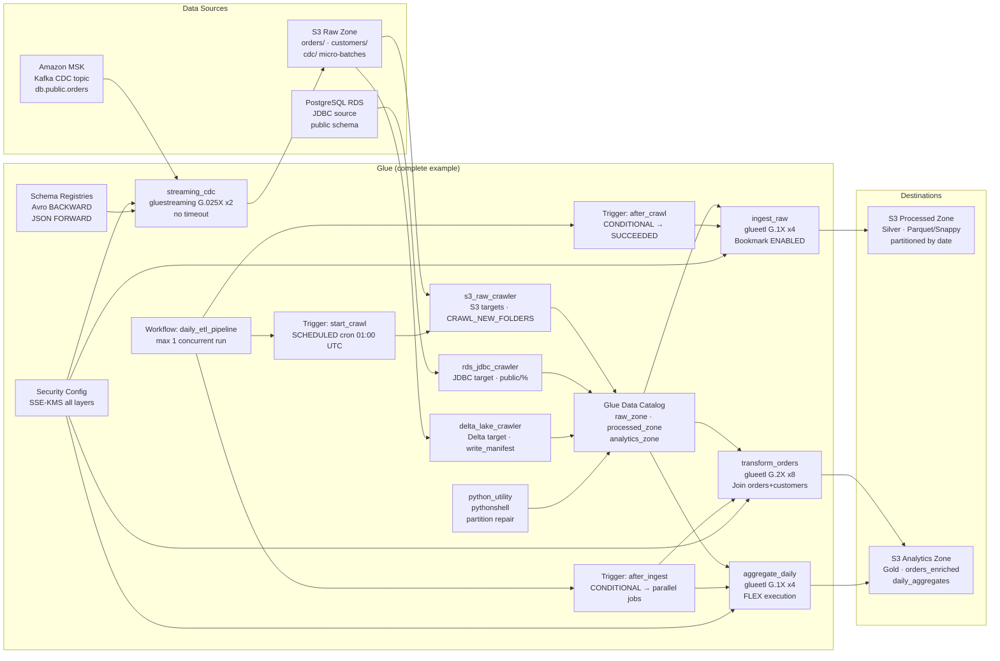

# tf-aws-data-e-glue Examples

Runnable examples for the [`tf-aws-data-e-glue`](../) Terraform module.

## Available Examples

| Example | Description |
|---------|-------------|
| [minimal](minimal/) | Single Glue ETL job with an auto-created IAM service role. No crawlers, triggers, workflows, or connections. The simplest starting point to get a script running on Glue 4.0. |
| [complete](complete/) | Production daily ETL pipeline: three catalog databases (raw/processed/analytics zones), three crawlers (S3, JDBC/RDS, Delta Lake), five jobs (ingest_raw, transform_orders, aggregate_daily, python_utility, streaming_cdc), one workflow with three triggers (scheduled + conditional), JDBC and Kafka connections, two schema registries (Avro + JSON), KMS security configuration, and catalog encryption. |

## Architecture



## Quick Start

```bash
# Minimal — single ETL job
cd minimal/
terraform init
terraform apply

# Complete — full production pipeline
cd complete/
terraform init
terraform apply -var-file="prod.tfvars"
```

### Required variables for `complete/` (`prod.tfvars`)

```hcl
environment             = "prod"
project                 = "data-platform"
data_lake_bucket_name   = "my-data-lake"
assets_bucket_name      = "my-glue-assets"
glue_kms_key_arn        = "arn:aws:kms:us-east-1:123456789012:key/..."
rds_jdbc_url            = "jdbc:postgresql://mydb.xxxx.us-east-1.rds.amazonaws.com:5432/appdb"
rds_username            = "glue_reader"
rds_password            = "changeme"
rds_subnet_id           = "subnet-0abc123"
rds_security_group_id   = "sg-0abc123"
rds_availability_zone   = "us-east-1a"
msk_bootstrap_servers   = "b-1.msk.xxxx.kafka.us-east-1.amazonaws.com:9092"
msk_subnet_id           = "subnet-0def456"
msk_security_group_id   = "sg-0def456"
```
