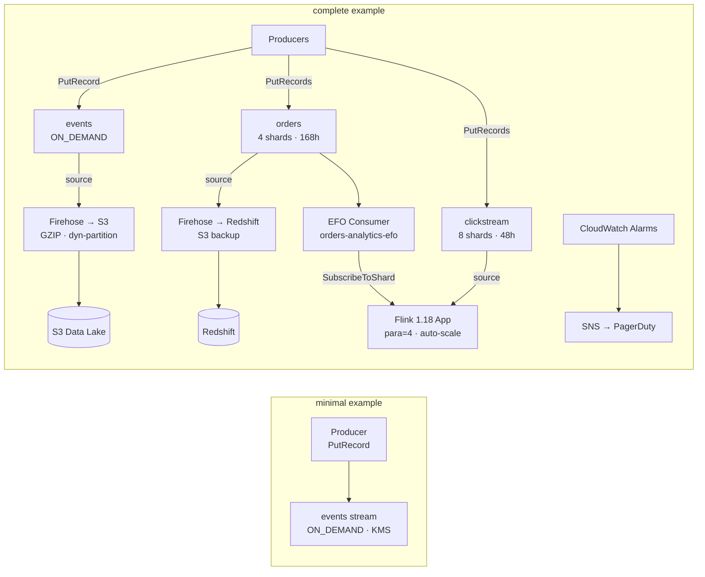

# tf-aws-data-e-kinesis Examples

Runnable examples for the [`tf-aws-data-e-kinesis`](../) Terraform module.

## Available Examples

| Example | Description |
|---------|-------------|
| [minimal](minimal/) | Single ON_DEMAND Kinesis Data Stream with KMS encryption. No Firehose, no analytics, no alarms. Best starting point for new pipelines. |
| [complete](complete/) | Full data pipeline: three streams (ON_DEMAND + PROVISIONED), Firehose to S3 and Redshift, a Flink 1.18 analytics application, Enhanced Fan-Out consumer, IAM roles, and CloudWatch alarms. |

## Architecture



## Quick Start

```bash
# Minimal — fastest path to a working stream
cd minimal/
terraform init
terraform apply

# Complete — full pipeline with all features
cd complete/
terraform init
terraform apply -var-file="prod.tfvars"
```

## Variable Files

The `complete` example ships with a `prod.tfvars` file. Copy and adjust for other environments:

```bash
cp complete/prod.tfvars complete/dev.tfvars
# Edit dev.tfvars — reduce shard counts, disable analytics, use cheaper KMS key
terraform apply -var-file="dev.tfvars"
```

## Notes

- The `complete` example sets `start_application = false` on the Flink app. Upload the JAR to S3 first, then set `start_application = true` and re-apply.
- Kinesis stream recreation destroys all data. Uncomment `prevent_destroy = true` in `streams.tf` for production workloads.
- ON_DEMAND mode is roughly 3–5x more expensive per GB than PROVISIONED at high steady-state volume.
