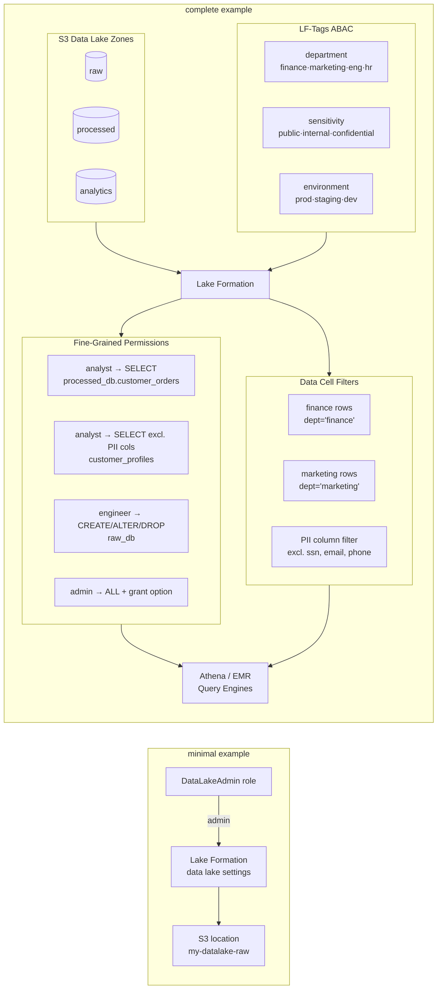

# tf-aws-data-e-lakeformation Examples

Runnable examples for the [`tf-aws-data-e-lakeformation`](../) Terraform module.

## Available Examples

| Example | Description |
|---------|-------------|
| [minimal](minimal/) | Register a single S3 bucket as a Lake Formation data lake location and set an admin. No permissions, no LF-Tags. |
| [complete](complete/) | Full Lake Formation setup: three S3 zones (raw/processed/analytics), LF-Tags for ABAC (department, sensitivity, environment), fine-grained table and column-level permissions, data cell filters for row-level security, and LF-Tag assignments on governed tables. |

## Architecture



## Quick Start

```bash
# Minimal — register one S3 bucket and set an admin
cd minimal/
terraform init
terraform apply

# Complete — full ABAC + row/column security setup
cd complete/
terraform init
terraform apply -var-file="dev.tfvars"
```

## Variable Files

The `complete` example requires the following variables:

| Variable | Description |
|----------|-------------|
| `environment` | Deployment environment (e.g. `prod`, `dev`) |
| `account_id` | AWS account ID (used in S3 bucket ARN construction) |
| `admin_role_arn` | IAM role ARN for the Lake Formation admin |
| `analyst_role_arn` | IAM role ARN for data analysts |
| `engineer_role_arn` | IAM role ARN for data engineers |
| `tags` | Default resource tags |

Create a `dev.tfvars` file:

```hcl
environment      = "dev"
account_id       = "123456789012"
admin_role_arn   = "arn:aws:iam::123456789012:role/DataLakeAdmin"
analyst_role_arn = "arn:aws:iam::123456789012:role/DataAnalyst"
engineer_role_arn = "arn:aws:iam::123456789012:role/DataEngineer"
tags = {
  Environment = "dev"
  ManagedBy   = "terraform"
}
```

## Notes

- Lake Formation permissions layer on top of IAM — both must allow access for a query to succeed.
- LF-Tags (ABAC) scale better than explicit per-table grants for large catalogs.
- Set `hybrid_access_enabled = true` on S3 locations during migration from IAM-only policies to coexist with existing S3 bucket policies.
- Data cell filters apply row-level and column-level security at query time — no data is physically removed.
