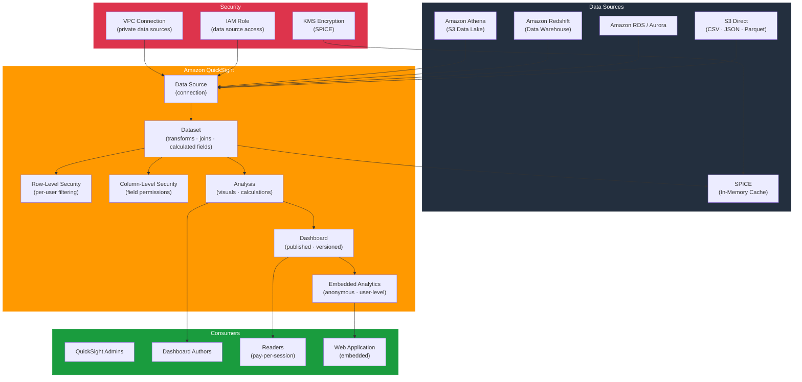

# tf-aws-data-e-quicksight

Data Engineering module for Amazon QuickSight — enterprise BI dashboards, data sources (Athena, Redshift, S3, RDS), datasets with row/column-level security, analyses, and embedded analytics.

---

## Architecture



---

## Features

- Data source connections: Athena, Redshift, RDS/Aurora, S3, MySQL, PostgreSQL, Snowflake, and more
- SPICE in-memory engine for sub-second dashboard queries at scale
- Dataset transformations: calculated fields, joins, renames, data type casts
- Row-level security (RLS) datasets for per-user or per-group data filtering
- Column-level security for restricting sensitive fields per user/group
- Analyses and dashboards with version control
- Embedded analytics for both anonymous public and authenticated user contexts
- VPC connections for private data source access (Redshift, RDS in VPC)
- KMS encryption for SPICE data at rest

## Security Controls

| Control | Implementation |
|---------|---------------|
| Row-level filtering | RLS dataset rules (user/group per row) |
| Column hiding | Column-level permission tags |
| Private connectivity | VPC Connection for Redshift/RDS |
| SPICE encryption | KMS CMK |
| IAM federation | QuickSight IAM role for Athena/S3 access |

## Versioning

Use explicit git tags such as `?ref=v1.0.0` to pin your deployments.

## Usage

```hcl
module "quicksight" {
  source = "git::https://github.com/your-org/golden_modules.git//tf-aws-data-e-quicksight?ref=v1.0.0"

  # QuickSight resources are provisioned via AWS Console or CloudFormation.
  # This module provisions supporting infrastructure:
  # - IAM roles for QuickSight service
  # - VPC connection security groups
  # - S3 manifest bucket policies
  # - KMS key policies for SPICE encryption
}

# Supporting IAM role for QuickSight → Athena access
resource "aws_iam_role_policy" "quicksight_athena" {
  name = "quicksight-athena-access"
  role = aws_iam_role.quicksight.id

  policy = jsonencode({
    Version = "2012-10-17"
    Statement = [
      {
        Effect   = "Allow"
        Action   = ["athena:StartQueryExecution", "athena:GetQueryExecution", "athena:GetQueryResults"]
        Resource = "*"
      },
      {
        Effect   = "Allow"
        Action   = ["s3:GetObject", "s3:ListBucket"]
        Resource = [aws_s3_bucket.datalake.arn, "${aws_s3_bucket.datalake.arn}/*"]
      },
      {
        Effect   = "Allow"
        Action   = ["glue:GetDatabase", "glue:GetTable", "glue:GetPartitions"]
        Resource = "*"
      },
    ]
  })
}
```

## SPICE Capacity Planning

| Users | Dashboards | Recommended SPICE |
|-------|-----------|-------------------|
| < 100 | < 20 | 10 GB (default) |
| 100–1,000 | 20–100 | 50–200 GB |
| 1,000+ | 100+ | 500 GB+ (enterprise) |

## Examples

- [Athena data lake dashboards](examples/athena/)
- [Redshift warehouse analytics](examples/redshift/)
- [Embedded analytics](examples/embedded/)
