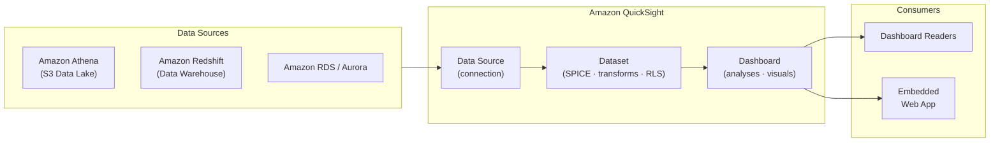

# tf-aws-data-e-quicksight Examples

Runnable examples for the [`tf-aws-data-e-quicksight`](../) Terraform module.

## Available Examples

| Example | Description |
|---------|-------------|
| [minimal](minimal/) | Minimal configuration — IAM role and S3 bucket policy granting QuickSight access to an Athena data lake |
| [complete](complete/) | Full configuration with Athena and Redshift data sources, SPICE datasets with row-level security, KMS encryption, VPC connection for private data sources, and dashboard publishing |

## Architecture



## Quick Start

```bash
cd minimal/
terraform init
terraform apply -var-file="dev.tfvars"
```
