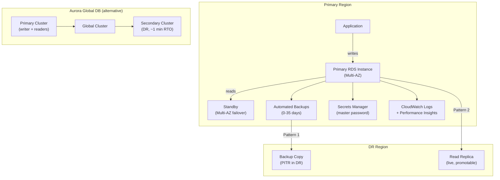

# tf-aws-data-e-rds Examples

Runnable examples for the [`tf-aws-data-e-rds`](../) Terraform module.

## Available Examples

| Example | Description |
|---------|-------------|
| [basic](basic/) | Single-region RDS instance with minimal configuration — ideal for dev/test environments |
| [complete](complete/) | Full-featured single-region RDS with KMS encryption, Performance Insights, enhanced monitoring, parameter groups, and Secrets Manager |
| [complete-all-engines](complete-all-engines/) | Side-by-side deployment of all supported engines (PostgreSQL, MySQL, Oracle EE, SQL Server EE, MariaDB) with engine-specific settings |
| [cross_region](cross_region/) | Generic cross-region template — choose backup replication, live read replica, or both via tfvars toggles |
| [cross_region_mysql](cross_region_mysql/) | MySQL 8.0 cross-region: primary in us-east-1 with optional backup replication and/or read replica in us-west-2 |
| [cross_region_postgres](cross_region_postgres/) | PostgreSQL 16 cross-region: primary + optional backup replication and read replica in DR region |
| [cross_region_mariadb](cross_region_mariadb/) | MariaDB 10.11 cross-region: primary + optional backup replication and read replica in DR region |
| [cross_region_oracle](cross_region_oracle/) | Oracle EE/SE2 cross-region: primary + optional backup replication and cross-region read replica |
| [cross_region_sqlserver](cross_region_sqlserver/) | SQL Server SE/EE cross-region: backup replication only (SQL Server does not support cross-region read replicas) |
| [cross_region_aurora_mysql](cross_region_aurora_mysql/) | Aurora MySQL Global Database: primary cluster in us-east-1 with optional secondary cluster in DR region (~1 min RTO) |
| [cross_region_aurora_postgres](cross_region_aurora_postgres/) | Aurora PostgreSQL Global Database: primary cluster with optional DR secondary cluster |

## Architecture



## Quick Start

```bash
# Single-region dev instance
cd basic/
terraform init
terraform apply -var-file="dev.tfvars"

# Full-featured production instance
cd complete/
terraform init
terraform apply -var-file="prod.tfvars"

# MySQL cross-region with backup replication + read replica
cd cross_region_mysql/
terraform init
terraform apply -var-file="prod.tfvars"

# Aurora MySQL Global Database
cd cross_region_aurora_mysql/
terraform init
terraform apply -var-file="prod.tfvars"
```

## Cross-Region DR Pattern Selection

| Need | Example | Toggle |
|------|---------|--------|
| Compliance backup copy in DR | any `cross_region_*` | `enable_automated_backup_replication = true` |
| Fast failover read replica (RTO < 5 min) | any `cross_region_*` (except SQL Server) | `create_cross_region_replica = true` |
| Fastest failover (~1 min), Aurora | `cross_region_aurora_mysql` / `cross_region_aurora_postgres` | `create_secondary_region = true` |
| SQL Server DR | `cross_region_sqlserver` | `enable_automated_backup_replication = true` |

Each example folder contains `dev.tfvars`, `staging.tfvars`, and `prod.tfvars` for environment-specific configuration.
