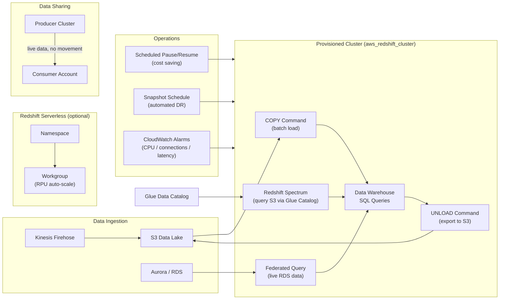

# tf-aws-data-e-redshift Examples

Runnable examples for the [`tf-aws-data-e-redshift`](../) Terraform module.

## Available Examples

| Example | Description |
|---------|-------------|
| [minimal](minimal/) | Single provisioned cluster with default settings — fastest path to a working Redshift cluster |
| [complete](complete/) | Production-grade deployment: provisioned clusters (prod + dev), Redshift Serverless, parameter groups, snapshot schedules, scheduled pause/resume/resize, data sharing, and CloudWatch alarms |

## Architecture



## Quick Start

```bash
# Minimal — single cluster, default settings
cd minimal/
terraform init
terraform apply

# Complete — production + dev clusters, serverless, all features
cd complete/
terraform init
terraform plan -var-file="prod.tfvars"
terraform apply -var-file="prod.tfvars"
```

## Feature Comparison

| Feature | minimal | complete |
|---------|---------|----------|
| Provisioned cluster | 1 (dev defaults) | 2 (prod ra3.4xlarge + dev dc2.large) |
| Redshift Serverless | No | Yes (adhoc namespace + workgroup) |
| Parameter groups | No | Yes (prod strict SSL + dev relaxed) |
| Snapshot schedules | No | Yes (daily prod snapshots) |
| Scheduled pause/resume | No | Yes (dev off-hours + prod weekend resize) |
| Data sharing | No | Yes (producer authorization) |
| CloudWatch alarms | No | Yes (CPU, connections, latency, disk) |
| KMS encryption | AWS-managed | Customer-managed (BYO key) |
