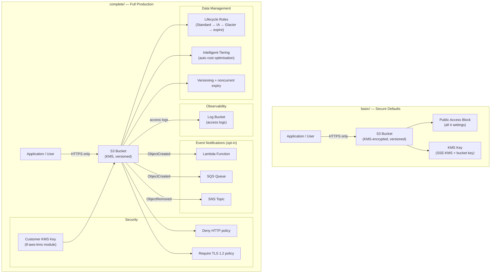

# tf-aws-data-e-s3 Examples

Runnable examples for the [`tf-aws-data-e-s3`](../) Terraform module.

## Available Examples

| Example | Description |
|---------|-------------|
| [basic](basic/) | Minimal S3 bucket with secure defaults — KMS encryption, versioning, and public access block enabled out of the box |
| [complete](complete/) | Full production setup: KMS encryption, access logging to a separate log bucket, lifecycle rules, Intelligent-Tiering, deny-HTTP and require-TLS-1.2 bucket policies |

## Architecture



## Quick Start

```bash
# Basic — minimal secure bucket
cd basic/
terraform init
terraform apply -var-file="dev.tfvars"

# Complete — full production configuration
cd complete/
terraform init
terraform plan -var-file="prod.tfvars"
terraform apply -var-file="prod.tfvars"
```

## Feature Comparison

| Feature | basic | complete |
|---------|-------|----------|
| KMS encryption | AWS-managed key | Customer-managed key (tf-aws-kms) |
| Versioning | Enabled | Enabled + noncurrent expiry |
| Public access block | All 4 settings | All 4 settings |
| Deny HTTP policy | Yes | Yes |
| Require TLS 1.2 policy | No | Yes |
| Access logging | No | Yes (dedicated log bucket) |
| Lifecycle rules | No | Yes (IA → Glacier → expire) |
| Intelligent-Tiering | No | Yes |
| Event notifications | No | Configurable (Lambda / SQS / SNS) |
| Cross-region replication | No | Configurable |
