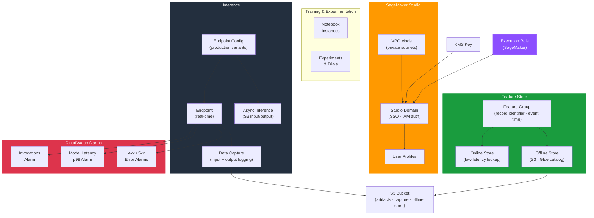

# tf-aws-data-e-sagemaker

Data Engineering module for Amazon SageMaker — Studio domains, inference endpoints with data capture and async inference, feature store feature groups, and CloudWatch alarms for model monitoring.

---

## Architecture



---

## Features

- SageMaker Studio domains with IAM or SSO authentication and VPC isolation
- Inference endpoint configurations with production variants and A/B traffic splitting
- Real-time and asynchronous inference endpoints
- Data capture for ground truth labelling and model drift detection
- Feature Store feature groups with online store (low-latency) and offline store (S3 + Glue)
- CloudWatch alarms: invocation count, model latency (p99), 4xx/5xx error rates

## Security Controls

| Control | Implementation |
|---------|---------------|
| Domain isolation | VPC mode with private subnets |
| Encryption | KMS CMK for domain, endpoints, feature store |
| IAM roles | Per-domain execution role — least privilege |
| Data capture | Encrypted input/output logging to S3 |

## Versioning

Use explicit git tags such as `?ref=v1.0.0` to pin your deployments.

## Usage

```hcl
module "sagemaker" {
  source = "git::https://github.com/your-org/golden_modules.git//tf-aws-data-e-sagemaker?ref=v1.0.0"

  # Studio domain
  domains = {
    ml_platform = {
      auth_mode         = "IAM"
      vpc_id            = module.vpc.vpc_id
      subnet_ids        = module.vpc.private_subnet_ids
      execution_role_arn = aws_iam_role.sagemaker.arn
      security_group_ids = [aws_security_group.sagemaker.id]
    }
  }

  # Inference endpoint
  endpoint_configurations = {
    bert_classifier = {
      production_variants = [{
        variant_name           = "primary"
        model_name             = "bert-classifier-v1"
        initial_instance_count = 2
        instance_type          = "ml.m5.xlarge"
        initial_variant_weight = 1.0
      }]
      data_capture_enabled       = true
      data_capture_s3_output_path = "s3://${module.mlops_bucket.id}/capture"
    }
  }

  # Feature group
  feature_groups = {
    user_features = {
      record_identifier_feature_name = "user_id"
      event_time_feature_name        = "event_time"
      online_store_enabled           = true
      offline_store_bucket           = module.mlops_bucket.id
      features = [
        { name = "user_id",          feature_type = "Integral" },
        { name = "purchase_count",   feature_type = "Integral" },
        { name = "avg_order_value",  feature_type = "Fractional" },
        { name = "event_time",       feature_type = "String" },
      ]
    }
  }

  create_alarms                    = true
  alarm_model_latency_p99_ms       = 500
}
```

## Endpoint Instance Types Reference

| Instance | vCPU | GPU | Use Case |
|----------|------|-----|---------|
| `ml.m5.xlarge` | 4 | — | General NLP / tabular |
| `ml.g4dn.xlarge` | 4 | 1×T4 | Computer vision, transformers |
| `ml.g5.xlarge` | 4 | 1×A10G | Large language models |
| `ml.inf1.xlarge` | 4 | 1×Inf1 | Cost-optimised inference |

## Examples

- [Studio domain](examples/domain/)
- [Real-time endpoint](examples/endpoint/)
- [Feature store](examples/feature-store/)
